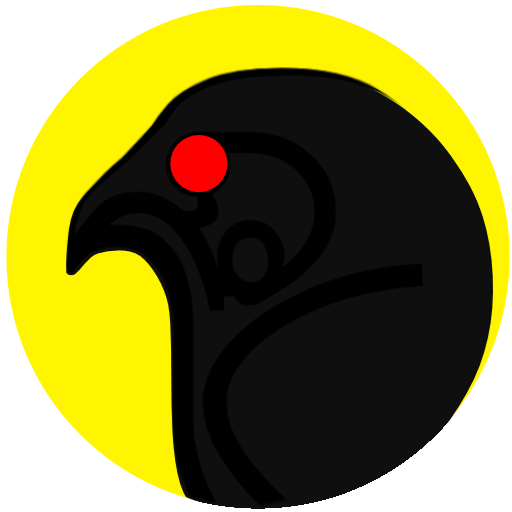

# CHOR
evenzero.in/chor

## chor icon and logo

## Problem Statement: Configurable, exportable, persistent, tab groups in a FSM.
## Philosophy: One thing well - enhance the chrome tabbing experience by 10x
## Approach: Started with react based boilerplate 

## Features (scope creep!)
### tab features
    - levitating active icon
    - inactive tab desaturation  spp
    - dnd in window
    - dnd across win/grp
    - some sort of super fast 3d rotation on cursor/hover 
### group features
    - auto group based on rule/regex
    - auto group on domain
    - window/group merge with dnd
    - 📅 timed, self-destructing tabs/pages/groups
    - 📅 timed, recurring tabs/groups
    - launch group on startup  
### commands
    kill (with animation)
        all
        tab
        windows
        group
        search

    curd
        tab
        window
        group
        page

    sequences:
        search and… split, destroy, group/name
        new [tab/window/group/page] and…
        group [search results, all current, … ] and …
        ungroup [group] and .. 
### options

    tab to flip to options modal
    now playing (Spotify, youtube, soundcloud …)
    day theme / match system setting
    password protect on launch, locally persistent hashed password
    custom launch shortcut
    party mode: 8-bit animation loop plays as bg
    holiday mode: snow, real snow
    clear search on exit meta
    analytics page
    save (.chor config, pages json) and export all saved
    sync saved to google drive

# Resources

## chrome
https://developer.chrome.com/docs/extensions/reference/tabs/
https://developer.chrome.com/docs/extensions/reference/tabGroups/
https://developer.chrome.com/docs/extensions/reference/action/
https://developer.chrome.com/docs/extensions/reference/commands/

## scroll things / pagination
https://www.npmjs.com/package/react-intersection-observer 
https://swiperjs.com/get-started

## dnd 
https://react-dnd.github.io/react-dnd/examples/dustbin/single-target

## xstate
https://xstate.js.org/viz

## Interpreted machine for background
a) command
b) sequence
c) search

https://www.npmjs.com/package/fuzzy-search
https://www.npmjs.com/package/react-lodash

## recoil
- recoil+xstate example https://codesandbox.io/s/njt5c
- https://recoiljs.org/

## others
window placement - 
SCSS placing items in a circle
Ripple codepen (not used)

## favicon in grid
https://codepen.io/surajs1/pen/ExXZmWP?editors=1100

## network graph/groups
https://visjs.github.io/vis-network/examples/network/nodeStyles/groups.html

## TESTing strategies
https://stackoverflow.com/questions/2869827/how-to-test-chrome-extensions
https://www.browserstack.com/guide/test-chrome-extensions-in-selenium

# state
- state should be a kind of bubbling up, not a reactive stream but a more modular cascade.
- all events be directed to the FSM
- render only on state update
  
## preliminary flowchart
- https://github.com/surajsharma/Designs/blob/master/chor

## state objects

### tab

~~~
active: false
audible: false
autoDiscardable: true
discarded: false
domain: "extensions/"
favIconUrl: ""
groupId: -1
height: 821
highlighted: false
id: 228
incognito: false
index: 2
mutedInfo: {extensionId: 'dakjohnomcaicpgeehgdmbpgeepkipao', muted: false, reason: 'extension'}
pinned: false
selected: false
status: "complete"
title: "Extensions"
url: "chrome://extensions/"
width: 962
windowId: 86
x: 0
y: 2
~~~

### page

~~~
pi: pageIndex
windows: (1) [{@window}]
~~~

### window

~~~
alwaysOnTop: false
focused: true
height: 900
id: 86
incognito: false
left: 478
state: "normal"
tabs: (3) [{…}, {…}, {…}]
top: 0
type: "normal"
~~~
