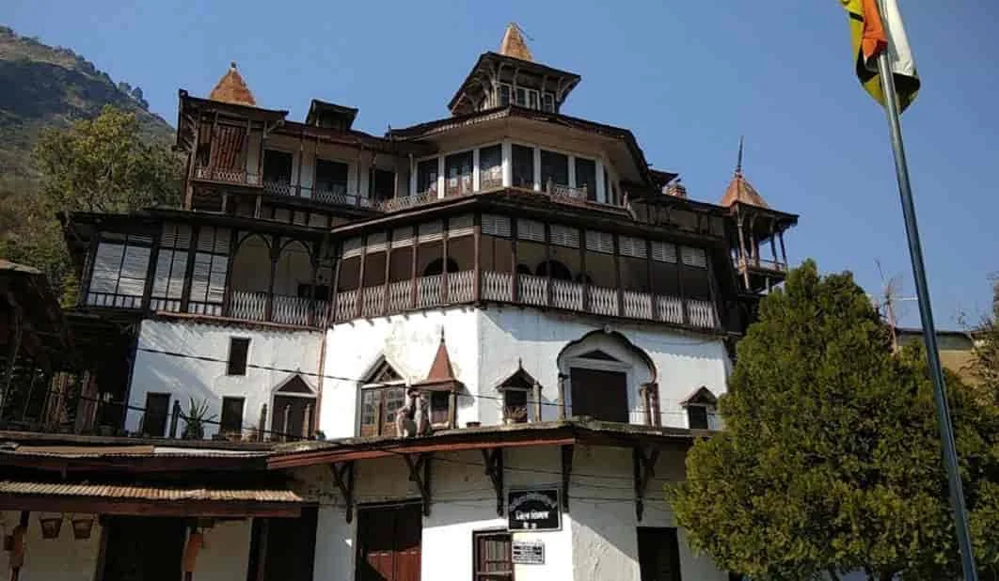
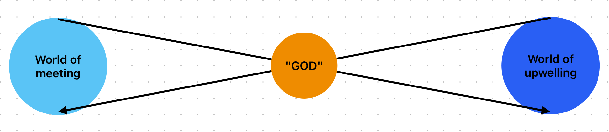
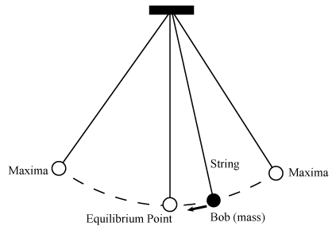

# 0. introduction - a city in a mirror

--

> विश्वं दर्पणदृश्यमाननगरीतुल्यं निजान्तर्गतं
  पश्यन्नात्मनि मायया बहिरिवोद्भूतं यथा निद्रया ।
  यः साक्षात्कुरुते प्रबोधसमये स्वात्मानमेवाद्वयं
  तस्मै श्रीगुरुमूर्तये नम इदं श्रीदक्षिणामूर्तये ॥ १॥
  
>  Translation: To Him who by maya as by dream, sees within Himself the universe which is inside Him, like unto a city that is seen in a mirror, (but) which is manifested as if without: to Him who apprehends, at the time of awakening, His own non-dual Self: to Him, of the form of the Preceptor, the blessed Dakśinamurti may this obeisance be! [2]

---

- Around 20 kilometers due north from Shimla, the capital of the state of Himachal Pradesh, on national highway no 5 is a 9-hole golf course, one of the oldest in the country built by none other than Lord Curzon (setting tone for the kind of characters that will follow), some 30 kilometers north by northwest ahead, in a temperate, rain-shadow valley of the Sutlej lies the tiny, erstwhile princely state or 'riyasat' of 'sunni', which my ancestors on my mother's side ruled for centuries until independence with much cruelty and heavy-handedness. 

- Of course stories of treachery, deceit, curses, and palace intrigue are part of common folklore and myth which has mostly stood the test of time. An example of this would be the central castle of sunni, which we are forbidden to enter due to a curse, which has been ostensibly proven in the form of miscarriages etc. 
  

- What happenned to the House of Kutlehar which has provenance in the Kutlehar state of Rajasthan is buried in the annals and gazetteers of the Raj, however, post-independence land was divided amongst eligible princes, and that is how my grandpa came into his share of the mountains.  

> sunni castle: a no go for us, but you may visit

- 'Nani ka ghar' as Indian kids call it, was indeed a magical place. Think southern california style almond, plum, peach and apricot orchards surrounding a ginormous estate and it was there, during summer vacations that we used to visit that my Prousto-Spiritual adventures started at quite an early age.

- My intellectual persuasion and spiritual curiosity was set mostly due to the heavy influence of my grandpa who himself was a man of erudition, besides being a magistrate. I remember sitting in his library for hours and reading everything from Osho to the latest horticulture manuals and the IPC - until one day, when I came across a book that by no leap of imagination seemed to belong there - a Sears Roebuck cataloge for Christmas 1966. 

- the exact year of this discovery of the torn, coverless, pallid, and frayed tome - with pages yellowed by decades of moisture and spine bared and damaged as if by force - is time out of mind, but my guess this this was the early nineties, shortly after Shri Rajiv Gandhi was 'recalled'. 

- In fact, if memory serves me right, I didn't find the book in the library, but in the dank alleylike outer wing of the house, inside a wooden 'kilta' with other pieces of trash paper. i would later find out this was deliberately placed there for me to find out but lets not get ahead of ourselves.

- grandfather was the very definition of "zen", so for all his royalty, the house was rather simple by comparative standards. i am inclined to compare his taste of living standards with that of nordic mideval kings, but humbler, though have no way to find out if this is true. it is pertinent to add that the house was littered with swiss, european artifacts left behind by friends visiting via the hippie trail, but the only american thing i ever saw apart from the cataloge was a bottle of prescription medicine for someone from Philly. 

- anyway, ever the connoisseur of fine trash, you can imagine my happiness. in a matter of no time the catalogue became my muse and girlfriend, one that accompanied me to family breakfasts, lunches, dinners, and everywhere else. the obsession grew to unhealthy levels to a point that folks started feeling concerned. eventually i think they burned it (yes it was heartbreaking), but i did spend a couple of real nice summers the licking every inch of the content off with my eyes. i was "hooked" in some literal sense and was about to be reeled in.

- the america depicted in the book wasnt much different from today's america, i mean they are still making man from uncle merchandise aren't they? and even though an utter master of suspicion, i had begun to put the story of my life together by that point - whatever psychological narrative i could gather surrounding why and how that book ended up there (a mystery to solve! it was already lame, but i played along, i could do little else) was never in question. this is to say that at least my family were quickly betrayed by their silence and kids are not at all dumb, so i may not have pieced the story together at that age, but the essence was communicated well enough. also, i didn't have the spiritual understanding i do now, hence the obsession. yes i was reading osho etc but didn't have the same handle on religion that i do now.

- the more intersting aspect of it all was that the spiritual rupture had started way before i ever laid eyes on the catalogue, but had not yet reached a level where i could put together a coherent theory of what was happening. at this point there are two clear strands of narrative running alongside my life, one of the spiritual visions that had started, the other of the rather uncanny "run" my parents seemed to be on. that both mom and dad were unlike other people was apparent from the very first memory i have of being alive. unlike not even in the worldly sense, but even within and among the extended family, they shone with a different lustre, there always was this feeling of there being some sort of magic in the background even if we were fighting. for all my sorrow and worldly complaints with them it was exhilerating and wonderous, but there was a clear gap that i witnessed early on - the first instance of which was when (and this was the only time) i discussed my first vision. had it not been laughed off and brushed aside, i would have turned out to be quite a different person. this wasn't just a matter of individuation but was psychoanalytical and perhaps the point where i decided to make my own way in life. i must have been around 7-8 at the time, and never until now discussed these revealations with anyone. most parents at any given point on the planet, are ill equipped to handle the children's spiritual encounters, but then ofc, most kids are not spiritual enough.

- which gives occassion to discuss the religion and spirituality of my family as i found it to be. the long and short of it was that most religion i saw practiced on my mother's side was merely organized, which makes sense for kshatriyas. dad however seemed to have his own extreme streak. this isn't to say he is a fundamentalist but there was always a hardlining edge coupled with intense practice i.e. puja path, karma-kanda and what have you. naturally this rubbed off and i was only sightly less dense about these matters. we did grow softer and more accomodating over the years, but that's an entirely different line of reasoning. religion to me, was half the fun of being an indian, spirituality became the other half - although my expression was less in the mimansa and more in sankhya. just like in our darker natures, he's more of a masochist while i'm more inclined towards neuroticism and sadism. i guess that much is acceptable being the son of the man who literally sold the world (yes, even Cobain was inspired so who was I?)

- the story behind my first brush with the cassandra paradox, the first religious vision, is once again deep and mired in the convoluted history of the ancestors on my mom's side. it was unexpected (i had just woken up) and wholly jarring (i was not prepared for what i saw) and essentially comprised of a trinity, which, my childlike innocence took to be the hindu trinity however now i have reasons to believe it was spirits of villagers tortured and killed by the mad king over, among other things, the land. you know, the standard rajputana trope. as beautiful as it was, the vision was completely disorienting and dislocating from reality - and left me uneasy as a child. because on the one hand i was asking myself as to what kind of a 7 year old gets to see something like this so early and without a particular affinity towards god and on the other it made me question reality as such - all of this naturally led to a philosophical bent of mind.

- if seeing dead people was some sort of ability, why could i not do it at will? 

- the vision was a mere vision, to be brushed aside as an early morning dream, but i had had dreams and nightmares before and could tell the basic difference between sleep and wakefulness, so wtf. years passed and by the time i found the well-placed sears catalogue, the memory of the vision had relegated itself to the background.

- that the world lived downstream from me and my family was a realization that would come quite later in life, but already i had inklings of intrigue, mystery and adventure beginning to sprout.

- humanity has become the sisyphean tragedy, an incident of road-rage on the information superhighway. a written-off version of GE, you know, "they're into healthcare and things that turn", to paraphrase a guy named Richard.

- man is born on a sort of a clothesline, forever stretched between `worlds of meeting and worlds of upwelling` with no initial caliberation of the bias between them, nor any manual on how to caliberate between them. through nature and nurture, an individual finds their respective balance, or lack thereof.

- this world is a world of meeting.

- by "world" here is meant any/all subject/predicate relation(s)

- by "meeting" is meant a special subject/predicate relation in the Buberian[3] sense of I/Thou [...]

- like the temporal arms of god, outstreached into substance for only so long, the two (kinds of) worlds exist in a mediated, para-causal, internally-reflected, and rotating relationship. [unpack this somewhere]

- this is to say, that the existence of this symmetry of worlds is itself a meeting betwixt them and prime mover - a metaphor for all creation then, is no more complicated than a meeting of Krishna with two gopis.

- the key point here is that there are two distinct realities separate from the prime mover. this makes sense scientifically too for in a 3-d world, the prime mover needs at least 2 dimensions (the third dimension being equilibrium)

- this trinity of worlds is nothing special and is referred to in this world as, for example, the trinity of heaven-earth-hell etc.

- so far what i have said is common sense. where it would get muddy however, is if one were to claim access to the world of upwelling. and that is precisely the author's claim here.

- this is not a falsifiable hypothesis, but as mentioned elsewhere, through certain special circumstances an opening of some sort of an inner "eye" (probably as a result of hypersurveillance the author was subjected to) took place, and glimpses were granted to the author handle to a reality hitherto imagined

- the two world are de-abstractions of the prime mover. conversely, the prime mover is the pure, synthetic abstraction of this bi-ontological symmetry. a lot like the infinite recursion that happens between two mirrors facing each other