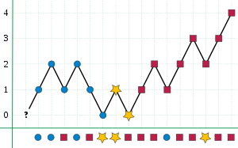

## 169. [Majority element](https://leetcode.com/problems/majority-element/)

### O(n log n)

```js
if(nums.length < 3) return nums[0]
nums.sort((a,b)=>a-b);
return nums[Math.floor((nums.length)/2)]
```

### O(n) space and O(n) time

```js
let hm = {}
let max = -1;
let i = 0;

for(n of nums){
    hm[n] = hm[n]+1 || 1
}

Object.entries(hm).forEach(k => {
    if(k[1] > max){
        max = k[1]
        i = k[0]
    }
})

return i;
```

### O(1) space and O(n) time, [Boyer-Moore majority voting](https://en.wikipedia.org/wiki/Boyer%E2%80%93Moore_majority_vote_algorithm)



```js
let candidate;
let count = 0;
for (const num of nums) {
    if (count === 0) {
        candidate = num;
    }

    count += (num === candidate) ? 1 : -1
}

return candidate;
```
