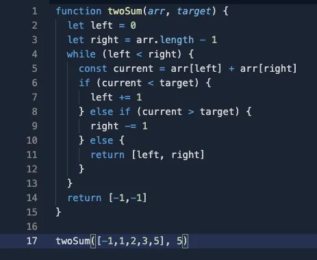

## 1. [Two Sum](https://leetcode.com/problems/two-sum/)

### O(n)


- javascript

```javascript
var twoSum = function (nums, target) {
    const map = {};
    for (let i = 0; i < nums.length; i++) {
        const current = nums[i];
        const complement = target - current;
        if (complement in map) {
            return [i, map[complement]];
        } else {
            map[current] = i;
        }
    }
};
```

- for sorted array use this [[two pointers]] approach, DO NOT SORT IF NOT ALREADY SORTED!




- python (naive)

```python
class Solution(object):
    def twoSum(self, nums, target):
        """
        :type nums: List[int]
        :type target: int
        :rtype: List[int]
        """
        for i in range(len(nums)):
            for j in range(len(nums)):
                if nums[i] + nums[j] == target and i !=j:
                    return [i, j]
```


[//begin]: # "Autogenerated link references for markdown compatibility"
[two pointers]: <../../../../patterns/two pointers> "two pointers"
[//end]: # "Autogenerated link references"