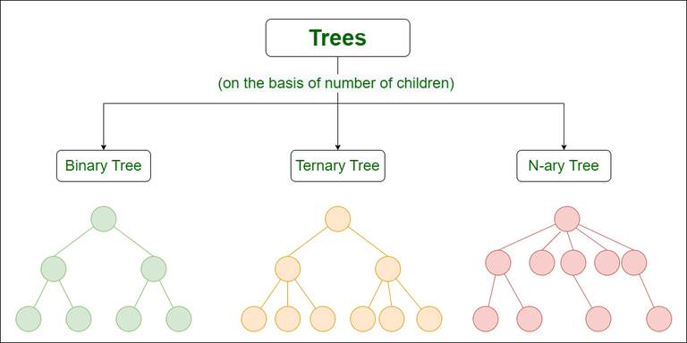
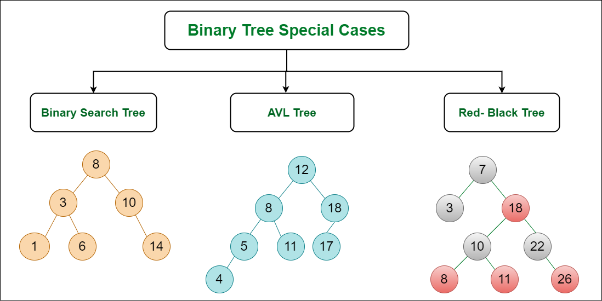

There are many types of trees in data structures, each with specific properties and use cases. Here's a breakdown of some common ones:

## Basic Classifications:

### General Tree (N-ary Tree): The most general form, where a node can have any number of children. Not very common in practice due to complexities in balancing and searching.

### Binary Tree: Each node can have at most two children, typically referred to as "left" and "right." This is a fundamental structure for many other tree types.

## Ordered Trees:

### Binary Search Tree (BST): A binary tree where each node has a value greater than all its left children and less than all its right children. This allows for efficient searching (average logarithmic time complexity).

### AVL Tree: A self-balancing BST that ensures the height difference between subtrees is always bounded, guaranteeing efficient searching and insertion operations.

### Red-Black Tree: Another self-balancing BST with similar properties to AVL trees, but with slightly different balancing rules.

## Other Specialized Trees:

### B-Tree: A balanced tree designed for efficient storage and retrieval of data on disk. Commonly used in databases for indexing large datasets.

### B+ Tree: Similar to B-Trees, but data is stored only in leaves, allowing for better space utilization and efficient range queries.

### Trie: A specialized tree for storing prefixes. Useful for applications like autocomplete or spell checking.

### Segment Tree: A tree used to store information about intervals or segments on a line. Efficient for performing range queries on the data.

### [[heap aka priority queue]]: A tree-based structure where the root node has a specific property (e.g., largest or smallest value). Used for priority queues and implementing efficient sorting algorithms.

## Choosing the Right Tree:

The appropriate tree type depends on your specific needs. Here are some factors to consider:

- Ordering: Do you need the elements sorted (like in BST) or not?
- Search/Insertion frequency: How often will you be searching or inserting elements?
- Balance: Is self-balancing important for maintaining efficient operations?
- Data size and storage: Are you dealing with large datasets that need efficient storage and retrieval (like B-Trees)?

[//begin]: # "Autogenerated link references for markdown compatibility"
[heap aka priority queue]: <heap aka priority queue> "heap aka priority queue"
[//end]: # "Autogenerated link references"