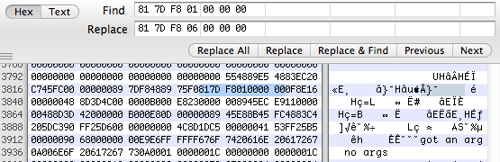
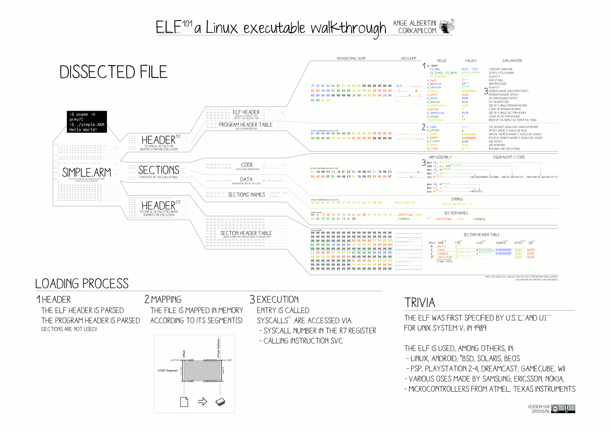

https://danluu.com/edit-binary/

Editing binaries is a trick that comes in handy a few times a year. You don't often need to, but when you do, there's no alternative. When I mention patching binaries, I get one of two reactions: complete shock or no reaction at all. As far as I can tell, this is because most people have one of these two models of the world:

There exists source code. Compilers do something to source code to make it runnable. If you change the source code, different things happen.

There exists a processor. The processor takes some bits and decodes them to make things happen. If you change the bits, different things happen.

If you have the first view, breaking out a hex editor to modify a program is the action of a deranged lunatic. If you have the second view, editing binaries is the most natural thing in the world. Why wouldn't you just edit the binary? It's often the easiest way to get what you need.

For instance, you're forced to do this all the time if you use a non-Intel non-AMD x86 processor. Instead of checking CPUID feature flags, programs will check the CPUID family, model, and stepping to determine features, which results in incorrect behavior on non-standard CPUs. Sometimes you have to do an edit to get the program to use the latest SSE instructions and sometimes you have to do an edit to get the program to run at all. You can try filing a bug, but it's much easier to just edit your binaries.

Even if you're running on a mainstream Intel CPU, these tricks are useful when you run into bugs in closed sourced software. And then there are emergencies.

The other day, a DevOps friend of mine at a mid-sized startup told me about the time they released an internal alpha build externally, which caused their auto-update mechanism to replace everyone's working binary with a buggy experimental version. It only took a minute to figure out what happened. Updates gradually roll out to all users over a couple days, which meant that the bad version had only spread to 1 / (60*24*2) = 0.03% of all users. But they couldn't push the old version into the auto-updater because the client only accepts updates from higher numbered versions. They had to go through the entire build and release process (an hour long endeavor) just to release a version that was identical to their last good version. If it had occurred to anyone to edit the binary to increment the version number, they could have pushed out a good update in a minute instead of an hour, which would have kept the issue from spreading to more than 0.06% of their users, instead of sending 2% of their users a broken update1.

This isn't nearly as hard as it sounds. Let's try an example. If you're going to do this sort of thing regularly, you probably want to use a real disassembler like IDA2. But, you can get by with simple tools if you only need to do this every once in a while. I happen to be on a Mac that I don't use for development, so I'm going to use lldb for disassembly and HexFiend to edit this example. Gdb, otool, and objdump also work fine for quick and dirty disassembly.

Here's a toy code snippet, wat-arg.c, that should be easy to binary edit:

```
#include <stdio.h>

int main(int argc, char **argv) {
  if (argc > 1) {
    printf("got an arg\n");
  } else {
    printf("no args\n");
  }
}

```

If we compile this and then launch lldb on the binary and step into main, we can see the following machine code:

```
$ lldb wat-arg
(lldb) breakpoint set -n main
Breakpoint 1: where = original`main, address = 0x0000000100000ee0
(lldb) run
(lldb) disas -b -p -c 20
;  address       hex opcode            disassembly
-> 0x100000ee0:  55                    pushq  %rbp
   0x100000ee1:  48 89 e5              movq   %rsp, %rbp
   0x100000ee4:  48 83 ec 20           subq   $32, %rsp
   0x100000ee8:  c7 45 fc 00 00 00 00  movl   $0, -4(%rbp)
   0x100000eef:  89 7d f8              movl   %edi, -8(%rbp)
   0x100000ef2:  48 89 75 f0           movq   %rsi, -16(%rbp)
   0x100000ef6:  81 7d f8 01 00 00 00  cmpl   $1, -8(%rbp)
   0x100000efd:  0f 8e 16 00 00 00     jle    0x100000f19               ; main + 57
   0x100000f03:  48 8d 3d 4c 00 00 00  leaq   76(%rip), %rdi            ; "got an arg\n"
   0x100000f0a:  b0 00                 movb   $0, %al
   0x100000f0c:  e8 23 00 00 00        callq  0x100000f34               ; symbol stub for: printf
   0x100000f11:  89 45 ec              movl   %eax, -20(%rbp)
   0x100000f14:  e9 11 00 00 00        jmpq   0x100000f2a               ; main + 74
   0x100000f19:  48 8d 3d 42 00 00 00  leaq   66(%rip), %rdi            ; "no args\n"
   0x100000f20:  b0 00                 movb   $0, %al
   0x100000f22:  e8 0d 00 00 00        callq  0x100000f34               ; symbol stub for: printf
```


As expected, we load a value, compare it to 1 with cmpl $1, -8(%rbp), and then print got an arg or no args depending on which way we jump as a result of the compare.

```
$ ./wat-arg
no args
$ ./wat-arg 1
got an arg
```
If we open up a hex editor and change 81 7d f8 01 00 00 00; cmpl 1, -8(%rbp) to 81 7d f8 06 00 00 00; cmpl 6, -8(%rbp), that should cause the program to check for 6 args instead of 1




```
$ ./wat-arg
no args
$ ./wat-arg 1
no args
$ ./wat-arg 1 2
no args
$ ./wat-arg 1 2 3 4 5 6 7 8
got an arg

```


Simple! If you do this a bit more, you'll soon get in the habit of patching in 903 to overwrite things with NOPs. For example, if we replace 0f 8e 16 00 00 00; jle and e9 11 00 00 00; jmpq with 90, we get the following:


```

   0x100000ee1:  48 89 e5              movq   %rsp, %rbp
   0x100000ee4:  48 83 ec 20           subq   $32, %rsp
   0x100000ee8:  c7 45 fc 00 00 00 00  movl   $0, -4(%rbp)
   0x100000eef:  89 7d f8              movl   %edi, -8(%rbp)
   0x100000ef2:  48 89 75 f0           movq   %rsi, -16(%rbp)
   0x100000ef6:  81 7d f8 01 00 00 00  cmpl   $1, -8(%rbp)
   0x100000efd:  90                    nop
   0x100000efe:  90                    nop
   0x100000eff:  90                    nop
   0x100000f00:  90                    nop
   0x100000f01:  90                    nop
   0x100000f02:  90                    nop
   0x100000f03:  48 8d 3d 4c 00 00 00  leaq   76(%rip), %rdi            ; "got an arg\n"
   0x100000f0a:  b0 00                 movb   $0, %al
   0x100000f0c:  e8 23 00 00 00        callq  0x100000f34               ; symbol stub for: printf
   0x100000f11:  89 45 ec              movl   %eax, -20(%rbp)
   0x100000f14:  90                    nop
   0x100000f15:  90                    nop
   0x100000f16:  90                    nop
   0x100000f17:  90                    nop
   0x100000f18:  90                    nop
   0x100000f19:  48 8d 3d 42 00 00 00  leaq   66(%rip), %rdi            ; "no args\n"
   0x100000f20:  b0 00                 movb   $0, %al
   0x100000f22:  e8 0d 00 00 00        callq  0x100000f34               ; symbol stub for: printf
```


Note that since we replaced a couple of multi-byte instructions with single byte instructions, the program now has more total instructions.


```

$ ./wat-arg
got an arg
no args


```


Other common tricks include patching in cc to redirect to an interrupt handler, db to cause a debug breakpoint, knowing which bit to change to flip the polarity of a compare or jump, etc. These things are all detailed in the Intel [architecture manuals](http://www.intel.com/content/www/us/en/processors/architectures-software-developer-manuals.html), but the easiest way to learn these is to develop the muscle memory for them one at a time.

Have fun!

see also: 

- https://github.com/radareorg/radare2
- [A ToC of the 20 part linker essay](https://lwn.net/Articles/276782/)
- [How to read an executable](https://jvns.ca/blog/2014/09/06/how-to-read-an-executable/)
- 
