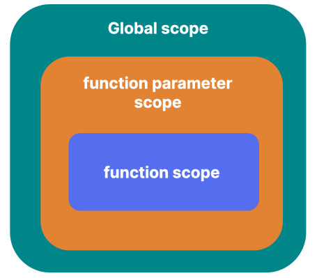

- [Scope](#scope)
  - [Lexical scope](#lexical-scope)
  - [Avoid polluting the global scope](#avoid-polluting-the-global-scope)
  - [Implicit globals](#implicit-globals)
  - [HTML attributes](#html-attributes)
  - [Shadowing declarations](#shadowing-declarations)
  - [Function (parameter) scope](#function-parameter-scope)
  - [Function expression name scope](#function-expression-name-scope)
  - [Block Scope](#block-scope)
  - [Module Scope](#module-scope)
  - [Scope Chain](#scope-chain)


## Scope

- scope of an identifier (variable, function, etc.) =  parts of the program where it can be accessed.

- Modern JavaScript has four main types of scopes that are mentioned below:
  - Global scope
  - Function scope
  - Block scope
  - Module scope

### Lexical scope	

 - determined at compile time
 - before the step-by-step execution
 - scopes can be nested within other scopes, with each nested scope having access to the outer or parent scope.
 - Lexical scope is also known as "static" scope. An alternative type of scope is Dynamic scope[³⁶](https://en.wikipedia.org/wiki/Scope_(computer_science)#Lexical_scope_vs._dynamic_scope).
 - In JavaScript, the global scope is the browser window or, more accurately, a browser window tab. exposed to the JavaScript code using the `window` object.

  ```javascript
  var todoList = ["grocery", "exercise", "meeting"];

  function emptyTodoList() {
    todoList = [];
  }

  console.log(window.hasOwnProperty("todoList")); 
  // true
  console.log(window.hasOwnProperty("emptyTodoList")); 
  // true
  ```

  ```javascript
  const todoList = ["grocery", "exercise", "meeting"];

  let emptyTodoList = function () {
    todoList = [];
  };

  console.log(window.hasOwnProperty("todoList")); 
  // false
  console.log(window.hasOwnProperty("emptyTodoList")); 
  // false
  ```

### Avoid polluting the global scope	

### Implicit globals	

- not in strict mode
- _Whenever there is an assignment to an undeclared variable, JavaScript will declare that undeclared variable as a global variable_. 
- This is most likely a mistake by the programmer, and instead of throwing an error, javaScript hides this by automatically declaring a global variable by the same name.

```javascript
function printSquare(num) {
  result = num * num;
  console.log(result);
}

printSquare(9);

console.log("implicit global "+ result)
```

- In strict mode, as expected, JavaScript throws an error


### HTML attributes

- there is another way we get implicit global variables

- value of the `id` attribute or the `name` attribute of HTML elements also gets added as a variable in the global scope of JavaScript.

```html
<h1 id="mainHeading">Hello World!</h1>
```

- Although this is supported by most browsers, this feature shouldn’t be relied upon, and we should always use standard mechanisms to target HTML elements because it can result in code that is hard to read and maintain

### Shadowing declarations

- is possible at all levels

### Function (parameter) scope	

- It is a common misconception that the function parameters are defined in the function’s local scope or that the parameters behave as if they are defined in the function’s local scope, but that is not always true.
- differentiate between "simple" and "non-simple" parameter lists
ES2015+ features like Default parameters⁴⁰, Destructuring⁴¹, or Rest parameters⁴², = ___non-simple parameters___
- If the parameters are simple, they behave like they are declared in the function’s local scope 
- non-simple, they are declared in their own scope.
- Non-simple parameter scope can be thought of as between the function scope and the scope containing the function
- 


```js
function paramScope(arr=["initial array"], buff=()=>arr) {
var arr = [1, 2, 3];
console.log(arr); // [1, 2, 3]
console.log(buff()); // ["initial array"]
}

paramScope();
```

- remove `var`, scopes collapse 

```js 

function paramScope(arr=["initial array"], buff=()=> arr) {
  arr = [1, 2, 3];
  console.log(arr); // [1, 2, 3]
  console.log(buff()); // [1, 2, 3]
}

paramScope();
```

### Function expression name scope	

```
let fn = function namedFn() {
  // code ...
};
```

- In the code example above, the name of the function expression `namedFn` is only accessible inside the function body. 

- As a result, some might incorrectly believe that the name of a named function expression is declared inside the function body, but that is not correct; the name is declared in a different scope. The following code proves this claim:

```
let fn = function namedFn() {
  let namedFn = 123;
  console.log(namedFn); // 123
};
```

- The `nameFn` inside the function body is actually shadowing the name of the function expression.

### Block Scope	

- scope that exists between blocks of code, such as if blocks or loops.

- Prior to the addition of block-scoped `let` and `const` in the JavaScript language, variables defined with the `var` keyword in a block were accessible outside that block. 

- This is because the variables declared with the `var` keyword have function scope.


### Module Scope	

### Scope Chain	

- Different scopes can be nested inside other scopes, creating a chain of scopes. This is known as a scope chain.

- process of traversing the scope chain will continue until the global scope is reached and there are no other scopes to look into for the declaration

- 

