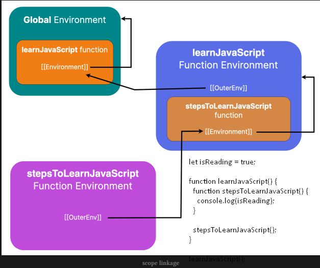

- [Closures](#closures)
  - [What is a closure?](#what-is-a-closure)
  - [How do closures work?](#how-do-closures-work)
  - [How are different scopes linked?](#how-are-different-scopes-linked)
  - [What causes this problem?](#what-causes-this-problem)
  - [How to resolve this problem?](#how-to-resolve-this-problem)
  - [emulating private methods with closures](#emulating-private-methods-with-closures)


## Closures

### What is a closure?

- ___closure: a function along with a reference to the environment in which it is created.___

- Closures allow a nested function to access the declarations inside the containing functio

### How do closures work?

- once again briefly go over how the [lexical scope](05-scope#lexical-scope) is resolved.

### How are different scopes linked?

- At this point, we know how the scope is resolved, and the different scopes are linked together, forming a chain that is known as the [__"scope chain."__](05-scope#scope-chain) But have you wondered how different scopes are linked?

- The answer is the hidden internal slot named `[[Environment]]`⁸⁰.

- This `[[Environment]]` internal slot exists on the functions, and it contains a reference to the outer scope/environment. 

- In other words, this internal slot contains a reference to the scope on which the containing function has closed over or formed a "closure"

- > There are many hidden internal slots⁸¹ mentioned in the ECMAScript specification. The specification uses these hidden internal slots to define the required behavior. These hidden internal slots, just like abstract operations, may or may not be actual things that are implemented by the different JavaScript engines.

- 

- When the inner function is invoked, the value of the `[[Environment]]` slot of the inner function is saved in the `[[OuterEnv]]` internal slot of the environment created for the execution of the inner function.

- Each time a function is created, javascript saves the reference to the surrounding environment of the function in the internal `[[Environment]]` slot on the function object


### What causes this problem?

- infamous '__closures in loop__' problem

```js 

for (var i = 1; i <= 3; i++) {
  setTimeout(() => {
    console.log(i);
  }, 1000);
}

// 4 4 4
```


- ___the callback function of each setTimeout forms a closure over the same variable `i`___
  - callback function of each `setTimeout` call is invoked ___after___ the loop execution has completed value of variable i after the last iteration of the loop is "`4`"
  - and because each callback function of the `setTimeout` has a closure over the same variable `i`, all three of them see `4` as the value of the `i`


### How to resolve this problem?


```js 

for (let i = 1; i <= 3; i++) {
  setTimeout(() => {
    console.log(i);
  }, 1000);
}

// 1 2 3
```

```js 

for (var i = 1; i <= 3; i++) {
  ((counter)=>{
    setTimeout(() => {
      console.log(i);
    }, 1000);
  })(i)
}

// 1 2 3 
```

### emulating private methods with closures 

- it is now possible to have private fields and methods⁸⁴ in JavaScript. However, before these changes were introduced in the language, closures were the go-to option for hiding data from public access. 

- In object-oriented programming terminology, this is referred to as `data hiding` and `encapsulation`.

- we can have private variables and methods using closures

- The code inside the IIFE is executed, and an object is returned from the IIFE that is assigned to the variable. 

- The object returned only contains the data that needs to be accessible from outside the IIFE. 

- The code that is meant to be private is not returned; as a result, that data remains private, limited to the boundary walls of the IIFE. 

- However, thanks to closures, publicly exposed data that is returned from the IIFE can still access the private data inside the IIFE.
