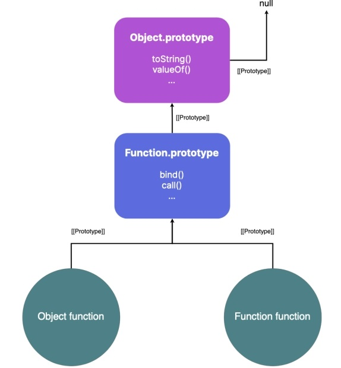

- [Prototypes](#prototypes)
- [How are objects linked?	Prototypes](#how-are-objects-linkedprototypes)
- [The `prototype` property](#the-prototype-property)
- [Getting prototype of any object](#getting-prototype-of-any-object)
- [`Object.prototype` - parent of all objects](#objectprototype---parent-of-all-objects)
- [`Function` function](#function-function)
- [Problems with `__proto__`](#problems-with-__proto__)
- [`Object.create` method](#objectcreate-method)
- [`Null` prototype object](#null-prototype-object)
- [ES2015 classes](#es2015-classes)

### Prototypes 

- Inheritance reduces code duplication and promotes code sharing between
different objects.

- the __prototype chain__ - Think of the scope chain, where each scope is linked to another scope until we reach the global scope. 

- The prototype chain is similar: one object is linked to another object. 

- This other object, in turn, is linked to another object, forming a chain between objects.

- __prototypal inheritance__ When we create an object literal in JavaScript, it is, by default, linked to the built-in `Object.prototype` object

### How are objects linked?	Prototypes

- Objects in JavaScript have a hidden internal slot named `[[Prototype]]` 

- linked to another object by saving a reference to the other object in the `[[Prototype]]` internal slot of the newly created object 

- `obj.[[Prototype]]` gives us the prototype of the obj object

- But as `[[Prototype]]` is an internal slot not accessible by JavaScript


### The `prototype` property

### Getting prototype of any object

- `.getPrototypeOf()`

### `Object.prototype` - parent of all objects

- At the top of the prototypal inheritance hierarchy is the `Object.prototype` object. It is the root object or parent of all objects

```js 
  console.log(Object.getPrototypeOf(obj) === Object.prototype); 
  //true 
  
  console.log(obj.toString()); 
  // [object Object]
  ``` 

- As discussed in the previous lesson, functions have a prototype property that points to an object that serves as the prototype of all instances of that function when that function is invoked as a "constructor". 

- So, the `Object.prototype` object serves as the "prototype" of all objects created via new `Object()` or through object literal notation.


### `Function` function

- there’s a function named Function⁸⁸. 

- Functions in JavaScript are objects and are instances of this "Function" constructor function. 

- `Function.prototype` object provides properties that are accessible by all functions; for example, methods like `bind`, `call`, `apply`, etc. 

- 

- The `__proto__` property is defined on the `Object.prototype` object. It is a getter and a setter that returns or sets the prototype of an object

-  it returns or sets the value of the internal `[[Prototype]]` property of an object.

- ___its use is discouraged___  property has been deprecated, and better alternatives have been provided (`setPrototypeOf`)

### Problems with `__proto__`

- deprecated

- not available for all objects

- not available for custom objects 

### `Object.create` method

- used to create a new object with another object, passed as the first argument, as the prototype of the newly created object.

- lets us explicitly set the prototype of an object

### `Null` prototype object	

- All objects ultimately inherit from the Object.prototype object because it sits at the top of the prototype chain and is the parent of all objects. 

- However, we can create objects that do not inherit properties from any object. 

- We just have to set null as the value of the internal [[Prototype]] property using the methods discussed above.

```js
const obj = Object.create(null);
console.log(obj.toString());
// Error: toString not defined
``` 

- The null prototype objects may seem useless, but they are useful in some cases. 
- For example, such objects are safe from attacks such as the __prototype pollution__ attack, where a malicious code might add some properties to the prototype chain of an object that could change the normal flow of code execution.

```js 
Object.prototype.isAdmin = true;
```

### ES2015 classes


-  Extending a class creates a parent-child relationship where the child class extends the parent class. It promotes code reusability.

- Until 2015, JavaScript didn’t have classes. Constructor functions were used instead. To inherit from a constructor function

-  JavaScript developers explicitly created a link between the prototype properties of two different constructor functions by using the `Object.create` method

-  it is error-prone because there are multiple steps to set a prototype link correctly between the two constructors.   


- As of 2015, JavaScript has classes. They provide a declarative way of writing code that is less error-prone. 

- Classes come with the `extends` keyword that helps create a parent-child relationship between classes