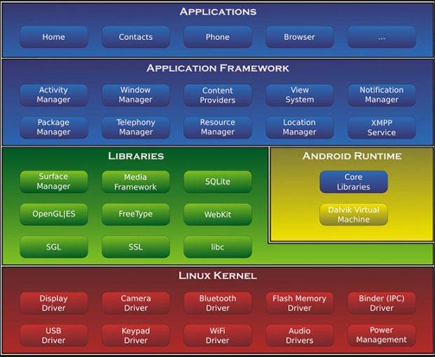
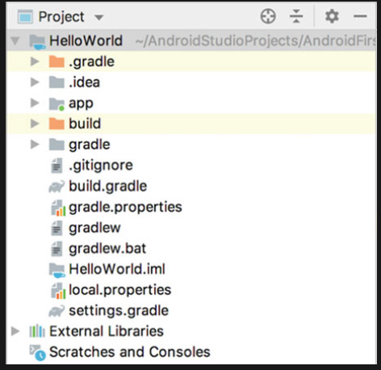
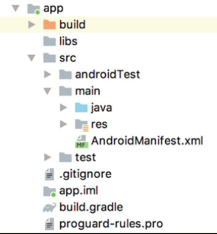
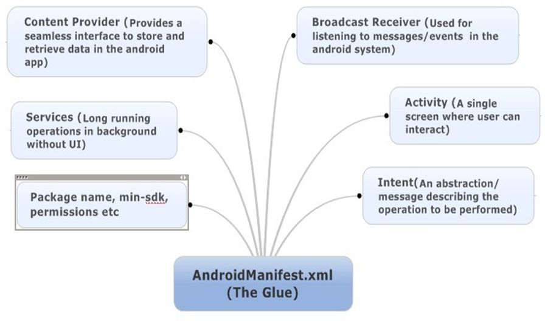

# Chapter 1: Your First Line of Android Code

1.1 Android: An Overview
1.1.1 Android System Architecture


1.1.2 Released Versions
1.1.3 What´s Special for Android Development?

1.2 Set Up Development Environment Step by Step
1.2.1 Prerequisite Tools
1.2.2 Set Up the Environment

1.3 Creating Your First Android Project
1.3.1 Creating HelloWorld Project
1.3.2 Starting Emulator
1.3.3 Running HelloWorld
1.3.4 Analyzing Your First Android Project



## AndroidManifest.xml 



1.3.5 Resources in a Project
1.3.6 File of build.gradle

Unlike Eclipse, Android Studio uses Gradle to build the project. Gradle is an advanced tool to build the project which uses a DSL (Domain Specific Language) based on Groovy to configure the project and avoids the complicated configuration with XML-based tools like Ant and Maven.

From Sect. 1.3.4, we can see that there are two build.gradle files in HelloWorld project. One is at the outer layer and another one is under the app directory. These two files are instrumental to build the Android Studio projects and let us take a deep dive into these two files.

#### First look at the build.gradle file at the outer layer as shown below:


```
/* outer layer build.gradle */

buildscript {
    ext.kotlin_version = '1.3.61'
    repositories {
        google()
        jcenter()
    }
    dependencies {
        classpath 'com.android.tools.build:gradle:3.5.2'
        classpath "org.jetbrains.kotlin:kotlin-gradle-plugin:$
        kotlin_version"
    }
}
    allprojects {
        repositories {
            google()
            jcenter()
        }
}
```

First, the two repository closures all use google() and jcenter() methods. These two methods are used to specify the code repository that this project is going to use.

The google repo is Google’s Maven repo and jcenter is the repo mainly for thirdparty open sources libs. With these two methods, we can easily use any libs in the google and jcenter repo.

Next, in the dependencies closure, classpath specifies Gradle plugin and Kotlin plugin. Why need to specify Gradle plugin? This is because Gradle wasn’t specifically created for building Android projects but for other types of projects written in Java, C++, etc. If we want to use it to build the Android project, we need to specify in Gradle to use com.android.tools.build:gradle:3.5.2 plugin. The series number at the end is the plugin version number and should be the same as the current Android Studio version number. The Kotlin plugin just means that the current project is written with Kotlin. If you use Java to develop Android project, then there is no need to use this plugin. When I wrote this book the latest version of Kotlin plugin was 1.3.61.

#### Next, let us look at the build.gradle under the app directory, code should be the same as follows:


```
apply plugin: 'com.android.application'

/*  
The first line applies a plugin which has two values to choose from: com.android.application means this is an application module; com.android.library means this is a lib module. application module can run independently while lib module will need to be loaded in other apps so that it can run
*/

apply plugin: 'kotlin-android'
// If you want to use Kotlin to develop Android app, then you must add this

apply plugin: 'kotlin-android-extensions'
//  some useful extensions of Kotlin which you will
find out in later chapters.


android {
    compileSdkVersion 29
    buildToolsVersion "29.0.2"

    defaultConfig {
        applicationId "com.example.helloworld"
        minSdkVersion 21
        targetSdkVersion 29
        versionCode 1
        versionName "1.0"
        testInstrumentationRunner "androidx.test.runner.
        AndroidJUnitRunner"
    }

    buildTypes {
        release {
            minifyEnabled false
            proguardFiles getDefaultProguardFile('proguard-androidoptimize.txt'), 'proguard-rules.pro'
        }
    }
}

dependencies {
/* There are three types of dependency: local binary dependency, local library module dependency, and remote binary dependency. Local binary dependency can add dependency to local jars or directories; local library dependency can be used to add dependency to local lib modules; remote dependency can be used to add dependency to the open-source projects in jcenter.    
*/

    implementation fileTree(dir: 'libs', include: ['*.jar'])
    implementation"org.jetbrains.kotlin:kotlin-stdlib-jdk7:$
    kotlin_version"
    implementation 'androidx.appcompat:appcompat:1.1.0'
    implementation 'androidx.core:core-ktx:1.1.0'
    implementation 'androidx.constraintlayout:
    constraintlayout:1.1.3'
    testImplementation 'junit:junit:4.12'
    androidTestImplementation 'androidx.test.ext:junit:1.1.1'
    androidTestImplementation 'androidx.test.espresso:espressocore:3.2.0'
}
```

1.4 Mastering the Use of Logging Tools
1.4.1 Using Android Log Tool
The log class in Android is Log(android.util.Log) which provides the following 5 methods to print logs in the console. Here the verbosity is in descending order for these methods.

- `Log.v()`: used for the least meaningful information with the highest level of verbosity.

- `Log.d()`: used for the debugging information which should help you debug the app and investigate issues.

- `Log.i()`: used for important information like data that can help analyze the user behavior.

- `Log.w()`: used to print some warnings which means there is potential risks and need some attention to investigate into the issue.

- `Log.e()`: used to print error information such as the error info in the catch statement. When there are error info logs, it usually means your app has some serious issue that needs to get fixed immediately. This should have the least verbosity.

1.4.2 Log Vs Println()

# Chapter 2: Explore New Language: A Quick Introduction to [[kotlin]]


# Chapter 3: Start with the Visible: Explore Activity

3.1 What Is Activity?

3.2 Activity Fundamentals
3.2.1 Manually Creating Activity
3.2.2 Creating and Mounting the Layout
3.2.3 Registering in AndroidManifest File
3.2.4 Using Toast in Activity
3.2.5 Using Menu in Activity
3.2.6 Destroying an Activity

3.3 Using Intent to Communicate Between Activities
3.3.1 Explicit Intent
3.3.2 Implicit Intent
3.3.3 More on Implicit Intent
3.3.4 Passing Data to the Next Activity
3.3.5 Return Data to the Last Activity

3.4 Activity Lifecycle
3.4.1 Back Stack
3.4.2 Activity States
3.4.3 Activity Lifecycle


3.4.4 Explore the Lifecycle of Activity
3.4.5 Recycling Activity

3.5 Launch Mode of Activity
3.5.1 Standard
3.5.2 singleTop
3.5.3 singleTask
3.5.4 singleInstance

3.6 Activity Best Practices
3.6.1 Identifying the Current Activity
3.6.2 Exiting the App from Anywhere
3.6.3 Best Practice to Start Activity

3.7 Kotlin Class: Standard Functions and Static Methods
3.7.1 Standard Functions: with, run, and apply
3.7.2 Define Static Methods

# Chapter 4: Everything About UI Development

4.1 How to Create UI?

4.2 Common UI Widgets
4.2.1 TextView
4.2.2 Button
4.2.3 EditText
4.2.4 ImageView
4.2.5 ProgressBar
4.2.6 AlertDialog

4.3 Three Basic Layouts
4.3.1 LinearLayout
4.3.2 RelativeLayout
4.3.3 FrameLayout
4.4 Customize the Widgets

4.4.1 Include Layout
4.4.2 Create Customized Widgets

4.5 ListView
4.5.1 Simple Demonstration of ListView
4.5.2 Customize ListView UI
4.5.3 Optimize the Efficiency of ListView
4.5.4 Click Event in ListView

4.6 RecyclerView
4.6.1 Basics About RecyclerView
4.6.2 Scroll Horizontally and Waterfall Flow Layout
4.6.3 RecyclerView Click Event

4.7 Best Practice to Build UI
4.7.1 Create 9-Patch Image
4.7.2 Build Beautiful Chat User Interface

4.8 Kotlin Class: Lateinit and Sealed Cass
4.8.1 Lateinit Variables
4.8.2 Optimization with Sealed Class

4.9 Summary and Comment

# Chapter 5: Support Phones and Tablets with Fragment

5.1 What Is Fragment?

5.2 How to Use Fragment
5.2.1 Basic Use of Fragment
5.2.2 Add Fragment Dynamically
5.2.3 Back Stack for Fragment
5.2.4 Interaction Between Fragment and Activity

5.3 Lifecycle of Fragment
5.3.1 Fragment State and Callbacks
5.3.2 Experiment with Fragment Lifecycle

5.4 Dynamically Load Layout
5.4.1 Use Qualifier
5.4.2 Use Smallest-Width Qualifier

5.5 Fragment Best Practice: A Basic News App

5.6 Kotlin Class: Extension Function and Operator Overloading
5.6.1 Extension Function
5.6.2 Operator Overloading

5.7 Summary and Comment

# Chapter 6: Broadcasts in Details

6.1 Introduction to Broadcast Mechanism

6.2 Receive System Broadcast
6.2.1 Dynamically Register BroadcastReceiver for Time Change
6.2.2 Open App After Booting with Static Receiver

6.3 Send Customized Broadcast
6.3.1 Send Normal Broadcast
6.3.2 Send Ordered Broadcast

6.4 Best Practice of Broadcast: Force Logout

6.5 Kotlin Class: Higher-Order Function
6.5.1 Define Higher-Order Function
6.5.2 Inline Functions
6.5.3 Noinline and Crossinline

6.6 Git Time: The First Look of Version Control Tools
6.6.1 Git Installation
6.6.2 Create Code Repository
6.6.3 Commit Local Code

6.7 Summary and Comment

# Chapter 7: Data Persistence

7.1 Introduction to Data Persistence

7.2 Persisting Through File
7.2.1 Persisting Data in File
7.2.2 Read Data from File

7.3 SharedPreferences
7.3.1 Save Data in SharedPreferences
7.3.2 Read Data from SharedPreferences
7.3.3 Implement Remembering Password

7.4 SQLite Database
7.4.1 Create Database
7.4.2 Upgrade Database
7.4.3 Add Data
7.4.4 Update Data
7.4.5 Delete Data
7.4.6 Query Data
7.4.7 Use SQL

7.5 SQLite Database Best Practice

7.5.1 Transaction
7.5.2 Best Practice to Upgrade Database

7.6 Kotlin Class: Application of Higher-Order Function
7.6.1 Simplify Use of SharedPreferences
7.6.2 Simplify Use of ContentValues

7.7 Summary and Comment

# Chapter 8: Share Data Between Apps with ContentProvider

8.1 Introduction to ContentProvider

8.2 Runtime Permissions
8.2.1 Android Runtime Permissions in Depth
8.2.2 Request Permission at Runtime

8.3 Access Data in Other Apps
8.3.1 Basic Use of ContentResolver
8.3.2 Read System Contact

8.4 Create Your Own ContentProvider
8.4.1 Create ContentProvider
8.4.2 Share Data Between Apps

8.5 Kotlin Class: Generics and Delegate
8.5.1 Basic Use of Generics
8.5.2 Class Delegation and Delegated Properties
8.5.3 Implement Lazy Function

8.6 Summary and Comment

# Chapter 9: Enrich Your App with Multimedia

9.1 Run Application on Phone

9.2 Notification
9.2.1 Create Notification Channel
9.2.2 Basic Use of Notification
9.2.3 Advanced Topics in Notification

9.3 Camera and Album
9.3.1 Take Photos with Camera
9.3.2 Select Images from Album

9.4 Play Multi-Media Files
9.4.1 Play Audio
9.4.2 Play Video

9.5 Kotlin Class: Use Infix to Improve Readability

9.6 Git Time: Advanced Topics in Version Control
9.6.1 Ignore Files
9.6.2 Inspect Modified Content
9.6.3 Revert the Uncommitted Changes 448
9.6.4 Check Commit History

9.7 Summary and Comment

# Chapter 10: Work on the Background Service

10.1 What Is Service?

10.2 Android Multithreading
10.2.1 Basic Use of Thread
10.2.2 Update UI in Worker Thread
10.2.3 Async Message Handling Mechanism
10.2.4 Use AsyncTask

10.3 Basic Use of Service
10.3.1 Define a Service
10.3.2 Start and Stop Service
10.3.3 Communication Between Activity and Service

10.4 Service Life Cycle
10.5 More Techniques on Service
10.5.1 Use Foreground Service
10.5.2 Use IntentService

10.6 Kotlin Class: Advanced Topics in Generics
10.6.1 Reify Generic Types
10.6.2 Application of Reified Type in Android
10.6.3 Covariance and Contravariance
10.6.4 Contravariance

10.7 Summary and Comment

# Chapter 11: Exploring New World with Network Technologies

11.1 WebView

11.2 Use HTTP to Access Network
11.2.1 Use HttpURLConnection
11.2.2 Use OkHttp

11.3 Parse XML Data
11.3.1 Pull Parser
11.3.2 SAX Parser

11.4 Parse JSON Data
11.4.1 JSONObject
11.4.2 GSON

11.5 Implementing Network Callback

11.6 The Best Network Lib: Retrofit
11.6.1 Basic Use of Retrofit
11.6.2 Process Complex Interface Address
11.6.3 Best Practice for Retrofit Builder

11.7 Kotlin Class: Use Coroutine for Performant Concurrent App
11.7.1 Basic Use of Coroutine
11.7.2 More on Coroutine Scope Builder
11.7.3 Simplifying Callback with Coroutine

11.8 Summary and Comment


# Chapter 12: Best UI Experience: Material Design in Action

12.1 What Is Material Design?

12.2 Toolbar

12.3 Navigation Drawer
12.3.1 DrawerLayout
12.3.2 NavigationView

12.4 FloatingActionButton and Snackbar
12.4.1 FloatingActionButton
12.4.2 Snackbar
12.4.3 CoordinatorLayout

12.5 CardView Layout
12.5.1 MaterialCardView
12.5.2 AppBarLayout

12.6 Pull to Refresh

12.7 Collapsible Toolbar
12.7.1 CollapsingToolbarLayout
12.7.2 Optimizing Using of System Status Bar

12.8 Kotlin Class: Creating Utils
12.8.1 Find Max and Min in N Numbers
12.8.2 Simplifying Use of Toast
12.8.3 Simplifying Use of Snackbar

12.9 Git Time: Advanced Topics in Version Control
12.9.1 Branch
12.9.2 Work with Remote Repo

12.10 Summary and Comment

# Chapter 13: High-Quality Developing Components: Exploring Jetpack

13.1 Introduction to Jetpack

13.2 ViewModel
13.2.1 ViewModel Basics
13.2.2 Pass Param to ViewModel

13.3 Lifecycles

13.4 LiveData
13.4.1 LiveData Basics
13.4.2 map and switchMap

13.5 Room
13.5.1 Use Room to CRUD
13.5.2 Room Database Upgrade

13.6 WorkManager
13.6.1 WorkManager Basics
13.6.2 Handling Complex Task with WorkManager

13.7 Kotlin Class: Use DSL to Construct Specific Syntax

13.8 Summary and Comment

# Chapter 14: Keep Stepping Up: More Skills You Need to Know

14.1 Obtaining Context Globally

14.2 Passing Objects with Intent
14.2.1 Serializable
14.2.2 Parcelable

14.3 Creating Your Own Logging Tool

14.4 Debug Android Apps

14.5 Dark Mode

14.6 Kotlin Class: Conversion Between Java and Kotlin Code

14.7 Summary

# Chapter 15: Real Project Practice: Creating a Weather App

15.1 Analysis Before Start

15.2 Git Time: Host Code on GitHub

15.3 Introduction to MVVM

15.4 Search City Data
15.4.1 Business Logic Implementation
15.4.2 UI Implementation

15.5 Display Weather Data
15.5.1 Business Logic Implement
15.5.2 Implement UI Layer
15.5.3 Record City Selection

15.6 Manual Refresh and Switch City
15.6.1 Manual Refreshing Weather
15.6.2 Switching Cities

15.7 Create App Icon

15.8 Generate Signed APK
15.8.1 Generating with Android Studio
15.8.2 Generating with Gradle

15.9 More To Do

--- 

[//begin]: # "Autogenerated link references for markdown compatibility"
[kotlin]: kotlin "kotlin"
[//end]: # "Autogenerated link references"