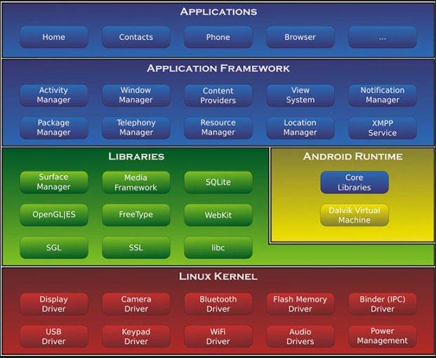
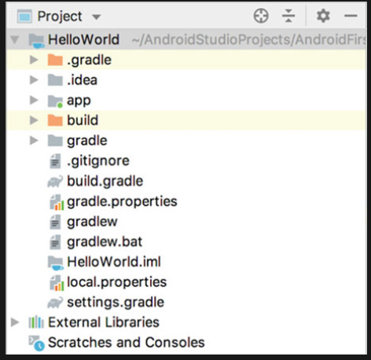
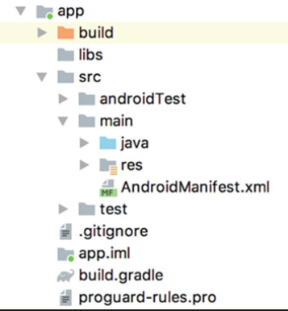
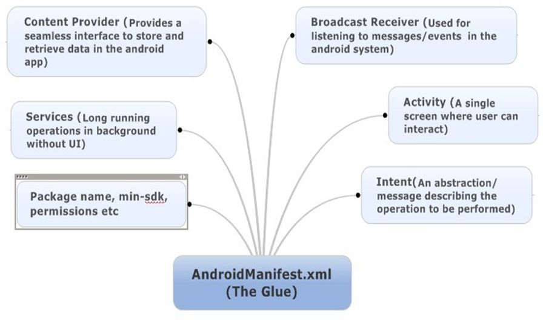
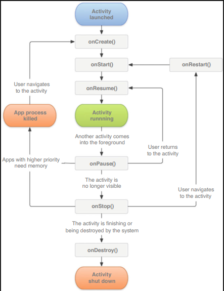

## 1.1 Android: An Overview  

### 1.1.1 Android System Architecture  

### 1.3.4 Analyzing Your First Android Project  

## AndroidManifest.xml 

1.3.5 Resources in a Project  
1.3.6 File of build.gradle
1.4 Mastering the Use of Logging Tools  
1.4.1 Using Android Log Tool  
1.4.2 Log Vs Println()
1.5 Summary

--- 

[[kotlin]]

---

3 Start with the Visible: Explore Activity  
3.1 What Is Activity?    
3.2 Activity Fundamentals   .
3.2.1 Manually Creating Activity  
3.2.2 Creating and Mounting the Layout  
3.2.3 Registering in AndroidManifest File  
3.2.4 Using Toast in Activity  
3.2.5 Using Menu in Activity  
3.2.6 Destroying an Activity  
3.3 Using Intent to Communicate Between Activities  
3.3.1 Explicit Intent  
3.3.2 Implicit Intent  
3.3.3 More on Implicit Intent  
3.3.4 Passing Data to the Next Activity  
3.3.5 Return Data to the Last Activity  
3.4 Activity Lifecycle    
3.4.1 Back Stack  
3.4.2 Activity States  
3.4.3 Activity Lifecycle  

3.4.4 Explore the Lifecycle of Activity  
3.4.5 Recycling Activity  
3.5 Launch Mode of Activity
3.5.1 Standard    
3.5.2 singleTop    
3.5.3 singleTask
3.5.4 singleInstance  
3.6 Activity Best Practices
3.6.1 Identifying the Current Activity  
3.6.2 Exiting the App from Anywhere 135
3.6.3 Best Practice to Start Activity 137
3.7 Kotlin Class: Standard Functions and Static Methods 138
3.7.1 Standard Functions: with, run, and apply 139
3.7.2 Define Static Methods 142

---

4 Everything About UI Development . . . . . . . . . . . . . . . . . . . . . . . . . 147
4.1 How to Create UI? . . . . . . . . . . . . . . . . . . . . . . . . . . . . . . . . 147
4.2 Common UI Widgets . . . . . . . . . . . . . . . . . . . . . . . . . . . . . . 148
4.2.1 TextView . . . . . . . . . . . . . . . . . . . . . . . . . . . . . . . . . 148
4.2.2 Button . . . . . . . . . . . . . . . . . . . . . . . . . . . . . . . . . . . 151
4.2.3 EditText . . . . . . . . . . . . . . . . . . . . . . . . . . . . . . . . . 153
4.2.4 ImageView . . . . . . . . . . . . . . . . . . . . . . . . . . . . . . . 158
4.2.5 ProgressBar . . . . . . . . . . . . . . . . . . . . . . . . . . . . . . . 160
4.2.6 AlertDialog . . . . . . . . . . . . . . . . . . . . . . . . . . . . . . . 164
4.3 Three Basic Layouts . . . . . . . . . . . . . . . . . . . . . . . . . . . . . . . 166
4.3.1 LinearLayout . . . . . . . . . . . . . . . . . . . . . . . . . . . . . . 166
4.3.2 RelativeLayout . . . . . . . . . . . . . . . . . . . . . . . . . . . . . 172
4.3.3 FrameLayout . . . . . . . . . . . . . . . . . . . . . . . . . . . . . . 176
4.4 Customize the Widgets . . . . . . . . . . . . . . . . . . . . . . . . . . . . . 178
4.4.1 Include Layout . . . . . . . . . . . . . . . . . . . . . . . . . . . . . 180
4.4.2 Create Customized Widgets . . . . . . . . . . . . . . . . . . . 182
4.5 ListView . . . . . . . . . . . . . . . . . . . . . . . . . . . . . . . . . . . . . . . 185
4.5.1 Simple Demonstration of ListView . . . . . . . . . . . . . . 185
4.5.2 Customize ListView UI . . . . . . . . . . . . . . . . . . . . . . 186
4.5.3 Optimize the Efficiency of ListView . . . . . . . . . . . . . 189
4.5.4 Click Event in ListView . . . . . . . . . . . . . . . . . . . . . . 192
4.6 RecyclerView . . . . . . . . . . . . . . . . . . . . . . . . . . . . . . . . . . . . 194
4.6.1 Basics About RecyclerView . . . . . . . . . . . . . . . . . . . 194
4.6.2 Scroll Horizontally and Waterfall Flow Layout . . . . . . 197
4.6.3 RecyclerView Click Event . . . . . . . . . . . . . . . . . . . . 202
4.7 Best Practice to Build UI . . . . . . . . . . . . . . . . . . . . . . . . . . . . 203
4.7.1 Create 9-Patch Image . . . . . . . . . . . . . . . . . . . . . . . . 204
4.7.2 Build Beautiful Chat User Interface . . . . . . . . . . . . . . 208
4.8 Kotlin Class: Lateinit and Sealed Cass . . . . . . . . . . . . . . . . . . 213
4.8.1 Lateinit Variables . . . . . . . . . . . . . . . . . . . . . . . . . . . 214
4.8.2 Optimization with Sealed Class . . . . . . . . . . . . . . . . . 216
4.9 Summary and Comment . . . . . . . . . . . . . . . . . . . . . . . . . . . . 218
Support Phones and Tablets with Fragment 221

What Is Fragment? 221

How to Use Fragment 223

Basic Use of Fragment 223

Add Fragment Dynamically 227

Back Stack for Fragment 230

Interaction Between Fragment and Activity 230

Lifecycle of Fragment 231

Fragment State and Callbacks 231

Experiment with Fragment Lifecycle 232

Dynamically Load Layout 236

Use Qualifier 236

Use Smallest-Width Qualifier 237

Fragment Best Practice: A Basic News App 240

Kotlin Class: Extension Function and Operator Overloading 249

Extension Function 249

Operator Overloading 252

Summary and Comment 256

Broadcasts in Details 259

Introduction to Broadcast Mechanism 259

Receive System Broadcast 261

Dynamically Register BroadcastReceiver for Time

Change 261

Open App After Booting with Static Receiver 262

Send Customized Broadcast 267

Send Normal Broadcast 267

Send Ordered Broadcast 270

Best Practice of Broadcast: Force Logout 274

Kotlin Class: Higher-Order Function 280

Define Higher-Order Function 280

Inline Functions 286

Noinline and Crossinline 289

Git Time: The First Look of Version Control Tools 293

Git Installation 293

Create Code Repository 293

Commit Local Code 295

Summary and Comment 296

Data Persistence 297

Introduction to Data Persistence 297

Persisting Through File 298

Persisting Data in File 298

Read Data from File 301

SharedPreferences 304

Save Data in SharedPreferences 304

Read Data from SharedPreferences 307

Implement Remembering Password 308

SQLite Database 311

Create Database 312

Upgrade Database 317

Add Data 322

Update Data 324

Delete Data 326

Query Data 328

Use SQL 331

SQLite Database Best Practice 333

Transaction 333

Best Practice to Upgrade Database 335

Kotlin Class: Application of Higher-Order Function 338

Simplify Use of SharedPreferences 338

Simplify Use of ContentValues 340

Summary and Comment 343

Share Data Between Apps with ContentProvider 345

Introduction to ContentProvider 345

Runtime Permissions 346

Android Runtime Permissions in Depth 346

Request Permission at Runtime 349

Access Data in Other Apps 354

Basic Use of ContentResolver 354

Read System Contact 358

Create Your Own ContentProvider 362

Create ContentProvider 362

Share Data Between Apps 368

Kotlin Class: Generics and Delegate 377

Basic Use of Generics 377

Class Delegation and Delegated Properties 379

Implement Lazy Function 382

Summary and Comment 384

Enrich Your App with Multimedia 387

Run Application on Phone 387

Notification 388

Create Notification Channel 389

Basic Use of Notification 392

Advanced Topics in Notification 399

Camera and Album 403

Take Photos with Camera 404

Select Images from Album 408

Play Multi-Media Files 411

Play Audio 412

Play Video 416

Kotlin Class: Use Infix to Improve Readability 420

Git Time: Advanced Topics in Version Control 423

9.6.1 Ignore Files   . .

423

9.6.2 Inspect Modified Content  

424

9.6.3 Revert the Uncommitted Changes  

426

9.6.4 Check Commit History  

427

9.7 Summary and Comment   .

428

10 Work on the Background Service  .

431

10.1

What Is

Service?    

431

10.2

Android

Multithreading  

432

10.2.1

Basic Use of Thread  

432

10.2.2

Update UI in Worker Thread  

433

10.2.3

Async Message Handling Mechanism  

435

10.2.4

Use AsyncTask   .

437

10.3 Basic Use of Service   . .

440

10.3.1 Define a Service   .

440

10.3.2 Start and Stop Service  

442

10.3.3 Communication Between Activity and Service  

445

10.4 Service Life Cycle    

450

10.5 More Techniques on Service  

450

10.5.1 Use Foreground Service  

451

10.5.2 Use IntentService  

453

10.6 Kotlin Class: Advanced Topics in Generics  

456

10.6.1 Reify Generic Types  

457

10.6.2 Application of Reified Type in Android  

459

10.6.3 Covariance and Contravariance  

461

10.6.4 Contravariance  

464

10.7 Summary and Comment   .

467

11

Exploring New World with Network Technologies  

469

11.1 WebView    

469

11.2 Use HTTP to Access Network  

471

11.2.1 Use HttpURLConnection  

472

11.2.2 Use OkHttp   . .

476

11.3 Parse XML Data    

478

11.3.1 Pull Parser   . . .

481

11.3.2 SAX Parser   . .

484

11.4 Parse JSON Data    

487

11.4.1 JSONObject   . .

488

11.4.2 GSON    

489

11.5 Implementing Network Callback  

491

11.6 The Best Network Lib: Retrofit  

494

11.6.1 Basic Use of Retrofit  

494

11.6.2 Process Complex Interface Address  

499

11.6.3 Best Practice for Retrofit Builder  

502

11.7 Kotlin Class: Use Coroutine for Performant Concurrent App . .

504

11.7.1 Basic Use of Coroutine  

504

11.7.2 More on Coroutine Scope Builder  

510

11.7.3 Simplifying Callback with Coroutine  

514

11.8 Summary and Comment   .

517

12

Best UI Experience: Material Design in Action  

519

12.1 What Is Material Design?  

519

12.2 Toolbar    

520

12.3 Navigation Drawer   . . .

527

12.3.1 DrawerLayout  

527

12.3.2 NavigationView   .

530

12.4 FloatingActionButton and Snackbar  

534

12.4.1 FloatingActionButton  

535

12.4.2 Snackbar    

539

12.4.3 CoordinatorLayout  .

540

12.5 CardView Layout    

542

12.5.1 MaterialCardView  .

542

12.5.2 AppBarLayout  

548

12.6 Pull to Refresh    

551

12.7 Collapsible Toolbar   . . .

553

12.7.1 CollapsingToolbarLayout  

553

12.7.2 Optimizing Using of System Status Bar  

560

12.8 Kotlin Class: Creating Utils  .

564

12.8.1 Find Max and Min in N Numbers  

565

12.8.2 Simplifying Use of Toast  

566

12.8.3 Simplifying Use of Snackbar  

568

12.9 Git Time: Advanced Topics in Version Control  

570

12.9.1 Branch    

570

12.9.2 Work with Remote Repo  

572

12.10 Summary and Comment   .

573

13

High-Quality Developing Components: Exploring Jetpack  

575

13.1 Introduction to Jetpack  

575

13.2 ViewModel    

576

13.2.1 ViewModel Basics  .

577

13.2.2 Pass Param to ViewModel  

579

13.3 Lifecycles    

583

13.4 LiveData    

587

13.4.1 LiveData Basics   .

587

13.4.2 map and switchMap  

590

13.5 Room    

596

13.5.1 Use Room to CRUD  

596

13.5.2 Room Database Upgrade  

603

13.6 WorkManager    

606

13.6.1 WorkManager Basics  

607

13.6.2 Handling Complex Task with WorkManager  

608

13.7 Kotlin Class: Use DSL to Construct Specific Syntax  

610

13.8 Summary and Comment   .

617

14 Keep Stepping Up: More Skills You Need to Know  

619

14.1

Obtaining Context Globally  .

619

14.2

Passing Objects with Intent  .

622

14.2.1 Serializable   . .

622

14.2.2 Parcelable   . . .

623

14.3

Creating Your Own Logging Tool  

624

14.4

Debug Android Apps   .

626

14.5

Dark Mode    

630

14.6

Kotlin Class: Conversion Between Java and Kotlin Code  

636

14.7

Summary    

640

15 Real

Project Practice: Creating a Weather App  

641

15.1

Analysis Before Start   . .

641

15.2

Git Time: Host Code on GitHub  

645

15.3

Introduction to MVVM  

651

15.4

Search City Data    

655

15.4.1 Business Logic Implementation  

656

15.4.2 UI Implementation  .

661

15.5

Display Weather Data   .

667

15.5.1 Business Logic Implement  

668

15.5.2 Implement UI Layer  

674

15.5.3 Record City Selection  

685

15.6

Manual Refresh and Switch City  

688

15.6.1 Manual Refreshing Weather  

688

15.6.2 Switching Cities   .

690

15.7

Create App Icon    

695

15.8

Generate Signed APK   .

700

15.8.1 Generating with Android Studio  

701

15.8.2 Generating with Gradle  

702

15.9

More To Do    

707

[//begin]: # "Autogenerated link references for markdown compatibility"
[kotlin]: kotlin "kotlin"
[//end]: # "Autogenerated link references"