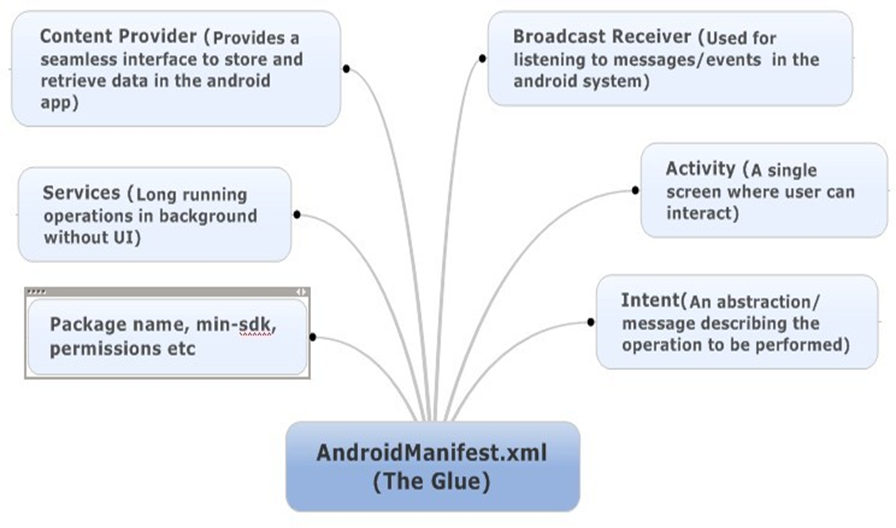

## Chapter 1: Your First Line of Android Code

1.1 Android: An Overview

### 1.1.1 Android System Architecture


1.3.4 Analyzing Your First Android Project

- 
- 

### proguard-rules.pro

- This is used for specifying the rules for code obfuscation. Obfuscation is used
when you don’t want your source code to be seen by other people

### AndroidManifest.xml 

- 

```
<activity android:name=".MainActivity">
    <intent-filter>
        <action android:name="android.intent.action.MAIN" />
        <category android:name="android.intent.category.LAUNCHER" />
    </intent-filter>
</activity>
```

- MainActivity is the main activity of this app and when user clicks the app icon in the phone, this activity
will be started first.

-  everything you can see in the app is hosted in the activity

- MainActivity inherits AppCompatActivity. AppCompatActivity is a backward compatible activity provided in AndroidX and can ensure the same functionality in different versions of OS

- onCreate() method will be called when an activity is being created. But we cannot see "Hello World” at
all. Where is this string?

- setContentView() method gets called in onCreate() and it is this method that imported the activity_main layout for the current activity. So "Hello World” must be in this file! Let’s open it and take a look.

- layout files are all under res/layout folder, so you should be able to find activity_main.xml there

### 1.3.5 Resources in a Project

-  folders start with "drawable” are used for images; "mipmap” directories are used for app icons; "values” directories are for strings, colors, etc.; and "layout” directories are used for layouts.

- • Use R.string.app_name in Kotlin, Java code to get the reference of this string.
- • Use @string/app_name in XML file

### 1.3.6 File of build.gradle

Unlike Eclipse, Android Studio uses Gradle to build the project. Gradle is an advanced tool to build the project which uses a DSL (Domain Specific Language) based on Groovy to configure the project and avoids the complicated configuration with XML-based tools like Ant and Maven.

*From Sect. 1.3.4, we can see that there are two build.gradle files in HelloWorld project. One is at the outer layer and another one is under the app directory. These two files are instrumental to build the Android Studio projects and let us take a deep dive into these two files.*

#### First look at the build.gradle file at the outer layer as shown below:


```gradle
/* outer layer build.gradle */

buildscript {
    ext.kotlin_version = '1.3.61'
    repositories {
        google()
        jcenter()
    }
    dependencies {
        classpath 'com.android.tools.build:gradle:3.5.2'
        classpath "org.jetbrains.kotlin:kotlin-gradle-plugin:$
        kotlin_version"
    }
}
    allprojects {
        repositories {
            google()
            jcenter()
        }
}
```

First, the two repository closures all use google() and jcenter() methods. These two methods are used to specify the code repository that this project is going to use.

The google repo is Google’s Maven repo and jcenter is the repo mainly for thirdparty open sources libs. With these two methods, we can easily use any libs in the google and jcenter repo.

Next, in the dependencies closure, classpath specifies Gradle plugin and Kotlin plugin. Why need to specify Gradle plugin? This is because Gradle wasn’t specifically created for building Android projects but for other types of projects written in Java, C++, etc. If we want to use it to build the Android project, we need to specify in Gradle to use com.android.tools.build:gradle:3.5.2 plugin. The series number at the end is the plugin version number and should be the same as the current Android Studio version number. The Kotlin plugin just means that the current project is written with Kotlin. If you use Java to develop Android project, then there is no need to use this plugin. When I wrote this book the latest version of Kotlin plugin was 1.3.61.

#### Next, let us look at the build.gradle under the app directory, code should be the same as follows:


```gradle
apply plugin: 'com.android.application'

/*  
The first line applies a plugin which has two values to choose from: com.android.application means this is an application module; com.android.library means this is a lib module. application module can run independently while lib module will need to be loaded in other apps so that it can run
*/

apply plugin: 'kotlin-android'
// If you want to use Kotlin to develop Android app, then you must add this

apply plugin: 'kotlin-android-extensions'
//  some useful extensions of Kotlin which you will
find out in later chapters.


android {
    compileSdkVersion 29
    buildToolsVersion "29.0.2"

    defaultConfig {
        applicationId "com.example.helloworld"
        minSdkVersion 21
        targetSdkVersion 29
        versionCode 1
        versionName "1.0"
        testInstrumentationRunner "androidx.test.runner.
        AndroidJUnitRunner"
    }

    buildTypes {
        release {
            minifyEnabled false
            proguardFiles getDefaultProguardFile('proguard-androidoptimize.txt'), 'proguard-rules.pro'
        }
    }
}

dependencies {
/* There are three types of dependency: local binary dependency, local library module dependency, and remote binary dependency. Local binary dependency can add dependency to local jars or directories; local library dependency can be used to add dependency to local lib modules; remote dependency can be used to add dependency to the open-source projects in jcenter.    
*/

    implementation fileTree(dir: 'libs', include: ['*.jar'])
    implementation"org.jetbrains.kotlin:kotlin-stdlib-jdk7:$
    kotlin_version"
    implementation 'androidx.appcompat:appcompat:1.1.0'
    implementation 'androidx.core:core-ktx:1.1.0'
    implementation 'androidx.constraintlayout:
    constraintlayout:1.1.3'
    testImplementation 'junit:junit:4.12'
    androidTestImplementation 'androidx.test.ext:junit:1.1.1'
    androidTestImplementation 'androidx.test.espresso:espressocore:3.2.0'
}
```


1.4 Mastering the Use of Logging Tools

### 1.4.1 Using Android Log Tool

The log class in Android is Log(android.util.Log) which provides the following 5 methods to print logs in the console. Here the verbosity is in descending order for these methods.

- `Log.v()`: used for the least meaningful information with the highest level of verbosity.

- `Log.d()`: used for the debugging information which should help you debug the app and investigate issues.

- `Log.i()`: used for important information like data that can help analyze the user behavior.

- `Log.w()`: used to print some warnings which means there is potential risks and need some attention to investigate into the issue.

- `Log.e()`: used to print error information such as the error info in the catch statement. When there are error info logs, it usually means your app has some serious issue that needs to get fixed immediately. This should have the least verbosity.
