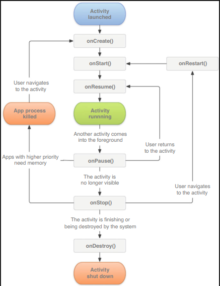

# Chapter 3: Start with the Visible: Explore Activity

- [Chapter 3: Start with the Visible: Explore Activity](#chapter-3-start-with-the-visible-explore-activity)
    - [3.4.3 Activity Lifecycle](#343-activity-lifecycle)

3.1 What Is Activity?

3.2 Activity Fundamentals

3.2.1 Manually Creating Activity

3.2.2 Creating and Mounting the Layout

3.2.3 Registering in AndroidManifest File

3.2.4 Using Toast in Activity

3.2.5 Using Menu in Activity

3.2.6 Destroying an Activity

3.3 Using Intent to Communicate Between Activities

3.3.1 Explicit Intent

3.3.2 Implicit Intent

3.3.3 More on Implicit Intent

3.3.4 Passing Data to the Next Activity

3.3.5 Return Data to the Last Activity

3.4 Activity Lifecycle

3.4.1 Back Stack

3.4.2 Activity States

### 3.4.3 Activity Lifecycle

3.4.4 Explore the Lifecycle of Activity

3.4.5 Recycling Activity

3.5 Launch Mode of Activity

3.5.1 Standard

3.5.2 singleTop

3.5.3 singleTask

3.5.4 singleInstance

3.6 Activity Best Practices

3.6.1 Identifying the Current Activity

3.6.2 Exiting the App from Anywhere

3.6.3 Best Practice to Start Activity

3.7 Kotlin Class: Standard Functions and Static Methods

3.7.1 Standard Functions: with, run, and apply

3.7.2 Define Static Methods