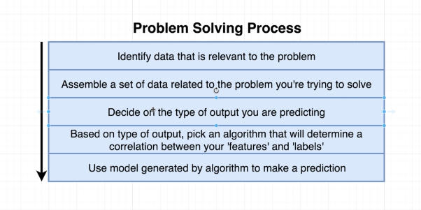
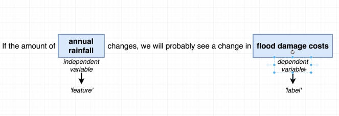

Loss Function: It is a function for finding the optimal gradients/coefficients of a machine learning model and it does so by minimizing the error. Let me try and explain with a simple example. Let’s consider Ferrari as the gold standard of the cars, and you have a car. Let’s call that “cardboard car”. Adjusting what components in what way ( e.g., engine capacity should go up, body has to go low, etc. (Full disclaimer: I don’t know any thing about cars)). The function that helps you do this, so that your “cardboard car” (model) becomes as close to the Ferrari as possible. Note that it doesn’t become Ferrari, but it tries to get as close to it as possible, by altering the gradients/coefficients so that the difference between your “cardboard car” and Ferrari is minimal.

Activation Function: If you had followed the previous analogy, It is the function that checks your “cardboard car”’s coefficients to see if it can pass as Ferrari, if it can it will let it pass, else it wont. Note that in contrast to the above loss function, this will only let you pass if you meet a certain criteria already. Formally, an activation function is the function that gets activated, thereby helping calculate the necessary gradients of a neural network.

