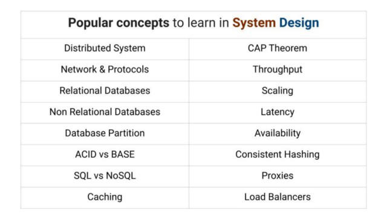
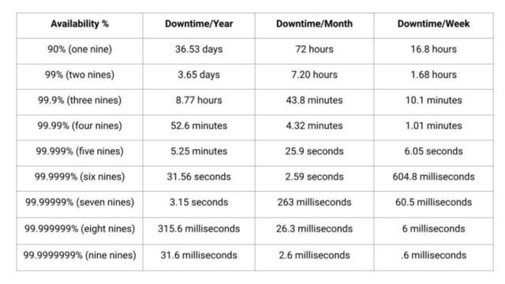
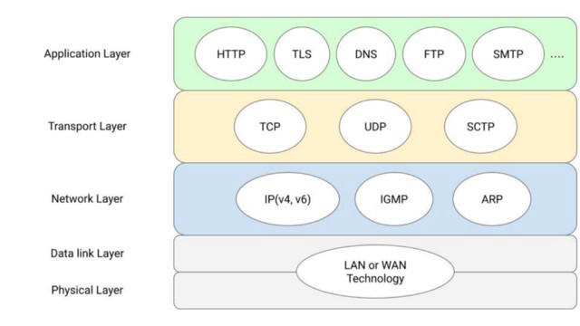

https://www.enjoyalgorithms.com/system-design-courses/

### Throughput

Throughput is the maximum rate of transfer or capacity of the system. It is used as a metric to determine how much work the system can do in a given time frame. One promising way to increase the Throughput of the system is by splitting up the requests and distributing them to various resources.

### Latency

Latency is a measure of the time duration to produce the result. It is the time spent or lags generating the desired output. In other words, latency helps us measure the speed of the system. Lower the Latency, the higher the speed of the system.

### Load Balancing

Load Balancers are machines that balance the load among various servers. To scale the system, we can add more and more servers, and hence there must be a way to direct the requests to these servers in such a manner so that there is no heavy load on one server to prevent it from failure. To deal with such situations, one can load balancers. 

Load Balancers distribute the traffic, prevent the service from breakdown, and contribute to maintaining the service’s reliability. 
Load Balancers act as traffic managers and help maintain the service's throughput and availability.

### Proxies

A proxy is a middle-man that sits between the client and server. When a client sends a request, it passes through the proxy and then reaches the server. Proxies are of two types: Forward Proxy and Reverse Proxy.

The forward proxy acts as a mask for clients and hides the client’s identity from the server, e.g., VPN. Similarly, Reverse Proxy acts as a mask for servers and hides the server’s identity from the response comes, e.g., Load Balancer.

### Databases
#db

Relational Databases are those that strictly enforce a strong relationship among the data. Relational Databases are highly structured in nature. Example: MySQL, PostgreSQL etc

Non Relational Databases have flexible structures, i.e., they are less rigid. Here data is stored in an unstructured way, and these databases are generally used in services that are highly distributed in nature and require high speed. Example: Cassandra, Redis, etc.

Database Partition is the way of dividing the database into smaller chunks to increase the performance of the service. It is another critical concept used to improve the Latency and throughput 

#### ACID vs BASE

Relational Databases and Non-Relational Databases ensure different types of compliance. Relational Databases are associated with ACID, while Non-Relational associated with BASE compliance.

##### ACID: Atomicity, Consistency, Isolation, Durability

Atomicity comprises one or more operations and ensures that if any of these operations fail, then the entire transaction fails. It’s like “All or Nothing,” which is vital in the case of transactions.

Consistency ensures that each transaction must be valid according to a given set of rules. Whenever database states change, it won’t corrupt the data, and transactions move from one valid state to another.

Isolation means that all the transactions are occurring independently without affecting other transactions. This ensures concurrency in database operations.

Durability ensures that whatever is written in the databases remains there, i.e., ensuring the databases’ persistence.

##### BASE: Basically Available Soft State Eventual Consistency

Basically Available ensures that the system should remain available and guarantees its availability.

Soft state gives flexibility to the system and allows the system to change over time to provide faster access.

Eventual Consistency ensures that the system takes some time to reach a consistent state and eventually become consistent.

#### SQL/NoSQL

If the system is distributed in nature and scalability is essential, then No-SQL databases are the best choice to go with. No-SQL databases are also preferred when the amount of data is huge.

Simultaneously, SQL databases are favourable when the data structure is more important and generally preferred when queries are complex, and databases require fewer updates. However, there is always a trade-off when choosing between No-SQL vs SQL database. Sometimes, according to business, a Polyglot architecture comprising both SQL and No-SQL databases is used to ensure the application's performance.

### Scaling

i.e., increasing the potential of the system. There are two ways of doing so: Horizontal Scaling and Vertical Scaling.

Horizontal Scaling means scaling the service by adding more servers to your applications to distribute the requests. Similarly, Vertical Scaling increases the same machine’s power or capacity by upgrading it to handle more and more traffic.

### cap theorem

CAP Theorem is one of the essential concepts necessary for designing networked shared data systems. CAP Theorem is a crucial concept that helps make trade-offs between the three available functionalities based on the unique use case that we need for our system.

Consistency: Consistency means that everything should go on in a very well-coordinated manner and with proper synchronisation. 
Availability: Availability means that the system is always there and ready whenever any request is made to it
Partition Tolerance: Partition Tolerance is necessary for any distributed system; we always need to choose between availability and Consistency. Partition Tolerance corresponds to the condition that the system should work irrespective of any harm or breakdown of nodes. 

### caching

so instead of querying the database, the data can be easily fetched from the cache. However, with the addition of cache, the system’s complexity increases. 

It is of utmost necessity to maintain synchronization between the data stored in the disk and the cache so that the system should remain consistent. 

Moreover, cache memory is too expensive.

So one can’t have a cache beyond a specific limit. Hence various data eviction algorithms like LIFO, FIFO, LRU, LFU, etc., are used to ensure the service’s performance.

How caching works in system design?

#### cache eviction policy
delete least used object in recent history
optimize the possibility of a cache hit

- random replacement
- least frequently used lfu
- least recently used lru
- fifo

#### types of caching

##### Application server cache 

- cache directly on app layer
- every request returns cached data if available

##### Global cache

##### Distributed cache

cache is broken up using @consistent hashing

##### CDN

##### Client-Side Caches

##### ISP layer cache

#### cache invalidation

means that cache content is invalid, will no longer be served
to ensure that the client gets latest content
three systems for invalidation

##### write through cache

write cache → write db, if both succeed, verified

##### write around cache

 write db → cache misses increased

##### write back cache 

cache syncs with db asynchronously, if cache layer dies, data lost

##### advantages

IOPS/increased read throughput
reduce backend load
reduce database cost
improve app performance
reduced db cost

### hashing
searching for an element in a hash table o(1) - o(n) worst case

consistent hashing

It is an improvement over normal Hashing. The traditional hashing method is ineffective in handling requests over a network. Here, in consistent hashing, the user and servers are located virtually in a circular ring structure called the Hash ring. The ring is considered infinite and can accommodate any number of servers irrespective of no fixed allocation and assign them random locations based on some hash function. This concept allows the distribution of requests or data in the servers and their mapping to servers efficiently. It helps achieve Horizontal Scaling and increases the throughput and Latency of the application.