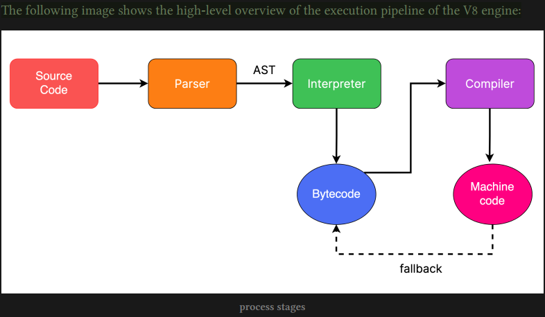
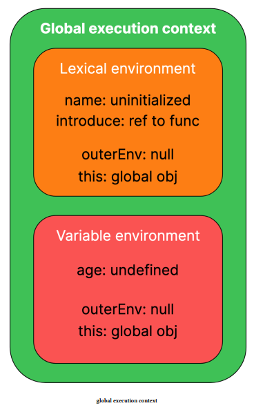

# advanced javascript

- [advanced javascript](#advanced-javascript)
  - [JIT Compiler](#jit-compiler)
  - [JavaScript Engine](#javascript-engine)
  - [Execution contexts](#execution-contexts)
    - [1. Global execution context](#1-global-execution-context)
    - [2. Function execution context](#2-function-execution-context)
  - [Execution context phases](#execution-context-phases)
    - [Creation phase](#creation-phase)
      - [Lexical and Variable environments](#lexical-and-variable-environments)
        - [Lexical environment](#lexical-environment)
        - [Variable environment](#variable-environment)
    - [Execution phase](#execution-phase)
      - [Stack overflow](#stack-overflow)
      - [Automatic garbage collection](#automatic-garbage-collection)
  - [Hoisting](#hoisting)
    - [\`\`var'' declarations](#var-declarations)
    - [Function declarations](#function-declarations)
    - [Function declarations inside blocks](#function-declarations-inside-blocks)
    - [Class declarations](#class-declarations)
    - [Temporal Dead Zone (TDZ)](#temporal-dead-zone-tdz)
    - [Function and class expressions](#function-and-class-expressions)
  - [Scope](#scope)
    - [Lexical scope](#lexical-scope)
    - [Avoid polluting the global scope](#avoid-polluting-the-global-scope)
    - [Implicit globals](#implicit-globals)
    - [HTML attributes](#html-attributes)
    - [Shadowing declarations](#shadowing-declarations)
    - [Function (parameter) scope](#function-parameter-scope)
    - [Function expression name scope](#function-expression-name-scope)
    - [Block Scope](#block-scope)
    - [Module Scope](#module-scope)
    - [Scope Chain](#scope-chain)
    - [ToPrimitive](#toprimitive)
  - [Coercion](#coercion)
    - [ToNumber](#tonumber)
    - [ToString](#tostring)
    - [ToBoolean](#toboolean)
    - [Summary of abstract equality operator](#summary-of-abstract-equality-operator)
    - [Addition Operator](#addition-operator)
    - [Relational operators](#relational-operators)
  - [Closures](#closures)
    - [What is a closure?](#what-is-a-closure)
    - [How do closures work?](#how-do-closures-work)
    - [How are different scopes linked?](#how-are-different-scopes-linked)
    - [What causes this problem?](#what-causes-this-problem)
    - [How to resolve this problem?](#how-to-resolve-this-problem)
    - [How are objects linked?	Prototypes](#how-are-objects-linkedprototypes)
    - [The \`\`prototype'' property](#the-prototype-property)
    - [Getting prototype of any object](#getting-prototype-of-any-object)
    - [Object.prototype - parent of all objects](#objectprototype---parent-of-all-objects)
    - [\`\`Function'' function](#function-function)
    - [Problems with __proto__](#problems-with-proto)
    - [Object.create method](#objectcreate-method)
    - [Null prototype object](#null-prototype-object)
    - [ES2015 classes](#es2015-classes)
  - [\`this' keyword](#this-keyword)
    - [Function context](#function-context)
    - [Global context](#global-context)
    - [Constructor function context](#constructor-function-context)
    - [Class context](#class-context)
    - [DOM event handler context](#dom-event-handler-context)
    - [Arrow functions to the rescue](#arrow-functions-to-the-rescue)
    - [Borrowing methods](#borrowing-methods)
    - [Chain constructor calls](#chain-constructor-calls)
    - [Revisit \`\`this'' problem](#revisit-this-problem)
    - [\`\`this'' vs globalThis](#this-vs-globalthis)
    - [Symbols and privacy	Symbol](#symbols-and-privacysymbol)
    - [Adding a description to symbols](#adding-a-description-to-symbols)
    - [Symbol.toPrimitive](#symboltoprimitive)
    - [Symbol.toStringTag](#symboltostringtag)
    - [Symbol.isConcatSpreadable](#symbolisconcatspreadable)
  - [Asynchronous JavaScript](#asynchronous-javascript)
    - [What does asynchronous mean?](#what-does-asynchronous-mean)
    - [Asynchronous JavaScript](#asynchronous-javascript-1)
    - [Problems with callbacks](#problems-with-callbacks)
    - [What is an event loop?](#what-is-an-event-loop)
    - [Promise states](#promise-states)
    - [Promise instance methods](#promise-instance-methods)
    - [Creating promises](#creating-promises)
    - [Using promises with callback-based API](#using-promises-with-callback-based-api)
    - [Promise specification](#promise-specification)
    - [Promise vs thenable](#promise-vs-thenable)
    - [then promise](#then-promise)
    - [catch promise](#catch-promise)
    - [finally promise](#finally-promise)
    - [Making sense of promise chaining](#making-sense-of-promise-chaining)
    - [Rejection handler in then vs catch](#rejection-handler-in-then-vs-catch)
    - [Concurrent requests](#concurrent-requests)
    - [Request timeout](#request-timeout)
    - [async functions](#async-functions)
    - [await keyword](#await-keyword)
    - [Multiple await expressions](#multiple-await-expressions)
    - [Error handling](#error-handling)
    - [Returning vs awaiting promise](#returning-vs-awaiting-promise)
    - [Awaiting non-promise value](#awaiting-non-promise-value)
    - [Unnecessary use of the Promise Constructor](#unnecessary-use-of-the-promise-constructor)
    - [Incorrect Error Handling](#incorrect-error-handling)
    - [Converting promise rejection into fulfillment](#converting-promise-rejection-into-fulfillment)
    - [Async executor function](#async-executor-function)
  - [Iterators and Generators](#iterators-and-generators)
    - [Iterables](#iterables)
    - [Iterators](#iterators)
    - [Iterator prototype](#iterator-prototype)
    - [Making custom iterable objects](#making-custom-iterable-objects)
    - [Infinite sequence](#infinite-sequence)
    - [Implementing iterators](#implementing-iterators)
    - [Consuming values](#consuming-values)
    - [Delegating to other iterators](#delegating-to-other-iterators)
    - [Further reading](#further-reading)


## JIT Compiler
- Crankshaft
- Turbofan 

## JavaScript Engine

- 

## Execution contexts	

- Every time any JavaScript code is executed, an execution context is created before its execution.

### 1. Global execution context

- i.e., the code that is not inside a function

- global variables, functions, etc. 
- It also contains the value for `this`
- and a reference to the outer environment, which, in the case of a global execution context, is null.

### 2. Function execution context

- Just like the global execution context, the function
- execution context contains:
  - variables and functions are declared inside the function.
  - value of `this` inside the function
  - reference to the outer environment

- ___There is a third type of execution context that is created for the execution of code inside the eval¹⁸ function. Still, as the use of the eval function is discouraged due to security concerns, we will only discuss the types of execution context mentioned above.___

## Execution context phases	

Execution contexts have following two phases:

### Creation phase

- During this phase, the variable declarations and references to functions are saved as key-value pairs inside the execution context.  

- The value of `this` and a reference to the outer environment are also set during this phase

- values for variables are not assigned during the creation phase.

- variables that refer to functions do refer to functions during this phase

- Variables declared using `var` are assigned `undefined`
as their value during this phase, while variables declared using `let` or constants declared using `const` are left __uninitialized__.

- In the case of a global context, there is no outer environment, so reference to the outer environment is set to null, ___but in the case of a function context, the value of `this` depends on how the function is called, so the value of `this` is set appropriately___


#### Lexical and Variable environments

- holds the key-value mappings of variables

##### Lexical environment

- `function` declarations
- variables declared with `let`
- constants declared using `const`

##### Variable environment

-  declared with the var keyword

```javascript
let name = "Jane Doe";
var age = 20;

function introduce(name, age) {
  console.log("Hello, I am " + name + " and I am " + age + " years old");
}
```



### Execution phase

- different variables in the execution context are yet to be assigned their respective values

- Assignments are done during the execution phase, and the code is finally executed

- A ___call stack___ is a structure that is used internally by the JavaScript engine to keep track of the piece of code that is currently executing. 
 
- simply a stack²² data structure that aids in the execution of the JavaScript code by keeping track of currently executing code 
  
- __a collection of [execution contexts](#types-of-execution-contexts)__

- Before executing any JavaScript code, a global execution context is created and pushed on the call stack. 

- label “global” is not important Google Chrome browser shows “(anonymous)” instead of “global.” 

- After pushing the global execution context on the call stack, any function calls encountered during the execution of the code will lead to more entries in the call stack. 

- For every function call, a new entry is added to the call stack before that function starts executing, and as soon as the function execution ends, that entry is popped off the stack. 

- top element in the call stack represents the currently executing piece of code

#### Stack overflow	

- call stack has a fixed size and can contain a limited number of entries.

- This error is thrown when the call stack gets filled up to its limit and can no longer hold more entries.

- JavaScript engines may allocate most values on the heap but could use the stack for optimization and store temporary values that might not last longer than a function call.

- different JavaScript engines may handle memory differently, and “primitives in javaScript simply go on the stack” is a misconception.

#### Automatic garbage collection	

- Memory that is no longer needed is automatically freed by the JavaScript engine

- garbage collection

- Currently, modern JavaScript engines use a Mark-and-sweep algorithm[²⁸](https://developer.mozilla.org/en-US/docs/Web/JavaScript/Memory_Management#mark-and-sweep_algorithm).

- This algorithm determines which blocks of memory are “unreachable”

- This algorithm is an improvement over the reference counting algorithm[²⁹](https://developer.mozilla.org/en-US/docs/Web/JavaScript/Memory_Management#reference-counting_garbage_collection), which has its limitations.

## Hoisting

### ``var'' declarations	

- variables and functions can be accessed before their actual declaration, and the term used to describe this in JavaScript is “Hoisting.”
  
- term “hoisting” is mostly associated with function declarations and variables declared with the

- “var” keyword

### Function declarations

- Function declarations, just like variables declared using the “var” keyword, are also hoisted.

- the function’s name is registered as a variable in the scope containing the function declaration, and it is initialized with the function itself.

- To be able to call a function before or after the function declaration is really useful and frees the developer from arranging the code in such a way that every function declaration comes before it is called.

- helps in code organization

### Function declarations inside blocks	

- In ES2015, the ECMAScript specification defined ___standard and legacy rules___ for handling function declarations

- the function declarations inside blocks are hoisted to the top of the block, converted into a function expression, and assigned to a variable declared with the let keyword.

- The function hoisted inside the block is limited to the containing block and cannot be accessed by code outside the block containing the function.

- It is important to note that the standard rules only come into effect in strict mode[³⁰](https://developer.mozilla.org/en-US/docs/Web/JavaScript/Reference/Strict_mode).

### Class declarations	

- if class declarations are hoisted, then why can’t we access them before their declaration? 
- The answer to this question is the “Temporal Dead Zone (TDZ)”

### Temporal Dead Zone (TDZ)	

- the time during which the block-scoped variables (let, const) or class declarations cannot be accessed. 
- The time starts from the start of the scope till the declaration is executed.
- TDZ is the reason class declarations cannot be accessed before their declaration is executed during the step-by-step execution of the code.
- As TDZ also applies to the let and const, are the variables declared using let or constants using const also hoisted? Yes, they are also hoisted, but, like the class declarations, they are hoisted differently because of the TDZ.


```javascript
var count = 5;
{
  console.log(count); // hoisted but cannot access due to TDZ
  let count = 10;
}
```

### Function and class expressions	

- The function and class expression are not hoisted
- a misconception about the concept of hoisting, and that is that the JavaScript engine moves the hoisted declarations to the top of the file. Although this makes it easy to understand the concept of hoisting, that is not the reality
- In the case of `var` variables, they are assigned the value of `undefined` until their declaration is executed. 
- In the case of blockscoped variables, they are marked as `“uninitialized”`.

## Scope

- scope of an identifier (variable, function, etc.) =  parts of the program where it can be accessed.

- Modern JavaScript has four main types of scopes that are mentioned below:
  - Global scope
  - Function scope
  - Block scope
  - Module scope

### Lexical scope	

 - determined at compile time
 - before the step-by-step execution
 - scopes can be nested within other scopes, with each nested scope having access to the outer or parent scope.
 - Lexical scope is also known as “static” scope. An alternative type of scope is Dynamic scope[³⁶](https://en.wikipedia.org/wiki/Scope_(computer_science)#Lexical_scope_vs._dynamic_scope).
 - In JavaScript, the global scope is the browser window or, more accurately, a browser window tab. exposed to the JavaScript code using the `window` object.

  ```javascript
  var todoList = ["grocery", "exercise", "meeting"];

  function emptyTodoList() {
    todoList = [];
  }

  console.log(window.hasOwnProperty("todoList")); 
  // true
  console.log(window.hasOwnProperty("emptyTodoList")); 
  // true
  ```

  ```javascript
  const todoList = ["grocery", "exercise", "meeting"];

  let emptyTodoList = function () {
    todoList = [];
  };

  console.log(window.hasOwnProperty("todoList")); 
  // false
  console.log(window.hasOwnProperty("emptyTodoList")); 
  // false
  ```

### Avoid polluting the global scope	

### Implicit globals	

- not in strict mode
- _Whenever there is an assignment to an undeclared variable, JavaScript will declare that undeclared variable as a global variable_. 
- This is most likely a mistake by the programmer, and instead of throwing an error, javaScript hides this by automatically declaring a global variable by the same name.

```javascript
function printSquare(num) {
  result = num * num;
  console.log(result);
}

printSquare(9);

console.log("implicit global "+ result)
```

- In strict mode, as expected, JavaScript throws an error


### HTML attributes

- there is another way we get implicit global variables

- value of the `id` attribute or the `name` attribute of HTML elements also gets added as a variable in the global scope of JavaScript.

```html
<h1 id="mainHeading">Hello World!</h1>
```

- Although this is supported by most browsers, this feature shouldn’t be relied upon, and we should always use standard mechanisms to target HTML elements because it can result in code that is hard to read and maintain

### Shadowing declarations

- is possible at all levels

### Function (parameter) scope	

- It is a common misconception that the function parameters are defined in the function’s local scope or that the parameters behave as if they are defined in the function’s local scope, but that is not always true.
- differentiate between “simple” and “non-simple” parameter lists
ES2015+ features like Default parameters⁴⁰, Destructuring⁴¹, or Rest parameters⁴², = ___non-simple parameters___
- If the parameters are simple, they behave like they are declared in the function’s local scope 
- non-simple, they are declared in their own scope.
- Non-simple parameter scope can be thought of as between the function scope and the scope containing the function
- 


```js
function paramScope(arr=["initial array"], buff=()=>arr) {
var arr = [1, 2, 3];
console.log(arr); // [1, 2, 3]
console.log(buff()); // ["initial array"]
}

paramScope();
```

- remove `var`, scopes collapse 

```js 

function paramScope(arr=["initial array"], buff=()=> arr) {
  arr = [1, 2, 3];
  console.log(arr); // [1, 2, 3]
  console.log(buff()); // [1, 2, 3]
}

paramScope();
```

### Function expression name scope	

- 

### Block Scope	

### Module Scope	

### Scope Chain	

### ToPrimitive	

## Coercion

### ToNumber	

### ToString	

### ToBoolean	

### Summary of abstract equality operator	

### Addition Operator	

### Relational operators	

## Closures

### What is a closure?	

### How do closures work?	

### How are different scopes linked?	

### What causes this problem?	

### How to resolve this problem?	

### How are objects linked?	Prototypes

### The ``prototype'' property	

### Getting prototype of any object	

### Object.prototype - parent of all objects	

### ``Function'' function	

### Problems with __proto__	

### Object.create method	

### Null prototype object	

### ES2015 classes	

## `this' keyword

### Function context

### Global context	

### Constructor function context	

### Class context	

### DOM event handler context	

### Arrow functions to the rescue	

### Borrowing methods	

### Chain constructor calls	

### Revisit ``this'' problem	

### ``this'' vs globalThis	

### Symbols and privacy	Symbol

### Adding a description to symbols	

### Symbol.toPrimitive	

### Symbol.toStringTag	

### Symbol.isConcatSpreadable	

## Asynchronous JavaScript

### What does asynchronous mean?	

### Asynchronous JavaScript	

### Problems with callbacks	

### What is an event loop?	

### Promise states	

### Promise instance methods	

### Creating promises	

### Using promises with callback-based API	

### Promise specification	

### Promise vs thenable	

### then promise	

### catch promise	

### finally promise	

### Making sense of promise chaining	

### Rejection handler in then vs catch	

### Concurrent requests	

### Request timeout	

### async functions	

### await keyword	

### Multiple await expressions	

### Error handling	

### Returning vs awaiting promise	

### Awaiting non-promise value	

### Unnecessary use of the Promise Constructor	

### Incorrect Error Handling	

### Converting promise rejection into fulfillment	

### Async executor function	

## Iterators and Generators

### Iterables

### Iterators	

### Iterator prototype	

### Making custom iterable objects	

### Infinite sequence	

### Implementing iterators	

### Consuming values	

### Delegating to other iterators	

### Further reading	

for await…of loop	
Debugging JavaScript
Wrap up
