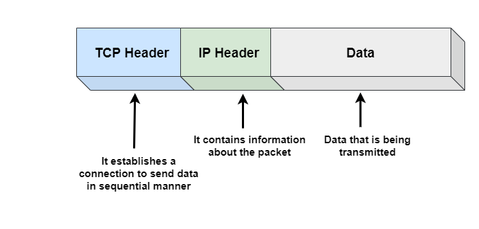

Transmission Control Protocol (TCP) is a more powerful and more functional wrapper around the Internet Protocol (IP).

network protocols image 2

 TCP provides an effective abstraction of a reliable network running over an unreliable channel, hiding most of the complexity of network communication from our applications: retransmission of lost data, in-order delivery, congestion control and avoidance, data integrity, and more. 

When you work with a TCP stream, you are guaranteed that all bytes sent will be identical with bytes received and that they will arrive in the same order to the client. As such, TCP is optimized for accurate delivery, rather than a timely one. This, as it turns out, also creates some challenges when it comes to optimizing for web performance in the browser.

The HTTP standard does not mandate TCP as the only transport protocol. If we wanted, we could deliver HTTP via a datagram socket (User Datagram Protocol or UDP), or any other transport protocol of our choice, but in practice all HTTP traffic on the Internet today is delivered via TCP due to the many great and convenient features it provides out of the box.

Chances are you won’t be working with TCP sockets directly in your application, but the design choices you make at the application layer will dictate the performance of TCP and the underlying network over which your application is delivered.

