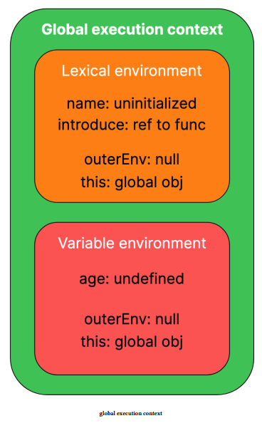

- [Execution contexts](#execution-contexts)
  - [1. Global execution context](#1-global-execution-context)
  - [2. Function execution context](#2-function-execution-context)
- [Execution context phases](#execution-context-phases)
  - [Creation phase](#creation-phase)
    - [Lexical and Variable environments](#lexical-and-variable-environments)
      - [Lexical environment](#lexical-environment)
      - [Variable environment](#variable-environment)
  - [Execution phase](#execution-phase)
    - [Stack overflow](#stack-overflow)
    - [Automatic garbage collection](#automatic-garbage-collection)


## Execution contexts	

- Every time any JavaScript code is executed, an execution context is created before its execution.

### 1. Global execution context

- i.e., the code that is not inside a function

- global variables, functions, etc. 
- It also contains the value for `this`
- and a reference to the outer environment, which, in the case of a global execution context, is null.

### 2. Function execution context

- Just like the global execution context, the function
- execution context contains:
  - variables and functions are declared inside the function.
  - value of `this` inside the function
  - reference to the outer environment

- ___There is a third type of execution context that is created for the execution of code inside the eval¹⁸ function. Still, as the use of the eval function is discouraged due to security concerns, we will only discuss the types of execution context mentioned above.___

## Execution context phases	

Execution contexts have following two phases:

### Creation phase

- During this phase, the variable declarations and references to functions are saved as key-value pairs inside the execution context.  

- The value of `this` and a reference to the outer environment are also set during this phase

- values for variables are not assigned during the creation phase.

- variables that refer to functions do refer to functions during this phase

- Variables declared using `var` are assigned `undefined`
as their value during this phase, while variables declared using `let` or constants declared using `const` are left __uninitialized__.

- In the case of a global context, there is no outer environment, so reference to the outer environment is set to null, ___but in the case of a function context, the value of `this` depends on how the function is called, so the value of `this` is set appropriately___


#### Lexical and Variable environments

- holds the key-value mappings of variables

##### Lexical environment

- `function` declarations
- variables declared with `let`
- constants declared using `const`

##### Variable environment

-  declared with the var keyword

```javascript
let name = "Jane Doe";
var age = 20;

function introduce(name, age) {
  console.log("Hello, I am " + name + " and I am " + age + " years old");
}
```



### Execution phase

- different variables in the execution context are yet to be assigned their respective values

- Assignments are done during the execution phase, and the code is finally executed

- A ___call stack___ is a structure that is used internally by the JavaScript engine to keep track of the piece of code that is currently executing. 
 
- simply a stack²² data structure that aids in the execution of the JavaScript code by keeping track of currently executing code 
  
- __a collection of [execution contexts](#execution-contexts)__

- Before executing any JavaScript code, a global execution context is created and pushed on the call stack. 

- label "global" is not important Google Chrome browser shows "(anonymous)" instead of "global." 

- After pushing the global execution context on the call stack, any function calls encountered during the execution of the code will lead to more entries in the call stack. 

- For every function call, a new entry is added to the call stack before that function starts executing, and as soon as the function execution ends, that entry is popped off the stack. 

- top element in the call stack represents the currently executing piece of code

#### Stack overflow	

- call stack has a fixed size and can contain a limited number of entries.

- This error is thrown when the call stack gets filled up to its limit and can no longer hold more entries.

- JavaScript engines may allocate most values on the heap but could use the stack for optimization and store temporary values that might not last longer than a function call.

- different JavaScript engines may handle memory differently, and "primitives in javaScript simply go on the stack" is a misconception.

#### Automatic garbage collection	

- Memory that is no longer needed is automatically freed by the JavaScript engine

- garbage collection

- Currently, modern JavaScript engines use a Mark-and-sweep algorithm[²⁸](https://developer.mozilla.org/en-US/docs/Web/JavaScript/Memory_Management#mark-and-sweep_algorithm).

- This algorithm determines which blocks of memory are "unreachable"

- This algorithm is an improvement over the reference counting algorithm[²⁹](https://developer.mozilla.org/en-US/docs/Web/JavaScript/Memory_Management#reference-counting_garbage_collection), which has its limitations.
