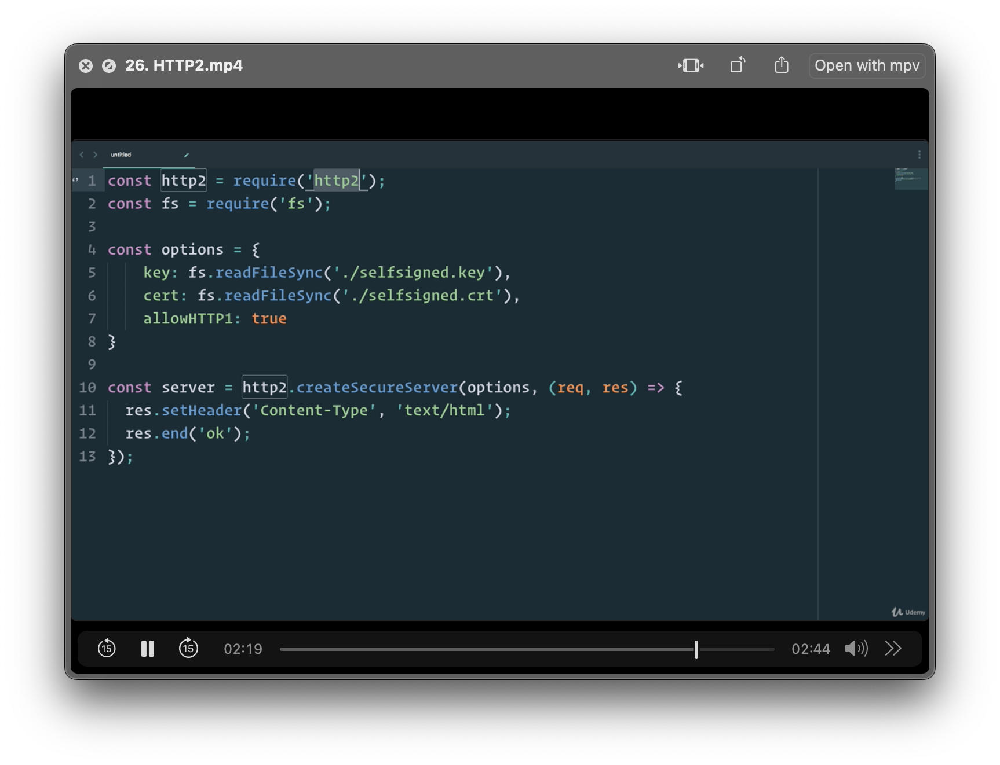

## basic http2 server



## [Nine HTTP Edge Cases](https://blog.dochia.dev/blog/http_edge_cases/)

### 1. The Range Header Problem

> Range headers exist for specific reasons: resuming downloads, seeking in videos, downloading file chunks, etc. They’re part of HTTP/1.1, defined in RFC 7233, and most of us never think about them until something breaks.

- [CVE-2024-26141](https://nvd.nist.gov/vuln/detail/CVE-2024-26141)

  - Rack is a modular Ruby web server interface. Carefully crafted Range headers can cause a server to respond with an unexpectedly large response. Responding with such large responses could lead to a denial of service issue. Vulnerable applications will use the `Rack::File` middleware or the `Rack::Utils.byte_ranges` methods (this includes Rails applications). The vulnerability is fixed in 3.0.9.1 and 2.2.8.1.

- the attack looked like this

    ```
    GET /report.pdf HTTP/1.1
    Range: bytes=0-999,1000000-2000000,999999999-...
    ```

- Static file servers like nginx and Apache handle this correctly. S3, CloudFront also fine. The problem appears when we write custom file download endpoints for access control, watermarking, or dynamic generation.

- But mitigation is not as simple as limiting range count. Even five ranges could generate problematic responses if the file is large enough. You need to validate both the number of ranges and the total projected response size. Spring Boot’s ResourceHttpRequestHandler does this for static resources, but custom controllers don’t inherit that protection:


- in spring-boot 
  
```java
@GetMapping("/api/files/{filename}")
public ResponseEntity<?> downloadFile(
    @PathVariable String filename,
    @RequestHeader(value = "Range", required = false) String rangeHeader) throws IOException {

    Resource file = fileService.loadAsResource(filename);
    long size = file.contentLength();

    if (rangeHeader == null || rangeHeader.isBlank()) {
        return ResponseEntity.ok()
            .contentType(MediaType.APPLICATION_OCTET_STREAM)
            .body(file);
    }

    List<HttpRange> ranges;
    try {
        ranges = HttpRange.parseRanges(rangeHeader); // this will throw an exception on bad syntax or >100 ranges
    } catch (IllegalArgumentException ex) {
        // RFC 7233: 416 for unsatisfiable/malformed; include Content-Range with '*'
        return ResponseEntity.status(HttpStatus.REQUESTED_RANGE_NOT_SATISFIABLE)
            .header(HttpHeaders.CONTENT_RANGE, "bytes */" + size)
            .build();
    }

    // Cap ranges and total bytes to defend resources
    final int MAX_RANGES = 5;
    final long MAX_BYTES = Math.min(size, 8L * 1024 * 1024);

    if (ranges.size() > MAX_RANGES) {
        // Option A: ignore ranges -> return full content (200)
        // Option B: 416 to force client to retry sanely, pick a consistent policy
        return ResponseEntity.ok().body(file);
    }

    long totalBytes = 0L;
    for (HttpRange r : ranges) {
        ResourceRegion rr = r.toResourceRegion(file);
        totalBytes += rr.getCount();
        if (totalBytes > MAX_BYTES) {
            return ResponseEntity.ok().body(file); // ignore ranges if too large
        }
    }

    // Let Spring write 206 / multipart or single-part automatically
    return ResponseEntity.status(HttpStatus.PARTIAL_CONTENT)
        .contentType(MediaType.APPLICATION_OCTET_STREAM)
        .body(HttpRange.toResourceRegions(ranges, file));
}
```
- in express

```javascript
import rangeParser from 'range-parser';
import fs from 'fs';
import path from 'path';

app.get('/files/:filename', (req, res) => {
  const filename = req.params.filename;
  const filePath = path.join(__dirname, 'files', filename);
  const stat = fs.statSync(filePath);
  const fileSize = stat.size;
  const rangeHeader = req.headers.range;

  if (rangeHeader) {
    // Parse with range-parser (same as express.static)
    const ranges = rangeParser(fileSize, rangeHeader, { combine: true });

    if (ranges === -1) {
      // Unsatisfiable -> 416 per RFC
      return res.status(416)
        .set('Content-Range', `bytes */${fileSize}`)
        .end();
    }
    if (ranges === -2) {
      // Malformed -> ignore Range, serve full
      return res.sendFile(filePath);
    }

    // Limit ranges & aggregate size
    const MAX_RANGES = 5;
    const MAX_BYTES = 8 * 1024 * 1024;

    if (ranges.length > MAX_RANGES) {
      // Too many -> ignore Range, serve full
      return res.sendFile(filePath);
    }

    let totalBytes = 0;
    for (const r of ranges) {
      totalBytes += (r.end - r.start + 1);
      if (totalBytes > MAX_BYTES) {
        // Too heavy -> ignore Range
        return res.sendFile(filePath);
      }
    }

    // If one range, serve 206 single part
    if (ranges.length === 1) {
      const { start, end } = ranges[0];
      res.status(206)
        .set('Content-Range', `bytes ${start}-${end}/${fileSize}`)
        .set('Accept-Ranges', 'bytes')
        .set('Content-Length', end - start + 1);
      return fs.createReadStream(filePath, { start, end }).pipe(res);
    }

    // If multiple ranges, you'd need to construct multipart/byteranges.
    // Node/Express doesn't do this automatically; consider rejecting or serving full content
    return res.sendFile(filePath);
  }

  // No Range -> serve full
  res.sendFile(filePath);
});
```

### 2. Content-Type Enforcement Prevents Weird Parser Behavior

```
POST /api/users HTTP/1.1
Content-Type: text/plain
Content-Length: 87

{"name": "Robert'; DROP TABLE users;--", "email": "bobby@tables.com"}

```

- malformed Request
  - Content-Type is wrong. You’re sending JSON but declaring text/plain. Most servers won’t parse the body as JSON unless Content-Type is application/json.
  -  Content-Length doesn’t match the body. For the exact JSON you posted (with those spaces, no trailing newline) it’s 69 bytes, not 87. A mismatched length can make the server hang/wait or return 400.
  -  Missing Host header. In HTTP/1.1, Host is required.

- Some frameworks see JSON-shaped text and parse it anyway. Others correctly reject it. The behavior varies, and that inconsistency creates security gaps. An attacker might craft payloads that only parse in specific framework versions or configurations.

- Always declare what Content-Types you accept. Permissive APIs create attack surface. If you only handle JSON, reject anything that isn’t explicitly application/json. Don’t try to be helpful by accepting “close enough” content types.


### 3. Accept Header Negotiation Gets Weird Fast

- Accept headers let clients specify format preferences with quality values:

`Accept: application/json;q=1.0, application/xml;q=0.5, */*;q=0.1`

- This says “I prefer JSON, XML is acceptable, and I’ll take anything if necessary.” Quality values range from 0.0 to 1.0, with higher being more preferred. Most APIs ignore this entirely and return whatever format matches first in their routing logic.

- Spring Boot handles content negotiation automatically with proper quality value parsing

- Express needs manual handling, and you have to get the parsing right:

```javascript 
app.get('/api/data', (req, res) => {
  // req.accepts() properly parses quality values
  const accepts = req.accepts(['json', 'xml']);
  
  if (accepts === 'json') {
    res.json(data);
  } else if (accepts === 'xml') {
    res.type('application/xml').send(toXml(data));
  } else {
    res.status(406).send('Not Acceptable');
  }
});
```

- Pick your supported formats deliberately. Don’t try supporting everything. If you only handle JSON in 99% of endpoints, don’t add XML support to one endpoint because a legacy system asked for it. That’s how you create the production incident I described.


### 4. Method Not Allowed Should Tell You What Works

- HTTP 405 responses should include an Allow header listing valid methods. This turns error responses into documentation. When developers get 405 instead of 200, they immediately know what methods are supported. Without proper Allow headers, 404 and 405 become indistinguishable, forcing developers to guess whether endpoints exist or they’re using the wrong method.

- Spring Boot handles this automatically for controller method

- Express needs explicit handling


### 5. Compression Configuration Is Never Where You Think

- Compression seems straightforward: enable gzip, save bandwidth, everybody wins. Then you discover your Spring Boot compression config does nothing in production because nginx (or another proxy) terminates the connection before it reaches your application.

- In production, you typically have nginx, HAProxy, or an API Gateway handling the TLS connection. They see the request, process it, and proxy to your backend. If nginx isn’t configured for compression, the response goes out uncompressed regardless of your Spring Boot settings. If nginx is configured for compression, it compresses the response whether Spring Boot is configured or not.

- Configure compression where it actually happens - at the edge. Also, disable app-level compression or strip Accept-Encoding upstream to avoid double-compression


### 6. Character Encoding Silently Corrupts Your Database

- Encoding mismatches destroy data permanently. A registration form accepts user data. Server assumes UTF-8. Client sends ISO-8859-1. Names get corrupted. The corruption is permanent because you can’t reliably detect encoding issues after the fact. You don’t know if is corrupted UTF-8 or correctly encoded text in another charset?

- IF the server assumes UTF-8, decodes the percent-encoded bytes as UTF-8, stores it. The corruption is permanent.

- Use UTF-8 everywhere and enforce it


- Django defaults to UTF-8

- For JSON endpoints, UTF-8 is mandatory per RFC 8259. Reject any request claiming non-UTF-8 encoding. It’s malformed per spec and processing it will corrupt data.


### 7. Path Traversal Lets Attackers Read Arbitrary Files

```javascript

    const path = require('path');

    app.get('/files/*', (req, res) => {
    const baseDir = path.resolve('/var/app/uploads');
    const requestedPath = path.join(baseDir, req.params[0]);
    const resolved = path.resolve(requestedPath);
    
    if (!resolved.startsWith(baseDir)) {
        return res.status(403).send('Forbidden');
    }
    
    res.sendFile(resolved);
    });
```

```python
    from pathlib import Path

    def serve_file(filename):
        base_dir = Path('/var/app/uploads').resolve()
        requested = (base_dir / filename).resolve()
        
        # Verify resolved path is inside base directory
        if not requested.is_relative_to(base_dir):
            return 403, "Forbidden"
        
        return send_file(requested)
```

- **Never trust user input for filesystem operations. Always normalize, resolve, and validate.**


### 8. Request Size Limits Prevent Memory Exhaustion

- Unlimited request sizes are the simplest DoS attack available. Send 100MB POST requests until server memory is exhausted. No sophistication required, no distributed attack needed. One attacker, one script, one poorly configured server.

- Set conservative limits everywhere

- Most APIs don’t need more than 1-10MB per request. Need larger uploads? Use chunked uploads, resumable protocols, or direct-to-S3 with presigned URLs. Don’t buffer entire uploads in memory.

- The Rack Range vulnerability combined with unlimited response sizes would have been catastrophic. Each layer of validation matters. Set limits, enforce them, test them.


### 9. Transfer-Encoding Enables Request Smuggling

- Request smuggling exploits disagreements between proxies and application servers about where one request ends and another begins. As per RFC 7230 Section 3.3.3: if Transfer-Encoding is present, Content-Length must be ignored.

- An attack sends conflicting headers:

    ```
    POST /api/submit HTTP/1.1
    Content-Length: 44
    Transfer-Encoding: chunked

    0

    POST /api/admin/delete HTTP/1.1
    ```

- Proxy processes Content-Length and sees one request. Application server processes chunked encoding and sees two requests. The second “smuggled” request bypasses authentication because the proxy already validated the first request.

- The vulnerability appears when proxies and application servers disagree about the spec. Your defense is ensuring each layer properly implements RFC 7230. Don’t try to add your own request smuggling detection. You’ll get it wrong and add complexity without security benefit.


### HTTP/2 and HTTP/3 Change the Attack Surface

- The edge cases discussed focus on HTTP/1.1, but HTTP/2 and HTTP/3 introduce different vulnerabilities. 
- HTTP/2’s binary framing and header compression (HPACK) enable new attacks like compression bombs (large, carefully crafted header tables) and stream abuse. 
- HTTP/3’s QUIC transport adds concerns such as connection migration and 0-RTT resumption, which can enable replay attacks if not carefully handled.

- Most frameworks abstract protocol differences, but some edge cases remain protocol-specific:

  - **Range headers**: Work identically across HTTP/1.1, HTTP/2, and HTTP/3.
  - **Request smuggling**: Common in HTTP/1.1 due to chunked encoding ambiguities, but not applicable in HTTP/2’s strict binary framing.
  - **Rapid reset attacks**: Unique to HTTP/2’s multiplexing, where attackers can open many streams and cancel them immediately, consuming server resources.
   - **Header compression exploits**: HPACK (HTTP/2) and QPACK (HTTP/3) can be abused for memory pressure attacks if implementations don’t enforce strict limits.
  - **QUIC transport risks**: HTTP/3 inherits issues like replay with 0-RTT and potential misuse of connection migration.

- Framework abstractions handle most protocol differences, but understanding which vulnerabilities apply to which protocol version matters when designing defenses. 

- A reverse proxy that translates HTTP/2 to HTTP/1.1 (or HTTP/3 to HTTP/2) introduces another layer where disagreements about request boundaries or header parsing can re-introduce old classes of bugs.

### Where Frameworks End and Your Responsibility Begins

- Most modern frameworks handle HTTP correctly. Custom validation code is rarely needed and often introduces more bugs than it prevents. The vulnerabilities presented above - CVE-2024-26141 (Rack Range headers), CVE-2019-19781 (Citrix path traversal), CVE-2020-7238 (Netty smuggling) - all exploited gaps between specification and implementation.

- Frameworks typically handle:
  -  Content-Type validation
  -  Accept header negotiation
  -  HTTP method validation
  -  Transfer-Encoding validation
  -  Basic path normalization
  -  Compression (when configured at the right layer)
  -  Character encoding defaults

- You must implement:
  -  Range header validation for custom file endpoints
  -  Path traversal prevention for dynamic file serving
  -  Request size limits (via configuration)
  -  Proper error responses with Allow headers

- Handle at infrastructure level:
  -  Rate limiting
  -  DDoS protection
  -  TLS termination
  -  Request normalization
  -  Geographic routing

- Your defense isn’t more code. It’s understanding HTTP deeply, knowing what your framework handles, using infrastructure layers for redundancy, and writing custom validation only where genuinely needed. Most security vulnerabilities come from unnecessary custom code that reimplements (incorrectly) what the framework already does correctly.