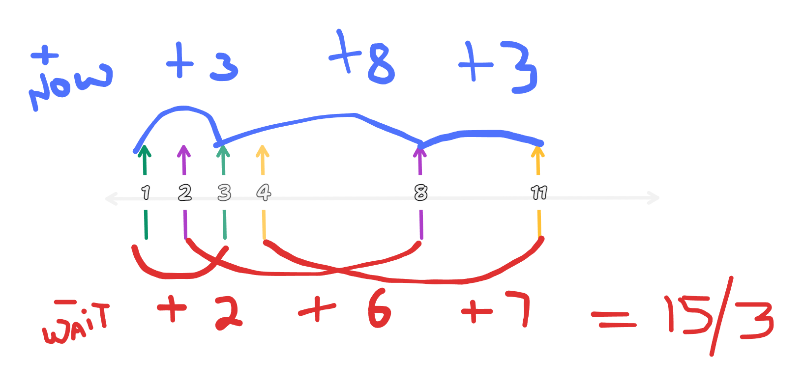

## 1701. [Average waiting time](https://leetcode.com/problems/average-waiting-time/description/)

### O(n)




```js 
var averageWaitingTime = function (customers) {
    let res=0, now=0;

    for(let [arr,prep] of customers){
        now = Math.max(now, arr)
        now += prep
        res += now - arr
    }

    return res/customers.length
};

```