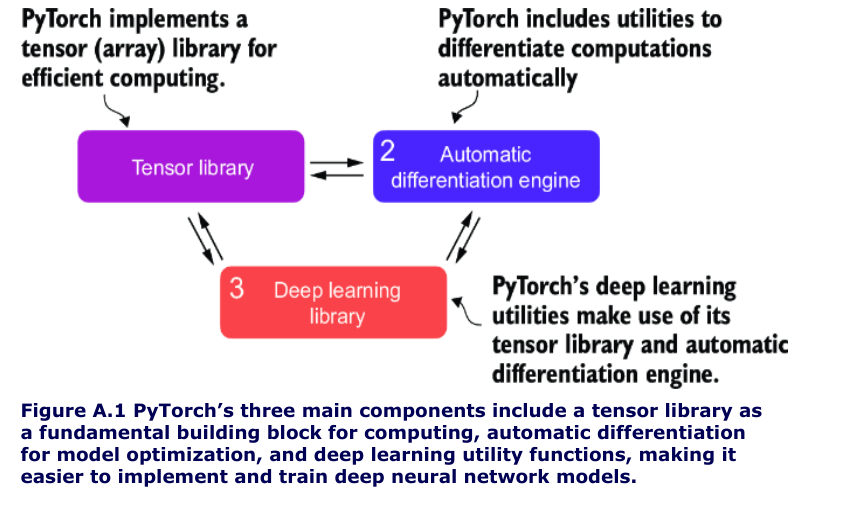
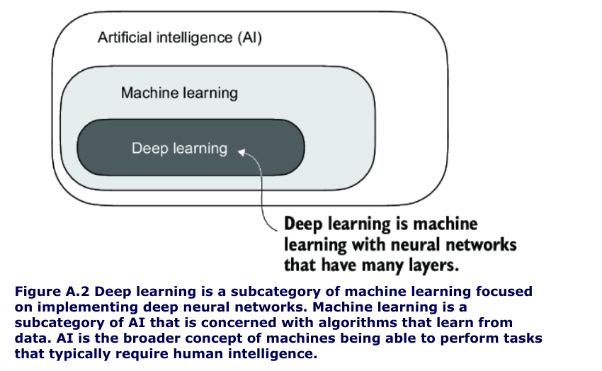
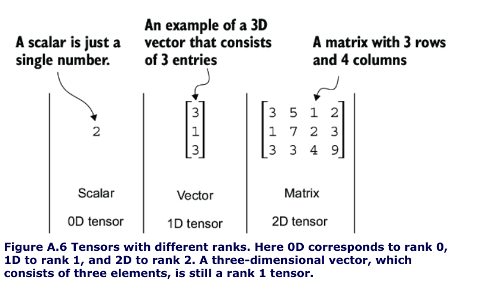
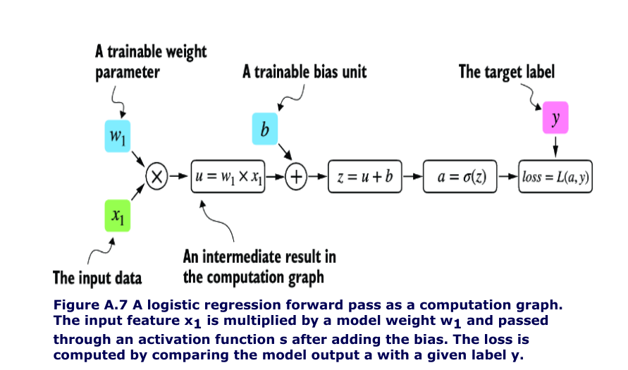
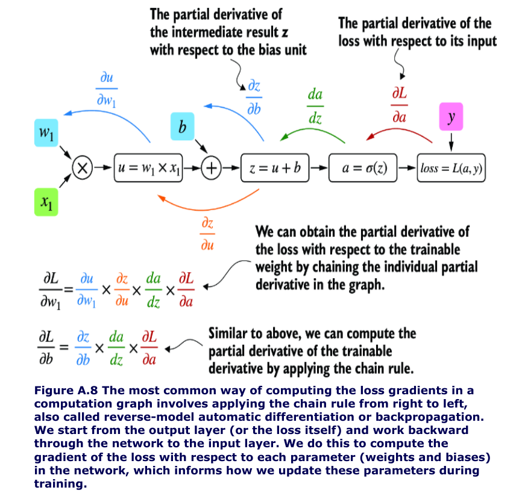
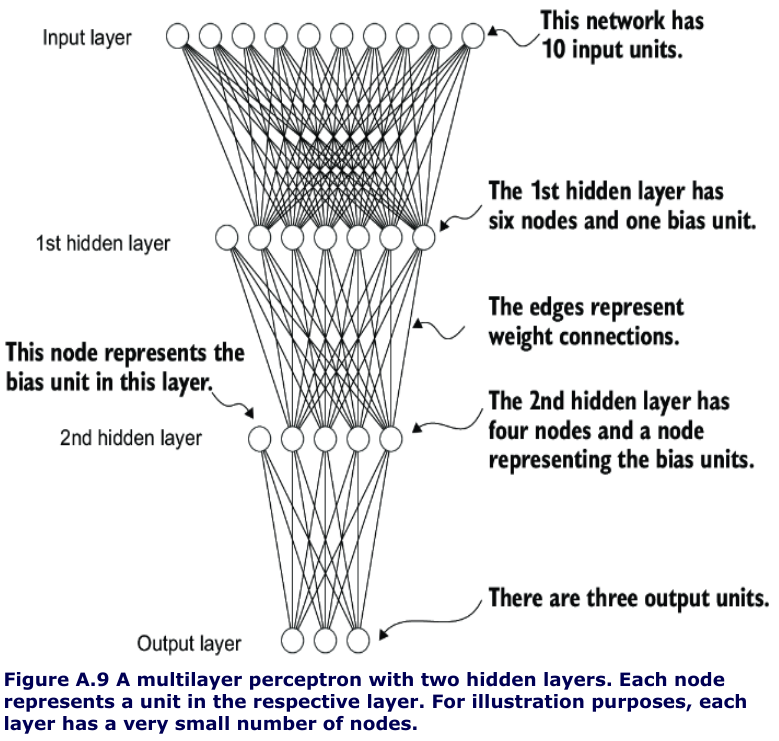

- [Three core components of pytorch](#three-core-components-of-pytorch)
- [Deep learning](#deep-learning)
- [Training process](#training-process)
- [Tensor ops](#tensor-ops)
  - [Precision / Tensor Data Types](#precision--tensor-data-types)
- [Autograd - PyTorch’s automatic differentiation engine](#autograd---pytorchs-automatic-differentiation-engine)
  - [Gradients are required when training neural networks via the popular backpropagation algorithm, which can be considered an implementation of the chain rule from calculus for neural networks.](#gradients-are-required-when-training-neural-networks-via-the-popular-backpropagation-algorithm-which-can-be-considered-an-implementation-of-the-chain-rule-from-calculus-for-neural-networks)
  - [Partial Derivatives And Gradients](#partial-derivatives-and-gradients)
- [Implementing multilayer/deep neural networks](#implementing-multilayerdeep-neural-networks)
- [Setting up efficient data loaders](#setting-up-efficient-data-loaders)
- [A typical training loop](#a-typical-training-loop)
- [Saving and loading models](#saving-and-loading-models)
- [Optimizing training performance with GPUs](#optimizing-training-performance-with-gpus)


## Three core components of pytorch


## Deep learning


## Training process


## Tensor ops
- Tensors represent a mathematical concept that generalizes vectors and matrices to potentially higher dimensions. 

- For example, a scalar (just a number) is a tensor of rank 0, a vector is a tensor of rank 1, and a matrix is a tensor of rank 2



- We can create objects of PyTorch’s Tensor class using the `torch.tensor` function

```py
import torch
tensor0d = torch.tensor(1) #1
tensor1d = torch.tensor([1, 2, 3]) #2
tensor2d = torch.tensor([[1, 2],
[3, 4]]) #3
tensor3d = torch.tensor([[[1, 2], [3, 4]],
[[5, 6], [7, 8]]]) #4


#1 Creates a zero-dimensional tensor (scalar) from a Python integer
#2 Creates a one-dimensional tensor (vector) from a Python list
#3 Creates a two-dimensional tensor from a nested Python list
#4 Creates a three-dimensional tensor from a nested Python list
```

### Precision / Tensor Data Types
- `torch.int64` 
- `torch.float64`

- it is possible to change the precision using a tensor’s `.to` method   

```py
floatvec = tensor1d.to(torch.float32)
print(floatvec.dtype)
```

- `.shape` attribute allows us to access the shape of a tensor

- To reshape the tensor into a 3 × 2 tensor, we can use the `.reshape` method

- `.view` is more popular if data is contiguous in memory

- `.T` to transpose a tensor, which means flipping it across its diagonal. Note that this is similar to reshaping a tensor

- the common way to multiply two matrices in PyTorch
is the `.matmul` method:

- However, we can also adopt the `@` operator, which accomplishes the same thing more compactly


```py
print(tensor2d.matmul(tensor2d.T))
#The output is
#tensor([[14, 32],
#[32, 77]])

#with the @ operator

print(tensor2d @ tensor2d.T)
#tensor([[14, 32],
#[32, 77]])
```

## Autograd - PyTorch’s automatic differentiation engine

- autograd system provides functions to compute gradients in dynamic computational graphs automatically.

- deep learning, a computation graph lays out the sequence of calculations needed to compute the output of a neural network

- we will need this to compute the required gradients for backpropagation, the main training algorithm for neural networks.

```py
# Listing A.2 A logistic regression forward pass
import torch.nn.functional as F #1

y = torch.tensor([1.0]) #2 True label
x1 = torch.tensor([1.1]) #3 Input feature
w1 = torch.tensor([2.2]) #4 Weight parameter
b = torch.tensor([0.0]) #5 Bias unit

z = x1 * w1 + b #6 Net input
a = torch.sigmoid(z) #7 Activation and output

loss = F.binary_cross_entropy(a, y)
```



- If we carry out computations in PyTorch, it will build a computational graph internally by default if one of its terminal nodes has the `requires_grad` attribute set to `True`.

- This is useful if we want to compute gradients. 
  
### Gradients are required when training neural networks via the popular backpropagation algorithm, which can be considered an implementation of the [chain rule](https://youtu.be/wl1myxrtQHQ?si=lTuudVdxX_XygM4V) from calculus for neural networks.



### Partial Derivatives And Gradients

- Figure A.8 shows partial derivatives, which measure the rate at which a function changes with respect to one of its variables.
-  A gradient is a vector containing all of the partial derivatives of a multivariate function, a function with more than one variable as input.

- all you need to know is: 
  - that the [chain rule](https://www.youtube.com/watch?v=wl1myxrtQHQ) is a way to compute gradients of a loss function given the model’s parameters in a computation graph. 
  - This provides the information needed to update each parameter to minimize the loss function, which serves as a proxy for measuring the model’s performance using a method such as gradient descent.

- PyTorch’s autograd engine constructs a computational graph in the background by tracking every operation performed on tensors.

- Then, calling the grad function, we can compute the gradient of the loss concerning the model parameter w1, as shown in the following listing.

```py
#Listing A.3 Computing gradients via autograd
import torch.nn.functional as F
from torch.autograd import grad

y = torch.tensor([1.0])
x1 = torch.tensor([1.1])
w1 = torch.tensor([2.2], requires_grad=True)
b = torch.tensor([0.0], requires_grad=True)

z = x1 * w1 + b
a = torch.sigmoid(z)

loss = F.binary_cross_entropy(a, y)
grad_L_w1 = grad(loss, w1, retain_graph=True)
"""
# 1 By default, PyTorch destroys the computation graph after
calculating the gradients to free memory. However, since we
will reuse this computation graph shortly, we set
retain_graph=True so that it stays in memory.
"""

grad_L_b = grad(loss, b, retain_graph=True


print(grad_L_w1)
print(grad_L_b)

#(tensor([-0.0898]),)
#(tensor([-0.0817]),)
```

- Here, we have been using the `grad` function manually, which can be useful for experimentation, debugging, and demonstrating concepts. 
- But, in practice, PyTorch provides even more high-level tools to automate this process. 
- For instance, we can call `.backward` on the loss, and PyTorch will compute the gradients of all the leaf nodes in the graph, which will be stored via the tensors’ `.grad` attributes

```py
loss.backward()
print(w1.grad)
print(b.grad)
#The outputs are
(tensor([-0.0898]),)
(tensor([-0.0817]),)
```

-  all you need to take away is that PyTorch takes care of the calculus for us via the `.backward` method—we won’t need to compute any derivatives or gradients by hand


## Implementing multilayer/deep neural networks

- look at a multilayer perceptron, a fully connected neural network



```py
# Listing A.4 A multilayer perceptron with two hidden layers

class NeuralNetwork(torch.nn.Module):
    """
    A multilayer perceptron with two hidden layers.
    
    We can subclass the torch.nn.Module class to define our own custom network 
    architecture. This Module base class provides a lot of functionality, making 
    it easier to build and train models. For instance, it allows us to encapsulate 
    layers and operations and keep track of the model's parameters.
    """

    def __init__(self, num_inputs, num_outputs):
        """
        Initialize the neural network with specified input and output dimensions.
        
        Within this subclass, we define the network layers in the __init__ constructor 
        and specify how the layers interact in the forward method.
        
        Args:
            num_inputs (int): Number of input features. Coding the number of inputs 
                and outputs as variables allows us to reuse the same code for datasets 
                with different numbers of features and classes.
            num_outputs (int): Number of output classes/neurons.
        """
        super().__init__()
        self.layers = torch.nn.Sequential(
            # 1st hidden layer
            torch.nn.Linear(num_inputs, 30),  
            # The Linear layer takes the number of input and output nodes as arguments
            torch.nn.ReLU(),  
            # Nonlinear activation functions are placed between the hidden layers

            # 2nd hidden layer  
            torch.nn.Linear(30, 20),  
            # The number of output nodes of one hidden layer has
            # to match the number of inputs of the 
            # next layer
            torch.nn.ReLU(),

            # output layer
            torch.nn.Linear(20, num_outputs),
        )

    def forward(self, x):
        """
        Define the forward pass of the network.
        
        The forward method describes how the input data passes through the network 
        and comes together as a computation graph.
        
        Args:
            x (torch.Tensor): Input tensor.
            
        Returns:
            torch.Tensor: The outputs of the last layer (logits).
            
        Note:
            In contrast, the backward method, which we typically do not need to 
            implement ourselves, is used during training to compute gradients of 
            the loss function given the model parameters.
        """
        logits = self.layers(x)
        return logits  # The outputs of the last layer are called logits


# Example usage
model = NeuralNetwork(50, 3)
print(model)
# Output:
# NeuralNetwork(
#   (layers): Sequential(
#     (0): Linear(in_features=50, out_features=30, bias=True)
#     (1): ReLU()
#     (2): Linear(in_features=30, out_features=20, bias=True)
#     (3): ReLU()
#     (4): Linear(in_features=20, out_features=3, bias=True)
#   )
# )
```

- use the `Sequential` class when we implement the `NeuralNetwork` class. `Sequential` is not required, but it can make our life easier if we have a series of layers we want to execute in a specific order, as is the case here
-  we just have to call the `self.layers` instead of calling each layer individually in the `NeuralNetwork’`s `forward` method.

- Next, let’s check the total number of trainable parameters of this model:

```py 

num_params = sum(p.numel() for p in model.parameters() if p.requires_grad)
print("Total number of trainable model parameters:", num_params)

#Total number of trainable model parameters: 2213

```

- Each parameter for which `requires_grad=True` counts as a trainable parameter and will be updated during training

-  these trainable parameters are contained in the `torch.nn.Linear` layers.
  
- A `Linear` layer multiplies the inputs with a weight matrix and adds a bias vector.

- Based on the print(model) call we executed here, we can see
that the first Linear layer is at index position 0 in the layers
attribute.

- Since this large matrix is not shown in its entirety, let’s use the `.shape` attribute to show its dimensions:

```py
print(model.layers[0].weight)
# This prints
# Parameter containing:
# tensor([[ 0.1174, -0.1350, -0.1227, ..., 0.0275, -0.0520, -0.0192],
# [-0.0169, 0.1265, 0.0255, ..., -0.1247, 0.1191, -0.0698],
# [-0.0973, -0.0974, -0.0739, ..., -0.0068, -0.0892, 0.1070],
# ...,
# [-0.0681, 0.1058, -0.0315, ..., -0.1081, -0.0290, -0.1374],
# [-0.0159, 0.0587, -0.0916, ..., -0.1153, 0.0700, 0.0770],
# [-0.1019, 0.1345, -0.0176, ..., 0.0114, -0.0559, -0.0088]],
# requires_grad=True)

print(model.layers[0].weight.shape)
#The result is
torch.Size([30, 50])
#(Similarly, you could access the bias vector via
model.layers[0].bias
```

- weight matrix here is a 30 × 50 matrix, and we can see that `requires_grad` is set to `True`

- which means its entries are trainable

- this is the default setting for weights and biases in `torch.nn.Linear`.

- The model weights are initialized with small random numbers, 0 which differ each time we instantiate the network.

- In deep learning, initializing model weights with small random numbers is desired to break symmetry during training. 

- Otherwise, the nodes would be performing the same operations and updates during backpropagation

- However, while we want to keep using small random numbers as initial values for our layer weights, we can make the random number initialization reproducible by seeding PyTorch’s random number generator via `manual_seed`

```py
torch.manual_seed(123)
model = NeuralNetwork(50, 3)

print(model.layers[0].weight) 

# Parameter containing:
# tensor([[-0.0577, 0.0047, -0.0702, ..., 0.0222, 0.1260, 0.0865],
# [ 0.0502, 0.0307, 0.0333, ..., 0.0951, 0.1134, -0.0297],
# [ 0.1077, -0.1108, 0.0122, ..., 0.0108, -0.1049, -0.1063],
# ...,
# [-0.0787, 0.1259, 0.0803, ..., 0.1218, 0.1303, -0.1351],
# [ 0.1359, 0.0175, -0.0673, ..., 0.0674, 0.0676, 0.1058],
# [ 0.0790, 0.1343, -0.0293, ..., 0.0344, -0.0971, -0.0509]],
# requires_grad=True)
```

- `NeuralNetwork` instance used via the forward pass

```py 
torch.manual_seed(123)
X = torch.rand((1, 50)) #toy input
out = model(X)

print(out)
# tensor([[-0.1262, 0.1080, -0.1792]], grad_fn=<AddmmBackward0>)
```

- When we call `model(x)`, it will automatically execute the forward pass of the model.

- `torch.no_grad()` context manager tells PyTorch that it doesn’t need to keep track of the gradients, which can result in significant savings in memory and computation

```py 
print(out)
# tensor([[-0.1262, 0.1080, -0.1792]])
```

- common practice to code models such that they return the outputs of the last layer (logits) without passing them to a nonlinear activation function. 
- That’s because PyTorch’s commonly used loss functions combine the softmax (or sigmoid for binary classification) operation with the negative log-likelihood loss in a single class. 

- The reason for this is numerical efficiency and stability. So, if we want to compute class-membership probabilities for our predictions, we have to call the softmax function explicitly:

```py
with torch.no_grad():
out = torch.softmax(model(X), dim=1)
print(out)
# This prints
tensor([[0.3113, 0.3934, 0.2952]]))
```

- The values can now be interpreted as class-membership probabilities that sum up to 1. 

- The values are roughly equal for this random input, which is expected for a randomly initialized model without training

## Setting up efficient data loaders


- we will implement a custom `Dataset` class, which we will use to create a training and a test dataset that we’ll then use to create the data loaders

```py
#Listing A.5 Creating a small toy dataset
X_train = torch.tensor([
    [-1.2, 3.1],
    [-0.9, 2.9],
    [-0.5, 2.6],
    [2.3, -1.1],
    [2.7, -1.5]
])

y_train = torch.tensor([0, 0, 0, 1, 1])

X_test = torch.tensor([
    [-0.8, 2.8],
    [2.6, -1.6],
])

y_test = torch.tensor([0, 1])
```
- PyTorch requires that class labels start with label 0 
- the largest class label value should not exceed the number of output nodes minus 1 (since Python index counting starts at zero). 
- So, if we have class labels 0, 1, 2, 3, and 4, the neural network output layer should consist of five nodes

```py
#Listing A.6 Defining a custom Dataset class
from torch.utils.data import Dataset
class ToyDataset(Dataset):
    def __init__(self, X, y):
        self.features = X
        self.labels = y

    def __getitem__(self, index): #1
        one_x = self.features[index] #1
        one_y = self.labels[index] #1
        return one_x, one_y #1

def __len__(self):
    return self.labels.shape[0] #2

train_ds = ToyDataset(X_train, y_train)
test_ds = ToyDataset(X_test, y_test)

#1 Instructions for retrieving exactly one data record and the corresponding label
#2 Instructions for returning the total length of the dataset
```

- the three main components of a custom Dataset class are the `__init__` constructor, the `__getitem__` method, and the `__len__` method

- Now that we’ve defined a PyTorch Dataset class we can use for our toy dataset, we can use PyTorch’s DataLoader class to sample from it

```py
#Listing A.7 Instantiating data loaders
from torch.utils.data import DataLoader
torch.manual_seed(123)

train_loader = DataLoader(
    dataset=train_ds, #1
    batch_size=2,
    shuffle=True, #2
    num_workers=0 #3
    drop_last=True
)

test_loader = DataLoader(
    dataset=test_ds,
    batch_size=2,
    shuffle=False, #4
    num_workers=0
)

#1 The ToyDataset instance created earlier serves as input to the data loader.
#2 Whether or not to shuffle the data
#3 The number of background processes
#4 It is not necessary to shuffle a test dataset.
```

- ⚠️ the setting `num_workers=0` in the `DataLoader` is crucial for parallelizing data loading and preprocessing. When `num_workers` is set to 0, the data loading will be done in the main process and not in separate worker processes. 
-.0 when num_workers is set to a number greater than 0, multiple worker processes are launched to load data in parallel, freeing the main process to focus on training your model and better utilizing your system’s resources

## A typical training loop

## Saving and loading models

## Optimizing training performance with GPUs
