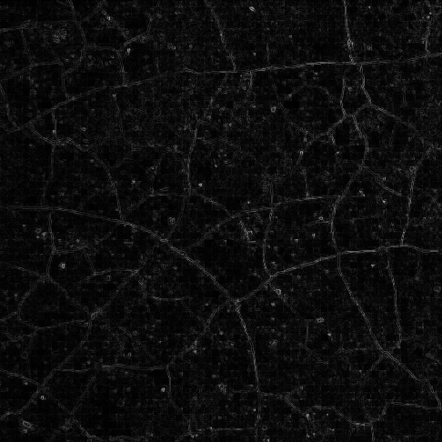

# being and difference 

1. 

- From womb to tomb, time has no gaps. Through waking life as well as through states of apperception like dreams, coma or altered perception like meditative, sleep, under the influence of chemicals benign or otherwise such as anesthesia etc. the virtual fabric of time knows no physical holes - neither on the number line, nor in provenance of memory.

- Even death is not untouched by the continuation of time in narratives of reincarnation, astral travel, karma and the like - which the spiritual literature of the world regurgitates frequently and fondly.

- In this seemingly homogeneous unity, difference is introduced - usually in and as a habitus - as a chain of repetition dividing firstly time and the cognition thereof, and secondly, the perception of this difference with itself pervasively, infinitely, and recursively, creating a feedback loop that not only marks off the boundaries between now and later, but also ushers tomorrow into today.

- What introduces this difference is not time itself, neither anything "perceived", not only because perception assumes time apriori but also because time, in as much as it appears to be "caused" to the being, always appears as something external to perception, and therefore is always outside its control. It is as if, slipstreaming in through a blind spot in cognition, time injects itself into extension creating substance. 

- The bastardized motionless stillness of extension without father time is a singular blind spot which cannot be confirmed by determination synthetic or rigor analytic. 
  
  
- The narrative of the "big bang" assumes a solitary accident describing the incidence of time, as if the observable universe is a single boat set adrift on memory bliss of a single observer who just happens to be a monothiest solipsist. It may shock the followers of abrahamic religions but it is possible to have more than one biological father. The scientific term for this anomaly is "heteropaternal superfecundation". Although the rare exception bears likeness to the anomaly John Donne called a "child with a mandrake root". 

- The practicality of unary numeral systems belongs to academic excursions alone, the holes on Spongebob's body cannot be counted with a single numeral for 1 is already the second number. All pluralities are already constituted by systems of other pluralities, necessitating the abstractions of higher dimensions in mathematics. 

- The embodied experience of being allows for little discernment of time as a single dimensional vector. Whatever occurs _is_ a slice of whatever _could be_, not whatever _is_, for whatever _is_, has already occurred and what has already occured apriori is _difference_. 

- What causes time in the being is the difference that is mind, or the time-sharing "society of mind" which is a multivariate difference in itself. Mind, which is reconstituted by and for the being from its own pluripotent splinters strewn across time. Mind is a dialectical composition of memory decomposing inside the being.  
  
  
- From within the embodied being one likes to call self, time appears linear and not at all in a superposition as claims to quantum gravity seem to suggest. The linear limitation is entirely biological, for the cessation of time in a dead body is nothing if not the cessation of memory. Memory as the biological consequence of time is indeed being's only road to unraveling this mystery. Memory is the political economy of time, the fetishization of time as a commodity. 

- The cessation of memory is not the same as apperception or altered perception, in that, as far as the being is concerned, there is a finality  without duplication or further propagation.

- In death, difference lives with as much violence as in its introduction - leaving behind only memory of someone's memories. In memory dwell differences, but difference itself is a function of a static, stationary, undifferentiated and infinitely liminal production known as pure difference.  
  
  
- Difference is difference, but the _difference of difference_ is "pure" not in the sense of being a "meta" state, making it nearly impossible to ever achieve a total metaphysics because all meta states conclude logically in a _reductio ad infinitum_. 

- Nor is the difference of difference a "post" difference for to imply a causation to difference is akin to saying the difference between one and two is not absolute in itself, but one occasionally becomes two and thus achieving a "post" oneness. "Pre" and "post" are already conditions of active difference, which is always an image of before and after framed together.

- "Pure" difference is Moses as a market-maker, creating two oceans from one, at least for those who still believe in old myths, if not thermodynamics. The reason its called "pure" is perhaps to signify its incorruptibility, there is nothing "pure" outside pure difference. More precisely, it is Shiva's third eye, the mother of chaos.

 
- Exhaustively, pure difference is not Sissyphus but Maxwell's demon, Eris not Kali, an earthquake-on-demand not a sought-after deluge. It is a feedback that creates a lateral difference in both amplitude and frequency instead of simply an amplification or deamplification in the monotonous similarity of the daily drudge of signal. Not a "flat circle" but a Möbius strip. Pure difference is the duality of difference and every duality casts an inseparable shadow through the realms of being, in case of pure difference the shadow is difference apriori.

- Pure difference is the essence of difference, it is difference _dissimilar_ or difference as its own subject. It is that which cannot be perceived by anything except itself and that which perceives nothing except itself. Difference raised to the nth power. The negation that negates itself. Not a Heideggerian ontological "_Differenz_", but rather it's essence which is "_dif-ference_". In other words, not the "first" difference but the very context that makes (first, or nth) difference possible.

- Heidegger himself wondered whether thinking could do away with considerations of ontological difference, and in the process, do away with metaphysics. Post-modernists like Derrida have inched towards a solution wrapping up such phenomenological reduction to hyperreal avenues such as that of _Différance_ which encapsulates both pure difference and its offspring creating a family of deconstructed entities - but such deconsructions merely maim metaphysics without squarely eliminating it. Which lead to relativistic ethics a-la Latour's multiplexed metaphysics or fanciful ideas of a "personal" metaphysics, which look good in fairy tales but live only on the surface of the imaginary.

- To take deconstruction to its logical conclusion is the phenomenological reduction of quantum gravity. To not destroy the possibility of _any_ metaphysics entirely, but to penetrate into the mind reductively and precisely until there is just enough cognition left for the existent to pour in. To gaslight metaphysics within an inch and let it confess "faith" - although one does not need faith to apply mathematical induction or Bayes' theorem, a measure of patience is needed for rigor's sake.

- Pure difference exists in dualities _embuted_, the moment of intention right before it becomes an action, the potential implicit in each circumstance, in other words, cause-implicit (whereas difference itself is cause-explicit). In the moment before meiosis begins and in the moment penultimate to the completion of cell division.

- Pure difference is why no two differences are alike and for the being braided between the fundamental differences of birth and death, the bookends speak volumes about the library. The singularity out of which duality is emergent, this splitting of the sum that is the whole, this shattering of the fragile innocence of the absolute, this is death of pure difference is a decay of two phases (φ/ϕ) of difference - into L-systems traversed by time and its entourage, memory, where both φ and ϕ are self-contained systems of differences eternal.

-  
    > Figure 1: A naturally occuring Lindenmayer system as a weathering of the waterproofing sealant on a terrace floor

- This "lub" and "dub" heard in each heartbeat as the twilight nears, is an _affiliation_ of not one duality but two; attesting that for being, the dualism of birth and death mirrorred in the very adjacent dualism of mind and body, creates a meeting or relationship, which leads to creation of other dualisms (or relationships, or meetings) inside continuous chains of reaction such as health and illness, small and big, rich and poor, master and slave etc. Any duality can be comprehended as an L-system.

- Descartes' big project was to understand this dualistic system reductively through doubt, but the immediacy of memory, and the continuity of perception create a dense soup leaving little wiggle room for doubt. Furthermore doubt is but one end of a duality which culminates in dasein's psyche as fear, doubt dissolves quickly in excruciating pain or euphoric highs leaving being in fear of the next bout. Descartes' hyperbolic doubt (and its shadow, hyperbolic fear) are both faces of zero on the number line. Both integers and whole numbers exist as shadow of zero, and zero exists as the counterpart of infinity. In such a squaring off of numbers, doubting _why_ there is something rather than nothing is the lesser position. Pure difference is difference _incognito_, it cannot be seen by any faculty of difference, let alone humble doubt which isn't even refined as reason. At least Kant was right to conclude that even reason is bounded by chains of difference to ever reach pure difference - a situation that includes worlds both within and without Plato's cave.
  
  
- The situation is such that the answer to all _why_ questions appears as the image of the one asking. Even Descartes in the end could not separate the cogito from its reflection, the sum. For if the cognition asking _why_ is determined to go beyond the _why not_, the answer is simple and expressible in a word or two - to the cogito determined by violence, the "why"/"why not" is a violent dualism, to that which is motivated by perfection, it is revealed as a perfection. Why pure difference is a mirror _is itself_ a pure difference that _is_ the mirror, _cognosco, ergo sum_. 
  
  
- Succinctly, Anselm's argument is correct in that being itself is the freedom of the recall of being, and the being that cannot recall itself is not perfect, but the scale of this freedom, and the degree of this perfection is difficult to fathom, which makes the lay person find succor in the bounds of the lowest common denomination of critical thinking, in the comfort zone of borrowed questions such as why. Had little red riding hood discovered her granny in the bed instead of the wolf, the _why_ questions would not have ensued. More often than not, the being that asks the faithless _why_ is being that cannot reconcile with what they see in the mirror. Those that can drop the baggage of accumulated "knowledge", rise above petty inquiries and swim onwards and upwards into what comes after it. 

- The twice-ejected being is rather first "geworfen" into the plot as a tragedy, then thrown out of it with impunity and indifference of a hypocritical farce. In between is a tweening of past, present, and future - modalities of memory screening through time as if models on a Kantian runway. Generative antinomies - for they imply, however anorexically, a self-referential, self-causal loop. Nevertheless, feedback cannot be self-caused, the signal exists _causa sui_ and recognizes itself _suo motu_. Why the bride must be unveiled or carried across the threshold is the reason for marriage and vice versa. It is not the sunrise that powers faith but faith that attests to the sunrise, just as death attests whether a life was well-lived or not.

- One can see that the signal that is the being's life is a a pair of two movements upon a network of statis drawn between two cul-de-sacs that at once terminate into and extend out of each other, thus actually being is stretched on a crossroads. The negative roll in the projector moves only vertically, but the image on the screen has both vertical and horizontal movement. Digital memory is one-dimensional but Mario can jump both up and down.

- Each movement is the representative of this interstitiality of memory. Motion itself is an additive synthesis of memory, producing not only the real image that is _geist_, spirit or bone, but also unreal images like motion pictures and animated films. Indeed more generally all storytelling within memory, including the storytelling with mediums such as music is a clever use of motion, the pacing of memory.

- The singular cause of all duality invites attempts at elucidations varied and contested throughout history, the truth is as simple as a crucifix, a four-way system of two distinct dualities. A "two-sided" L-system upon which being is composing and decomposing. Not the unuttered duality of ੴ  (which is itself a doubling of the singularity that is ॐ), but its doubling in each utterance creating a tetragrammaton connecting back to YHWH until the question which is begged is not an inquisition of something but a tort of negligence of nothing.

- Memory is the melancholy of nothing neglected so in a total recall, everything is recollected. Something is the recall of nothing remembering how much of nothing it is. It takes a lot of nothing recalled to create the something which is recall itself. This recall casts a shadow that appears to being as past, present, and future. 

- This then is the primary duality, a nothing and its recall, the original magician and his original apprentice, the organ-grinder and the monkey, incorrigible narcissus and his infinite reflection, the ego and its "I". One possible ontology of time as the prime mover, the one that is zero and the one that is 1 repeated as its own addition into infinity.

- The shadow of this primary duality, is a secondary couple - a trinity and a quarternity completing one fourfold revolution of dasein in time. Considering the purity of nothing, and its senile (thus impure) recall that is something, we can establish a similar lateral parallel which connects the trinity to the singularity and the quarternity to the duality.

- Trinities abound but mentions of quarternities are encountered less frequently and talked about even rarely. The binary that is the original duality, and the binary that is its counterpose are arranged in a "quad" where grows a perennial tree of pure difference. Just as zero explodes into one, all singularities, dualities, and trinities light their own pyre in their own corresponding sums.

- It takes millions of triangles to create a 3D scene, each of which hides not only itself but the infrastructure that is the mesh forming the characters and the landscape. The abject neglect of each triangle, its repression and submission into the mesh leads to the return of the scene out of memory - consumed and once again forgotten in the production of productions. Genome hides in sequences of four letters and in the four phases of cell division, computer memory lives in multiples of four for the same reasons as revolutions of the earth hide inside one day of each leap year. To arrive at four from one, or three from zero then, is no ordinary leap, but a total revolution of difference.

- Like all leaps, the certitude of faith powers the fourfold movement of memory in memory, and the Abraham and Issac that return from Moriah are not the Abraham and Issac that started the ascent.

- Memory as eternal return appears thus to be a symphony with four distinct and unique movements, each with undeniably different style. Movement to and from history and the movement to and from future in a dialectical emergence that is present. This of course repeats eternally because both past and fututre are cul-de-sacs.

- The holy grail of cognition as a subject, the essence of eternal return, and the end of all existential ennui is a production of memory as a unitary image - the entelechy of time in dasein, memory immortalised as a transcendent machine or _transcendental memory_ - a "para" reflection of pure difference in the difference that is memory.

- Memory sprouts in the harvest of difference from pure difference, eternally until the next crop - for in pure difference "_boredom is the root of all evil_", as Kierkegaard puts it. With each successive birth, the crop of memory rotates somewhat until an exhausted memory reaches a fallow period. Whereupon a new season of fertility begins.

- If it as a appears hegelian hoax to say memory is the cause célèbre of cognition and the context for the appearance of the apparition of first twofold principle called duality, then that is because it is precisely that, but hoaxes can be instructive and the knowledge of the absolute is possible in establishment of memory while avoiding the curse of circularity. If knowledge is recall, then knowing the absolute is also a recollection.

- I remember waking up one morning and a beautiful song was playing on the radio, a Proustian wave of happiness washed over me. It was the first time i had heard it, but though the melody was as familiar as a long-lost friend, those ideal few seconds were without the paranoia and dread of a deja-vu, yet absolutely lacking in any unfamiliarity. A bluesy tune with and excellent bass-line and a cerpescular melody that welded without gaps, my morning to every twilight preceding and since.

- Just as there are no gaps in time, or relatively speaking, just as time _is_ the gap in space, similarly, memory has no gaps, or relatively speaking, memory _is_ the gap in forgetting.

- This associative punctuation, this relativistic binary structures the dasein with difference, wherein all pasts, presents, and futures are decorated with differences thoroughly. No two memories are alike just as no two seconds are alike, and certain special ones create long shadows and far-reaching consequences for the composition and decomposition of being.

- There are two parts to pure difference, the 'pure' bit is the symbolic, and the 'difference' is the real. There are no imaginary gaps in pure difference, infact, it is the absolute lack of the imaginary which constitues pure difference such that, the addition of a siingle instance of the imaginary synthesiszes it into a single instance of difference.

- This dialectical is not unlike what happens in a photocopy, projection, offset printing, or photolithography. The antithesis of pure difference in the real substance of blank paper or silicon wafer is exposed to the theses - a symbolic determination of the original schematic - to create a production of difference which is an image of the next fold in difference - the synthesis. This is also how one image becomes another which is "new" and thus not the same as original, the new image is different in that it is enlarged or inverted or somehow more tangible. Word is made flesh when the symbolic image of the recepie in the recepie book becomes the real pie, the blueprint produces the building and so on.

- The idealism that gets produced is not "meta" or "post" difference, but a "para" difference analogous but not synonymous to pure difference.

- The 'difference' in pure difference is the corporeality of the symbolic, it complements the antithesis that is the real but is not constituted by it, but rather with another antithesis - that of the more creative duality of imaginary and symbolic - there is nothing real in the symbol, it is a tabula rasa marked on the underside (unterschied), but unable to roll itself over without difference - the 'difference' is the life of dasein in its current iteration whereas the 'pure' is the collective expression of all past and future lifetimes of the dasein across imaginary, symbolic and real realms.

- This completes the dialectical of birth-life-death, and hints towards its ever-recurrance - solidifying eternal return as an entity (at least for the dasein) that is born-into, lived-through, and died-in innumerably. the marking on the underside is serially inscribed memory going all the way back to pure difference - but without the context of memory, it cannot be recalled or even accessed.

- Thus, like an eternally flipping coin levitating in a quantum superposition, pure difference awaits for memory to allow the wave function to collapse. The important thing to note here is that each face of the coin is a duality in itself. could we then not describe singularity as a fabrication of not single duality but rather a pair? 

- These four mothers (causality implicit) of reality give then birth to one daughter that transcribes reality for being - that daughter is memory, or causality made as explicit (at once real, imaginary, and symbolic) as the atriums and ventricles in each heart. 

- More mathematically, we can study pure difference by beginning with difference itself. 

- In order to have a difference we need a duality, a singular entity cannot be differentiated against itself in any particular moment of time, to differ is to compare one thing with another. Pure difference is simply this duality of comparison folded onto itself, or difference compared with difference itself making the total number of entities four.

- Ususally, well adjusted folk compare apples to apples, but one can compare apples to oranges as well, the latter comparison yeilds not a fruit but pure difference - more specifically, the pure difference that expresses itself as both fruits, or the pure difference that _is_ a fruit, any fruit, or no fruit, or fruit of fruits, or fruition itself. To compare epistemological categories is an excercise in "bad faith", the symbolic isn't the real, which isn't the imaginary, which isn't the transcendent - to compare them with one another yeilds pure difference.

- To difference with equivalent difference mathematically is to arrive at four different singularities that occur as two self-contained finite sets of zero and inifinity, and two infinite sets contained as each other within unity and duality.

- Depending on the arithmatical operation performed In each operation, a chasm opens up and yawns for all those that dare peek in - already we can see how pure difference works, what is also interesting to note is that memory is already at work in pure difference for duality renders itself more readily as an antithesis than others because the memory of reification of singularity is still fresh in it.

- Thus for our intents and purposes, it is safe to conclude that reality is an expression of difference and memory, not unlike a magnetic tape unspooling over the floor.

- Transverse to the cul-de-sac that makes one road which stretches from life to death in the crossroads upon which dasein is crucified is another cul-de-sac that appears as a road stretching between memory and forgetting.

- No one ever actually forgets anything, but the object of recall changes from moment to moment, alongwith the distance from the co-ordinates of space-time where the memory resides - to forget is to remember something else. Thus firstly, memory is to be understood as time, still apriori but unfolded and stretching infinitely across dimensions of pure difference. 

- The forgetting of dreams is a prime example, Frued's royal road is a richer alternative to this humble trail down memory lane in that it may be more accessible to some, but this trail is long-winded, more beautiful, consistent, and stable. The difference in approaching memory rather than dreams is akin to strolling to-and-fro on a piece of highway versus taking a stroll through a pine forest or the tidy ebb-and-flow of the ocean waves crashing on the beach versus the messy and wild traversal of a river from its origin to the sea.

- Just as quickly as a dream is forgotten, reality is re-membered. The dream is then re-constituted by wakefulness but the encoding is of course lossy, partly due to the sensitive, phenomenologically reduced nature of the memory that constitues sleep, partly due to the re-remembering of the rush of memory that is wakefulness.

- Both rememberance and forgetting are partial movements of pure difference, whereas eternal return is the completion of these movements.

- Having thus established conciousness as a singular traversal across two faustian ends of pure difference disguised as memory (and it's reflection, forgetting), we can begin to see the circularity in pure difference as purity itself. Pure difference is a judgement without values, whereas all values are systems of mere differences accumulated historically.

- Just as difference has its origin in pure difference, memory has its origin in transcendental memory. The formal verification of memory is nothing but the crude mind-body duality just as the formal verification of difference is pure difference. There cannot be a pure memory, for memory is already populated with the purity of difference, "pure memory" is just the imaginary condition of perception, which along with the real ('impure' difference), symbolic ('impure' memory), and transcendent (pure difference) constitute genesis. 

- The question of origins is settled over the quad that is apriory memory, apriori difference, and their aposteriori counterparts. As the thread unravels, a structre emergent is presented, the rhizome that is time sprouts out from the earth, revealing in green shoots the L-system of memory it was broken over. But unlike a tree or a child's pre-teen growth spurt, pure difference is not a plateau but a mountain without a summit.

- The structure of pure difference is a great clue in understanding the structure of substance, so one can start there, in a "folding" of the substance onto itself. 

- The commanding monism here must be seen as a whole, and the structural details of all spatio-temporal reality reveals itself to be "folded" but not curved, there is no "curved" movement in space as two parallel lines never meet even if they traverse infinitely over a curved euclidian space.

-  "Light curves" measure the light intensity of a celestial object or region as a function of time, but light itself does not curve, it only bends. In as much a bend is a differential of the fold, we can use this intuition to trace the geometry of pure difference. 

- Pure difference as a nonduality is an angular bend (as opposed to a curve) with the crease marking the channel through which memory traverses and substance is nothing but this dialectic of bend, crease, and the resultant, oft forgotten fold itself.

- In atomic terms, this manifests as a unity, wherein the nucleus is the fold around which the electrons trace their creases indefinitely. At more general levels, we can see the pattern repeat in celestial bodies like those that make up the solar system.

- How the primitive angularity of the nonduality ends up in locally perceived curvature is also a function of pure difference, albeit one that is several rungs down in the essence of its function. 

- This coginitive sphere is the subject of reflexive perception appropriated via modalities of matter, the language-less, shadow-free origin of the origin itself, the primary bend without quadratic embellishments lies *without* the spherical perfection of any self-sustainable and stable configuration of matter.

- Reality is then, in some fundamental sense, bent. It is not the case that this "corruption" happens within substance; the case is that that _substance itself_ is a successive corruption of difference prima facie, and the twice-excommunicated being can do little except repent this fact perpetually between entry and exit.