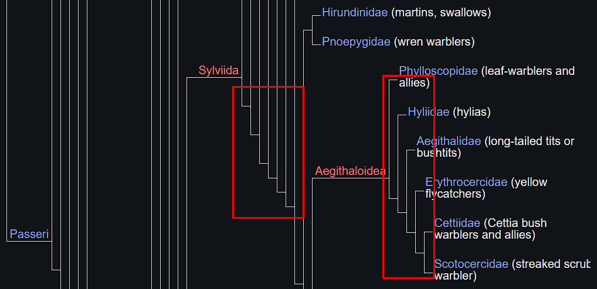

4.

> _No shepherd, and one herd!_

- Remembrance arrived at the plateau that is the self is worthless - the point is not to get out of Plato's cave to witness the featureful landscape that the self can be, but to go back inside and challenge existing assumptions. Dasein in bad faith might abscond and abdicate, but a fully realized being will necessarily fashion out of this newfound self a sermon on the mount or a song on a chariot not in mere hope of bringing about change but as a prayer that will decisively reconfigure existing associations and assignations.

- Challenging existing assumptions is a game frought with differences dangerous to the dasein's current assumptions, and since life is lived mostly on the parallax of assumptions, descending back into cave on the plateau is riskier than escaping from it. Being realized, or in Maslow's lexicon, "self-actualised", is being with an interalised death drive - one who choicelessly, with or without feigned reluctance, appears only to disappear until only the movement of the coming and going remains and dasein itself becomes, if anything, a shadow on the wall of the cave.

- Memory as a topological invariance of pure difference unfolding as difference, culminating in the eidetic determinism of an n-polytope (hitherto referred to as Adwaita in Hinduism) with an observable universe as each of its faces in any given dimension, affording peaks and troughs on the crease that give a vantage point for observers astute and discerning - and transcendental memory, being one such peak (which may be found in myths related to holy mountains such as mount Meru) - where one can see the disbursal blueprint of memory along the die of difference bring us to the final declension of the theory, which is sociological. 

- It is so because the time that allows for no gaps is simply a sociological phenomenon, as observing anyone who wakes up after years of being in a comatose state can confirm. It is memory that is gapless and fills the homogenity of pure differnce densely, and difference sparsely.

- Whether in a coma, dreaming in deep sleep, lost in a reverie, or under the influence of anesthesia or other drugs, what goes on is not time but memory.

- Upon death, memory simply leaves an empty channel of difference which is filled in by reminiscences of other memorising machines until the channel finally runs dry, leaving behind wadis that successing differences may or may not rush into.

- The logic behind animal (or human) sacrifices is precisely to flood these arid channels of difference with the memory of a recently desceased, recently diverted flow of difference. But while the instinct is correct, sacrifices fail to take into consideration the volition, sovereignty, and weigthed momentum of determinism driving the difference which is the sacrificed soul.

- Each successive difference is a step away from singularity and a step towards nefarious dualities represented in L-systems which populate networks of self-similar but not identical significance.
  
-  
    > Figure 3: A section of the phylogeny of the Pesserine, revealing the breakdown of genera with highlighted binaries unfolding in Linnean steps.

- Pure difference informs each difference, including one between normative and descriptive, reality and fantasy, fact and value, good and bad, all of which are binary concerns of differences conditioned to see only half the picture. But seeing half the picture is half the journey out of the cave and back again. Once outside the cave, the  empire of time cracks in two over an intermediating, agentic bridge dissociating from _causa causans_ and falling squarely into _causa proxima_, the realised being goes out of the nativity of time and into its abortion.

- The whole picture is a quadrature wherein not just time and space, but difference itself collapses into a redoubling of pure difference, a shrinking of volumes, densities, and latencies. Dasein thus arranged attains to states of consciousness which Heideggerian phenomenologies labelled as states of "care" or "concern". 
  
  
- However, in the determined termination of corporeal differences, "care" is at best an indifferent stance. Dasein achieving freedom from the ghetto of time is already constituted by care in the n dimensions of its being and linguistic differences fail to map its altered state. Moreover, in the dual systems that configure matter, "care" automatically creates its phenomenologically evil-twin, its shadow which at best is an ennui-driven carelessness and at worst the inspired malady of neglect feeding on guilt and boredom. For this reason one had to invent a new word - "_embuted_", as a flare in this new lexical darkness, in order to create an effective pointer to the mood which is said state.

- Dasein that is truly non-binary thus does not substitute one binary for another but steps inside the whole quad, and climbs the tree of pure difference growing in it. Being embuted is the bug crushed under a thumbnail, the measure of distance between the runners in Zeno's famous paradox, being with a limit tending to one singularity and in doing so, attending to another. Such a being sleeps in four quarters of wakefulness and awakens to the fifth.

- Sometimes, at least as recorded history seems to suggest, dasein achieves this nth self-sufficiency by sheer accident, on occassions effort is involved, regardless of context. Dasein that does not achieve the escape velocity, tends to retard in the flow of memory and lives through a self-alienation which could be said the primary cause of its being lost in _samsaric_ indentations, unaware of its options - there could be no greater loss.

- But achieving this escape velocity, like in rocket science, is no small feat. The empire of entropy is vast and extends on either side of Plato's cave, futhermore it is populated by retarding and reactionary forces like friction, decay, inertia, and momentum working at more than physical and biological levels. Hiding in structures and superstructures such as language, rhizomes like the banking system, organs without bodies, bodies without organs, or historical concepts, disguised as entertainment, (un)employment, coping mechanisms and the violence of everyday life - underneath it all is a difference common to all decay, that if moulded in certain fashion can become _persuaded with_ instead of _persuaded of_.

- However, as the somber warning of the metaphysics that follows implores, one would be foolish to set forth on such enterprise with the intention of undertaking it in bad faith. Which is also tragically where this short ontology ends, in that this is not a thoroughfare public. 

- The reason is baked in as usual. The teeming millions chug along as complacent automatons inspired only by their hatred for the free, rare soul that dares yearn. Not that the walled garden that is the solar system is unpenetrable or distances beyond have not been scaled, but that enlightement as a difference is not amenable to scale.

- What is expected nevertheless is that dasein in the fullness of time comes to its own undoing, dying and being reborn innumerably in each moment in time until the mountain to be scaled is no longer time but difference responsible. 
  
  
- The horizontal chirality of similarity transcends into the helical ascent of difference, the beginning of a new pilgrimage as a member of not the class of dasein previously determined, but currently assigned. 
  
  
- To the hero who hears this call, and then embarks on the journey with scant regard for moral and material trade-offs, untold bounties of pure difference await not as a consolation for having forgone a sense of self, but in its very finding. 

- 
Dasein that hears is concomitantly heard and thus a herd unto himself, this Übermensch is reviled, discarded, excommunicated or imprisoned if not drawn and quartered by the seething and bankrupt social machine which is deaf and invested in remaining absolutely committed to relative ends - making the journey out of relativity and into absolution a perennially dangerous one. 
