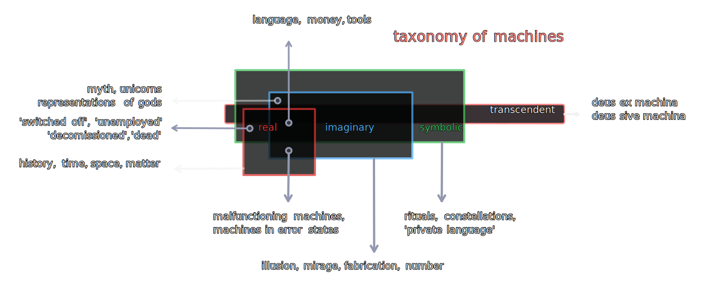

## 2.

> _Nenn’ ich, Sakuntala, Dich, und so ist Alles gesagt._ - Goethe

#### 2.1 A basic outline of machine taxonomy (with examples)
 

#### 2.2 The closest definition of a machine in this context then, is something like an origami sculpture - _a structure "folded" into function(s)_.

2.2.1 Just as complex creations arise out of a small number of folding techniques in the Japanese art form, complex machines arise out of combinations, permutations, and repetitions of simpler ones.

2.2.2 What is structured is the folding function, what is functional is the folded structure.

2.2.2.1 The folding is a function of the structure, the function is a base upon which, or into which structure is operated upon.

2.2.2.2 Structure is pronounced as states and announced into connections upon each discrete fold producing in each iteration connected and connectionless states, and stateful and stateless connections. 

2.2.3 What is folded and folded into are not just protiens, dimensions, and uncertainties, but even epistemic categories are arranged as an assortment of bends and creases.

2.2.4 Transcendence the structureless fold, or foldless structure as a category occurs without any and all structure, the rest operate within the folds of cognition.

2.2.4.1 Qualia and its praxis are both antinomically rooted in relations oblique to the real, imaginary, and symbolic. 

2.2.4.2 Epistemological categories are vernaculars of function whose input and output is substance. 

2.2.4.3 The source of epistemic integration is the fold itself, the categories mere creases apparent. 

2.2.4.3 Transcendence is modality of episteme apriori, an integration of the sum and knowledge the differential sutures of the integral that is original function.

#### 2.3 Knowledge for and of machines is always already knowledge of their states.
