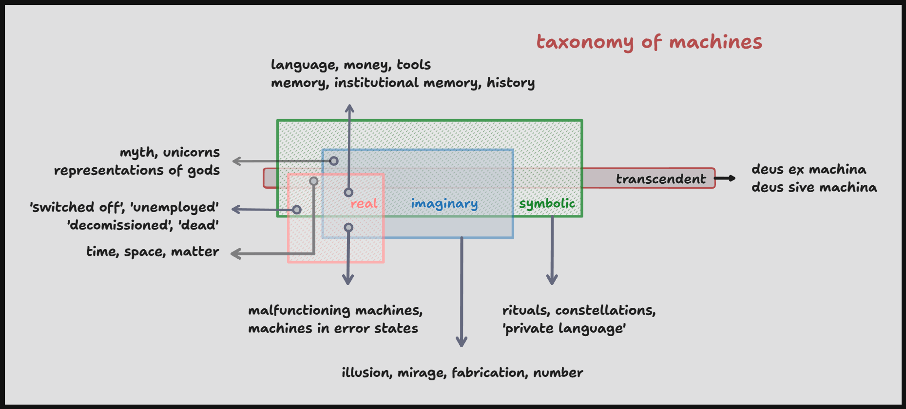

## 2.

> _Nenn’ ich, Sakuntala, Dich, und so ist Alles gesagt._ - Goethe

#### `2.1` A basic outline of machine taxonomy (with examples)
 

`2.1.1` Strucutres of cognition or modes of epistemic translation (of sense data into information and information into knowledge) are a useful classification of machinery.

> `2.1.1.1` Although each is constituted discretely enough to be studied independently, not each renders itself accessible to a exhaustive interpretation in mutual exclusion. 

> `2.1.1.2` The _real_ appears contradictory and relative from an imaginary standpoint, the _imaginary_ lacks corporeality, the _symbolic_ descends into metacognitive artifacts, and the _transcendent_ appears as a paradoxical, paranormal void veiled from scientific enquiry.

> `2.1.1.3` Objectively, these become the apparatus of cognition composing and decomposing one machine out of and into another, including superstructures like nation state, organization, family, and other agglomerations.

> `2.1.1.4` Cognitively speaking, mind and body are on an eternal drive home on highways at once real (roads), imaginary (roads in video games, paintings), symbolic (roads in pilgrimages), and transcendent (roads in myth), the dialectic of history thus churns itself out of itself.

`2.1.2` These epistemological modes are vernaculars of a function whose input and output is substance. 

#### `2.2` The closest definition of a machine in the context of substance then, is something like an origami sculpture - _a structure "folded" into function(s)_.

`2.2.1` Just as complex creations arise out of a small number of folding techniques in the Japanese art form, complex machines arise out of combinations, permutations, and repetitions of simpler ones.

`2.2.2` What is structured is the folding function, what is functional is the folded structure.

> `2.2.2.1` The folding is a function of the structure, the function is a base upon which, or into which structure is operated upon.

> `2.2.2.2` Structure is pronounced as states and announced into connections upon each discrete fold producing in each iteration connected and connectionless states, and stateful and stateless connections. 

`2.2.3` What is folded and folded into are not just protiens, dimensions, and (un)certainties, but even epistemic modes are arranged as an assortment of primitive bends and creases.

`2.2.4` Transcendence the structureless fold and "master function" occurs without any and all structure, the rest operate within the real, imaginary, and symbolic folds of cognition.

> `2.2.4.1` Qualia and its praxis are both antinomically rooted in relations oblique to the (transcendental) easels upon which are hung the paintings called machines - deconstructively, the frame around the canvas. 

> `2.2.4.3` The source of epistemic integration is the fold itself, the modes mere creases apparent with an infinitesimal frequency. 

> `2.2.4.3` Transcendence is modality of episteme apriori, an integration of the sum and knowledge of differentiation by original function.

`2.2.6` Superstructures are machines too, with the caveat that the frame of reference is always relative to the size of the immediate neighbourhood. 

> `2.2.6.1` A flock of seagulls is as much a machine as a seagull but compared to a single cell in its body, a seagull is also a relative superstructure.

#### `2.3` All machines are state machines reductively and asymptotically, knowledge _for_ and _of_ machines is always already knowledge of their states.

`2.3.1` For example, matter is a finite state machine with four common (and four uncommon) states.

> `2.3.1.1` States are simply descriptive data on extant machine, a state is a unit of information broadcasting a machine's conditions, environment, health etc.

> `2.3.1.2` Plurality of states is a state machine.

> `2.3.1.3` States are broadcasts via mediums known variously as connections, relationships, channels etc. 

> `2.3.1.4` A flower blooms, its fragrance announces the change, attracting pollinating agents perpetuating the transition.

> `2.3.1.5` Without connections it is not possible, for example, to urinate into (or outside) a pot (`3.1.2`).

`2.3.2` By contrast, substance or extension is an infinite state machine that includes states of qualia and transcendence.

> `2.3.2.1` Finite state automata may be as simple or as complex as the machine represented by it, a pneumatic robot arm has fewer connections than a human brain thus exists in a state space exponentially smaller.

> `2.3.2.2` This isn't to confirm or deny the transcendence immanent in sheer numeric strength of connections, but because each number is a collation of infinity, it can be impossible to find new transcendent (or even prime) numbers formulaically.

>> `2.3.2.2.1` The Riemann hypothesis is still unproven as of this writing, precisely because the number of "non-trivial zeros" between two connections cannot be ascertained.

> `2.3.2.3` It is easier thus for a unicellular organism to transcend its enviroment than it is for a digit to become disloged from the number line. 

> `2.3.2.4` Mathematics is just normative description but biology is determination prescriptive, thus a more fruitful reproduction of the function with more possibilities to enumerate.

`2.3.3` Any fundamenal knowledge of states is knowledge of a "translation", both in geometric and linguistic sense.

> `2.3.3.1` In an `n`-dimensional universe, a single state can be represented by a `n-1` lexical system or a base `n-1` numeral system. A two-dimensional planet will have one pole, a three dimensional two. The representation is immediate and precise - the set of planets with two poles is identical to the set of all three dimensional planets.

> `2.3.3.2` This loss in translation is always the loss of original state, this loss represents the primordial fold, the genesis of transcendence.

> `2.3.3.3` Indeed entropy is at work within the quinian loss inherent in the very definition of translation. This is apparent outside "natural" language, for example in stock prices, or in Rømer delay.

`2.3.4` All states originate in immanence and get _translated_ into domains of biophysical, desiring, or transcendental production.

`2.3.5` Machines exist in and as a finite field (or network, see `3.1`) of states and connections, wherein state transitions are relayed inter alia.

> `2.3.5.1` Connections are interfaces or "relations" within and without machines. They are middlemen appropriating states inside the network. Much as a thumb is an interface, thus giving rise to the idiom "rule of thumb".

> `2.3.5.2` Unlike non-functional states, a connection can be a functional machine i.e. a connecting machine such as a bridge, tunnerl, strait, isthmus, or fibrocartilage.

> `2.3.5.3` Connections can inhere in states, lie dormant (implicit) and get activated (explicit) upon transitions like grounding and decentering (`3.5`).

> `2.3.5.4` State transition is a reification of feedback, not a _process_ for "_the dogma of process leaves room for freedom_", there are no processes, only state transitions immediately immanent.

> `2.3.5.5` Processes are only symbolic and abstract machines like constellations. Only a label given usually post-facto to streaks of state transitions observed repeatedly.

#### `2.4` A functional quanta of a state machine is a configuration _of_ the state machine.

`2.4.1` Configuration may appear as a fold in associated structure, such as a bend in a pipe or as a constellation, or as a fold in pure function as in sexual or magnetic polarity.

> `2.4.1.1` Configuration is the inedible part of the machine, the offal that is discarded by the collective but is fundamental to individual constitution.

`2.4.2` A state space quantized by chains of extant structural-functional bindings constitutes configuration; For instance, colour is structural binding, culture a functional configuration - "race" a combined state space.

`2.4.3` Bindings are narratives of states emergent in _association_ with and _assignation_ of other machines. A nation state is a binding, as is a book.   

> `2.4.3.1` Different configurations arise as a consequence of these associations and assignations. 

>> `2.4.3.1.1` The porosity of a towel is a configuration of the yarn arising as a consequence of its assignation by the loom.

>> `2.4.3.1.2` The colour of the towel is an assignating binding of the dye.

>> `2.4.3.1.3` Both color and porosity are thus configurations of the towel, however its wetness and dryness are states arising out of association with water.

>> `2.4.3.1.4` A towel faded in color after years of use has changed in configuration, one that has been torn has leaped over states of structural integrity.

`2.4.4` Normatively the configuration is an implicit faculty, like a value or mode made explicit only in the act of arriving at it.

#### `2.5` The `n`-dimensional integration of the sum of all discrete and continuous state machines is the delta called feedback. 

`2.5.1` Feedback is to singleton state what deus ex machina is to machina or machine.

> `2.5.1.1` It is a square-summable sequences of signals, a hilbert space that is an uncountable set or a hyperbolic manifold with `n` surfaces. 

> `2.5.1.2` The deontological totality of feedback makes it comparable to broadcasting machines such as water or air. 

> `2.5.1.3` Feedback is the stitch in the needle, the thread, _and_ the cloth.

> `2.5.1.4` Feedback is the fold to which all states return, it is information as a functor. Reductively, the canvas (`2.2.4.1`).

>> `2.5.1.4.1` All states originate and terminate in feedback, which originates and terminates in original state that is an astructural, afunctional, stateless and functionless condition.

`2.5.2` In so far as a state is representative of itself or configuration extant, feedback is representative of discipline active.

> `2.5.2.1` Simply put, feedback is any state *observed*.

> `2.5.2.2` With mathematical precision and certaintly, every state transition changes the overall state of the sum deterministically, giving occasion to such fields of scientific study such as Chaos theory, Hamiltonian optics, Lagrangian mechanics etc.

`2.5.3` Unlike states, the knowledge of feedback is not a translation, for there is no space to decenter extension, nor can there be a language of languages that simultaneously expresses atomic facts in all dialects.

> `2.5.3.1` Knowledge of feedback is direct and immediate, a bulb is either on or off.

>> `2.5.3.1.1` All knowledge is feedback, whether corroborated by prosaic sense datum or supernaturually procured.

`2.5.4` Logically from `2.5.1`, no machine may exist beyond feedback. Even dead, switched off, broken machines relay feedback as their deadness, powerlessness, and brokenness. 

#### `2.6` At every intersection of structure and function is produced the synaptic, spiracular, parallaxed, and liminal lattice of image. 

`2.6.1` Image is the original function, a quine that reproduces its own source as the only output. The first fold in structure of substance is nothing but the image of structure folded, producing a connected dualism.

> `2.6.1.2` Since the original function is a meta structure, its production is only a copy of itself, connected to itself.

> `2.6.1.3` The reason any localised agglomeration of machines appears to be connected is precisely because unitary machine is already a network made in its own image.

> `2.6.1.4` The original function is irreducible, thus image is irreducible - already in a photograph we observe tiny particles or waves of light coming together to function as narrative on a planar surface.

> `2.6.1.5` The image that is connection is not yet discernible as a whole (except as a `n-1` dimensional primitive), but an abstract primitive unit of the network that is image discerible.

>> `2.6.1.5.1` From `2.2.6.1` this primitivity is a function relative to the size of the network under consideration, a triangle is an image for the network that could be a pyramid, a lateen-rig etc.

> `2.6.1.6` In so far as a photograph is an imaginary machine, a lathe a real one, a symbol a symbolic machine, and the number `π` a transcendental machine, an image is a network of machines.

`2.6.2` Knowledge for a machine is thus a recoiling snapshot of the totality of all images that correspond to all states in a state machine.

`2.6.3` The function of functions is the production of images such that even in consumption, what is produced is an image of consumption.

`2.6.4` If machine is substance, its plurality - extension - is symbolised rather aptly by the machine that is an extension chord, a gateway hosting a small network.
