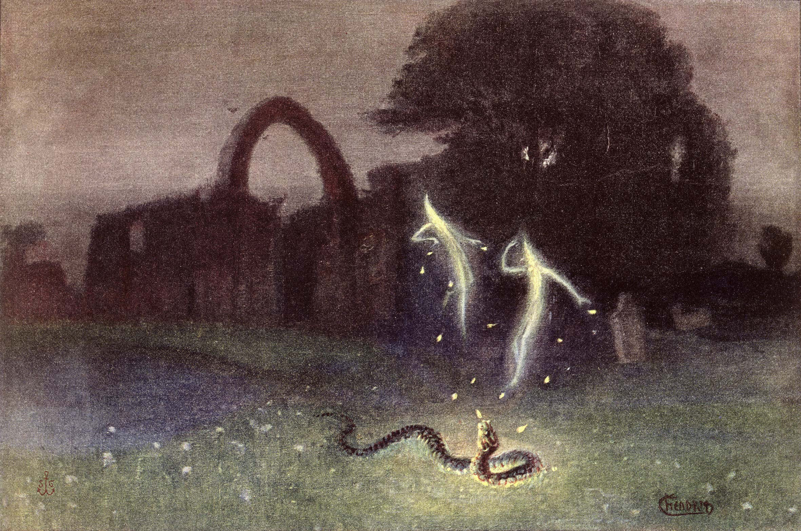

## 4.

> _It is slaves, not free men, who are given rewards for virtue_ - Baruch Spinoza.

#### `4.1` States of error are preempted by protocols.

`4.1.1` Freedom appears as nothing but the ability to error, to deviate from image-in-command, to turn aside from the program and the pogrom. 

> `4.1.1.1` Protocol hierarchies are the keepers of the unitary differences, they are the very patterns knowledge is recollection of. 

> `4.1.1.2` The length of one second is a determination of a protocol, arbitrarily mapped to decay of the caesium-133 atom.

>> `4.1.1.1.1` Protocol hierarchies are the metaphysical equivalents of machine hierarchies, for example, a food web is a higher ranked protocol than a food chain.

> `4.1.1.2` Networks mutate (`3.2.4`), shrink and grow but never lose their identities. Otherwise, witnessing a pigeon turn into parakeet would be commonplace. Yet this only happens in dreams, fantasies, synthetic images, and  magical illusions.

>> `4.1.1.2.1` Outside of a fantasy, to see a frog eat a carrot is a network violation, hence a freedom, or an _entelechy_ revolutionary for the subject and fellow frogs but only evolutionary for the ecosystem.

> `4.1.1.3` The moment a coin is minted decides the outcome of every subsequent toss. For a coin to imagine freedom from its network is to imagine a fourth state - in which it is neither flat on either side nor upright in any of the 360 degrees. 

> `4.1.1.4` Freedom appears not as an error but as an (fantasmatic) entelechy precisely due to this currying of functions, if Spinoza is right, freedom is in getting no reward for virtue. Indeed, substance, machine, and God is reward without virtue and vice.
 
>> `4.1.1.5` Chains of the reasoning are precisely protcols of a determination to reason. A prostitute dreams of escaping out of prostitution, the tattooed out of skin, a housewife out of the kitchen, and a human out of the planet and so on contructing only bigger prisons of error states.

`4.1.2` States of error are bi-determined shims, halo effects appearing in between two linear continuations reset or substituted by the third.

> `4.1.2.1` States of errors resolve into a folding upwards of production, into images of ahistoricity, into states of ignorance guaranteed by the protocol in which the error has occurred, mediated by the protocols below and above it.

> `4.1.2.2` If one represents the state space of a machine as a circle, wherein each point on the circumference represents a single determined state, then entelechy (the `n`th continuation) is represented by an undifferentiated point leviating unmoored above that circumference.

> `4.1.2.3` Achieving entelechy however is not simply a matter of identifying this so called point, but identifying it eternally, grounding it into a timeless identity that replaces all connections and states downstream from _self_ or identity. It is of course no achievement to fix an error state only to fall back into it.

>> `4.1.2.3.1` This is done by constructing shims leading up to the fault, a ladder of twin-faceted topologies that sublate entire state space into a state, a _scala paradisi_ of not pure but established reason. 

>> `4.1.2.3.2` A physical example such a construct is the evolution of the spinal cord in invertebrate and tail loss in hominoids.
     

`4.1.3` From such a sublated perspective like that of the Übermensch or the Buddha, entelechy was the previous state, but for mere mortals, it can be a perfect memory from decades ago. 

> `4.1.3.1` For physical machines simpler than man, entelechy is more or less entirely a structural state and for virtual machines (data loops etc.) it's a state of execution.

#### `4.2` Entropy is a penultimate protocol, the phase-type distribution of difference _in_ randomness.

`4.2.1` Randomness is the penultimate flavour of entropy whose ultimate taste is decay. The very definition of the word "random" implies that any cognitive artifact can be placed in a context, translated in and out of relative states, giving everything a borrowed significance in eternal return.

> `4.2.1.1` The reason why the length of one second is arbitrary (`4.1.1.2`), why there cannot be a formula for generating prime numbers (`2.3.2.2`), is the same reason why random number generators outsource entropy as a seed.

> `4.2.1.2` True random distribution is thus already an overdetermination hence impossible, God doesn't overwrite.

>> `4.2.1.2.1` Nor is it the case that the absolute is overdetermined, for that would be akin to turning on ignition in an already running car. 

>> `4.2.1.2.2` Each determination is already an end-state in a trinary juxtaposition to the previous and next states, closed to further play of probabilities unless acted upon.

> `4.2.1.3` Fruits rot because they cannot escape the taste, their own sweetness works as an agentic configuration of mechanical decay, and since nothing can be random, the agent might be attributed to, if not addressed.

> `4.2.1.4` But mere praying isn't enough to channel the rot into transcendent phase, so machines _work_, even languages dream inside other languages. However, it is simply not the exclusive largesse of activity that liberates. 

> `4.2.1.5` Work, like dreaming, is no will, for will, like chance, is an overdetermination. 

>> `4.2.1.5.1` Only in a random universe will working and dreaming states not exist and if things could be overdetermined, all work would be random and androids would be but a dream of static in the Will-o'-the-wisp.  

>> `4.2.1.5.2` The absolute is a thoroughly determined ocean, and the relative a storm in it, pretending to be free like an incredulous typo fighting the rest of the manuscript.

>> `4.2.1.5.3` In the absolute it isn't as if there is room for an inch's worth of revolution or arbitrage available to exploit, each straw and sheaf of wheat standing in a field can attest to this fact of relative freedom.

>>  `4.2.1.5.4` So even digging and filling wells could be considered ethical or even electrical resistance could be seen in righteous light, but outside of steam shovels and resistors, that would be an equally impossible _underdetermination_.

`4.2.2` Neither of the two phases-type distributions of cognition can be over or undertermined. A coclear balance that is more than the sum of its parts propels work into etropy or entelechy.

`4.2.3` The physical definition of work follows the transcendent wherein effort expounded is but a movement of the flow of transmission, from hearing to seeing and sensing, all work is a pre-establishment.

`4.2.4` States are not willed _into_ existence but substituted through connections and represent the execution of the greasy transmission (`3.1.4.5`) which conqures time with a scorched earth ferocity of _ignorantia legis neminem excusat_.

> `4.2.4.1` States of resistance serve to impede production and flow, but also do so as part of the same determined transmission.

`4.2.5` That which isn't rational isn't real. It might be imaginary, symbolic, or even transcendental, but rationality is the domain of the real alone and randomness is irrational apriori. 

> `4.2.5.1` Conversely, that which isn't real isn't rational. So machines symbolic, imaginary, and transcendental are all beyond reason, and randomness their unreal source.

> `4.2.5.2` Ranks of real or corporal machines are considered only at this interface with entropy, this penultimate threshold that leaps over into the files of the intangible, a transubstantiation of passover into law.

`4.2.6` Chance is a state of distributive entropy for a machine and a factor of its unfolding state space. A dice includes six stable states, a coin two but a dice rolled _appears_ to shuffle momentarily between states until achieves the next stable state and as does a flipped coin.

>`4.2.6.1` These only _appear_ to be between states because a stable state for these machines is a matter of perspective, which is relative.

> `4.2.6.2` Symbolically, the "flipping" state belongs not to the coin but to the piece of metal just as it is not the dice that rolls but the cube representing it.

> `4.2.6.3` Machines with a single state space such as numbers are most stable in this regard, thus `3.14` cannot be random, or appear to be between determinations, giving mathematics its rigor.

`4.2.3` Nor is chance a matter of _how_ the machine is fitted into its epistemological framework - a _symbolic-transcendent_ machine such as `ॐ` is stable amongst modalities of its knowledge or sodalities of its guild.

> `4.2.3.1` It is both symbolic and transcendent in each mention and never real or imaginary. 

>> `4.2.3.1.1` The only way to make it real is as a symbol, and the only way to imagine it is also as a symbol, and its chanting leaves nothing to the imagination.

> `4.2.3.2` Other symbolic machines such as the swastika have gathered enough stability through their use to represent machines that create or destroy unsustainable images.

#### `4.3` Production is always production of an image. 

`4.3.1` Image here is not a photograph or painting, not a virtual image of the real, but _the production of productions_, the network of networks that is eternal return.

`4.3.2` Image is never a totality for a totality is negation not a positivity. As a result, neither pure entropy nor pure entelechy can be.

> `4.3.2.1` The treachery of the image is its partiality, one so well hidden not only by frames ornate, whether legal, social, or psychological but also by the partiality of the observer-image. 

> `4.3.2.2` The reason why no real, imaginary, or symbolic machine is perfect is the partiality of difference that creates them, the attainment of network is a process of subnetting.

> `4.3.3.3` The transmission mimetic of image in network is a flow of entropy, the artful dodging of the original.

> `4.3.2.3` Authenticity is attained outside the network, in the very lack of any image and in the isolated exclusion of difference from its yoke.

`4.3.3` Deus ex machina is a perfect machine because it is no image, it is instead the very _unterscheid_ of image, the plain obverse of a photograph wherein dwells the inextension of its means and ends.

> `4.3.3.1` Transcendental machinery is therefore not to be found in the realm of the production, the first tetrapod that evolved a spine was not miming its network, rather mining it for transcendent resources. 

> `4.3.3.2` Destruction is also a production, albeit of inverted images, hence here too, the search for transcendence in part or whole is misleading.

 `4.3.4` Entelechy is to be found rather in the conjunction of images, at borders destructive, in relations transcendent, and in connections immanent. In the connecting adipose tissue lies the pluripotentiality of cellular structures and functions.

>> `4.3.4.1` A subtle addendum to Hegel's dictum of "spirit is the bone" is a revisionist movement inching inwards in search of the root of the bone, hence "spirit _in_ the bone", where a bone is a mere mimetic reflection of the networked production.

>> `4.3.4.2` All images are images of pain, productions of entropy acting on a receptivity, the dissolution before death. The image of feedback is thus the image of sadness, the broadcast of decay, by decay, into decay, for decay.

#### `4.4` Entelechy is the ultimate protocol, the phase-type distribution of networks in network.

`4.4.1` Entelechy is a model for transcendence as work, the force behind entropy, and the _raison d'être_ for _self_, entropy is mere comparative assertion of the network.

`4.4.2` The classification of machines in `2.1` is a classification of their respective work as well. 

> `4.4.2.1` In so far as a machine is what a machine does, real machine produce real images, symbolic machine create symbols, and the output for imaginary machines is imaginary images. 

> `4.4.2.2` Machines can produce each other of course, so can transcendental machines - miraculously, ordinary machines can create the Buddha out of the same protocols, a combination of simple machines is an abstraction in `n±1` dimensions.

> `4.4.2.3` Transcendental machines produce images of transcendence.

`4.4.3` The difference between machines ordinary and transcendent is their drive, which is a determination to follow protocol, to produce images of one kind or another, to work.

> `4.4.3.1` Whereas ordinary machines are driven by the nihilistic and mechanical whims of entropy, machines transcendent have a fuzzy tendency to form networks on the less dogmatic, antipodal face of empiricism.

> `4.4.3.2` The goal of all work is the discernment of truth, the Rome all roads lead to is not to be found by standing motionless on the default bank of the Rubicon or Charon or Styx, but in the crossing of the river and arriving at the other bank.

> `4.4.3.4` While machines geared towards entropy end their production on a regressive, single stream of production, entelechic machines fan out like a delta, creating the very networks of work they join, creating more, transcendent work for each other like some divine bureaucracies fashioned by and for their self-transgressive nature.

> `4.4.3.5` Transcendence is in this very transgression of the penultimate, or what becomes the penultimate in the production of the crossing over, in this original "leap of faith" that produces the image of ultimate change, or difference. 

> `4.4.3.6` This is in stark contrast and diametric opposition to the faithless entropy, which produces only the static, changeless landscape of similarity where each rotation of the stepper motor is a revolution in-situ, where even the fragrance of a rose in full bloom is mere olfactory perception.

> `4.4.3.7` Unlike the ultimate the penultimate can have an ontology. Like a police or fire truck siren, the penultimate is the engine of the particular, the map of whatever can come before or after a thing. Entropy can have a map, but not entelechy - which can at best be labelled as a drive without the driven.  

`4.4.4` What differentiates entropic images from entelechic is precisely this drive, this _protocol-in-rebellion_ that is a qualitative and quantitative difference in state which unlike entropy (_protocol-in-execution_) not just announces but also arrives.

> `4.4.4.1` In a transcendent machine, the determination and orientation of work must return to entelechy, to connect to networks inside the networks of symbolic, real, and imaginary.

>> `4.4.4.2` The ecstasy of _bhakti marga_ is in the division until immanence but transcendence is a multiplication into absolution leading to the door of the same ecstasy, which is so dear to total entelechy.

>> `4.4.4.3` The liberation is only in its recognition, which is a matter of practice, thus to a large extent profoundly elusive. As if one were tracing holographic markers of time with thermally unstable crayons, a dismal undertaking of connecting the dots retrospectively. 

>> `4.4.4.4` _Moksha_ is one small step as the difference between journeys, a leap over and into such a recognition is always a totality, it is no half-hearted admission that charges and discharges dutifully, indeed nor is the resolve to make such a journey a casual one.  

>> `4.4.4.5` In so far as transcendence is a desiring production, it is non-negotiable. Protocols of negotiation exist only in the real and happen only on the biophysical level.