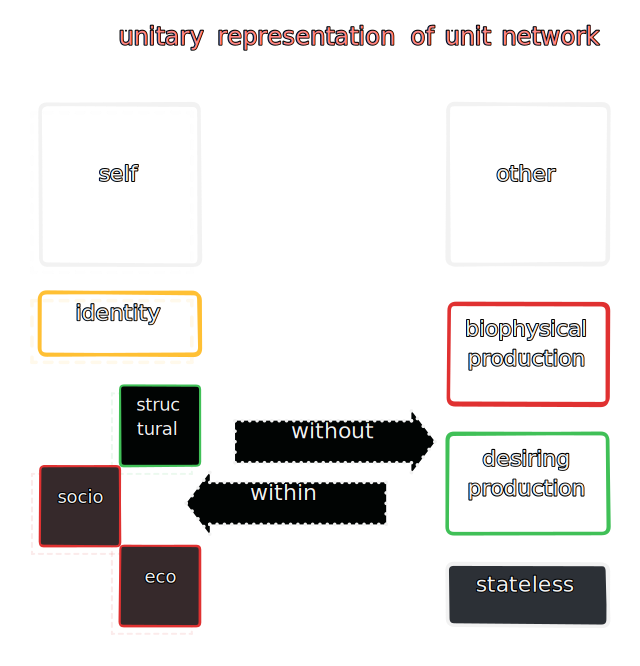

#### 2.4 these categories sort machines into futher relationships (hierarchies) downstream, such as those of declinations, declensions, inclinations, and intentions etc. As interesting as these hierarchies are in themselves, for the purposes of this text we shall consider language as a machine/tool without much emphasis on linguistic relations. 

2.4.1 our primary interest is the cartography of this metaphysical kingdom without getting lost in the paralysing parade of linguistic flotillas of meaning, or allowing psychoanalytic concerns to queer the pitch any more than necessary.

#### 2.5 just as a counter cannot be made without numbers, legends in metaphysical maps cannot be constructed without using the configurations of singularity (self, identity...), duality, trinity and so on. as described in 3.3.2 the _self_ or singularity of psychosomatic "oneness", is one such config, the duality of a childhood friendship, or the holy trinity others.

2.5.1 such identities of identities form the landscape above which levitate unmoored - circular, linguistic, and string-like rings of _assignation_ and _association_, grouping machines further into categories ad infinitum.

2.5.2 a movement of these rings correlates strongly with the movements of '_grounding_' and '_decentering_' in personal and public psyches.

2.5.3 these structures are purely language-derived in themselves but assume logico-social reality in operation and execution outside of language.

2.5.3 the grounding and decentering allocates a machine its functional boundaries, in so far as a machine is defined in functional terms, its ontological and epistemological borders come from these associative bands of meaning.

---

#### 3.1 types of connections

#### 3.3 machines are 'conscious' to the extent that their connections can discern this network.

3.3.1 it is such discernment that turns imaginary networks into real and symbolic and vice-versa. thus, a wolf's consciouness is by and large limited to the pack, a buddhist monk's to the sangha, on offline computer knows only itself, and a comb tooth in exile from the comb becomes a decentered machine at once more and less useful than a comb.

3.3.2 sentient machines exist in a state of stochastic ergodicity, thanks to their identity connection, whereas for non-sentient machines the primary state of being is more markovian. bearing in mind 1.4.2 which implies the bounds (including bounds of irrational and erroneous states like madness etc.) of rationality.

3.3.2.1 it is a superlative critique of pure reason that cognitive faculties of each machine are limited to the context of its connections, a pneumatic robot arm has fewer connections than a human brain thus exists in a state space exponentially smaller.

3.3.3 sentience and consciousness are somewhat different callings of the identity connection, in that while sentience means awareness of only localized sense datum, consciouness is a non-local feedback loop within sentience.

3.3.4 as the networked consciousness grows, individual and group behaviours take on a multiplicity of states. such as hunting in groups, waging wars, technological innovations and so on.

3.3.5 this is diametrically opposed to marxist emphasis on negation, or negation of negations, for regardless of unit, what is apparent is a positivism.

3.3.5.1 like any positivism worth its salt, this one is also self-replicating, often in beautiful fractals. a hollow pvc tube is a machine that through this kind of additive synthesis shifts into entirely different identities under different networks (drainage, insulation etc.)

3.3.6 it is clear also that there are degrees to consciousness, a table, a rabbit, and a human being are conscious in increasing order of awareness, sentience, and transcendence.

#### 3.4 connections are relatively simple machines grounding machines into states of self and other inside the network.

#### 3.5 a machine's connections assign state to its structure.

3.5.1 state is, for the most part, synonymous with function. a function is a series of states seen frequently in a linear succession or a state is a snapshot of a function during execution. candidly, function is _the_ state of being machine.

3.5.2 a migrant laborer performing morning ablutions on the railway track is in a state assigned by the socio-economic connections with the machine that is the track, the biopolitical connections between the body and the sun, and the connection of desiring production assigned by the machine that is the day and so on.

3.5.3 connections are as innumerable as there are machines and can at best be grouped into numerable categories as illustrated above.

3.5.4 the key idea in substituting function with state is to weaken the concept of process, there are no processes, only state transitions ever - "_the dogma of process leaves room for freedom_".

3.5.4.1 processes are as illusory as constellations, which is to say only symbolic and abstract, they are neither machines, nor connections. only a label given usually post-facto to streaks of state transitions observed repeatedly.

#### 3.6 simplicity is a guiding tenet for the study at hand, but a simplicity beyond attributes of matter and spaces, a simplicity which remains in the elegance of machines simple and complex. 

3.6.1 it is in the sublime simplicity of rivers, railways, and toasters and in the humility of mere bottlecaps and contraptions without rigor that we find the gyrations of history unfold.

3.6.1 but if it is difficult for clergy and laity alike to see a river as a machine, consider their plight if asked to imagine the (concept of) an uncanny valley as an automaton, or perhaps visualise the parasitic torques and countercurrents of resistance flowing through both air and water in each infinite valley and each river running through it.

3.6.1.1 to truly measure the scale of this field-of-perception, glance at the machinations of history in all its glory, ever in motion as the planet it claims to transcribe - replete with its own tools and accesories where every bullet fired is as much a machine as the war or revolution it was fired in, the person it was fired at, the organs it pierced through, the gun etc. 

3.6.1.2 history however, is rarely transcendent. which is to say that unless sought, unlike real, symbolic, and imaginary, it slips through the fingers. thus transcendent machines are rare.

#### 3.7 'entelechy' is a model for transcendence as work, the force behind entropy, and the _raison d'être_ for _self_

3.7.1 connections inspire change of state, but these states clearly aren't arranged in a random fashion, the survival of any machine depends on detecting patterns in states and between changes in them.

3.7.2 nor is the diurnal chugging along one happenstance in service of another, larger one - one that lasts as long as entropy.

3.7.3 entelechy is the force behind entropy, it is _the ghost in the machine_. it is the commanding principle of the immanence that relates a machine to itself and is the first and final cause of each action.

3.7.3.1 the most clearest example of this is how any true random number generator needs to be seeded externally by a source of entropy.

3.7.4 it is through this entelechy that a purposeful derivation of the connection called _self_ is birthed. without it, no machine could claim ownership on a piece of work. entelechy is indeed the only principle behind a machine's work, the degree of which is the transcendence of work, and thereby the transcendence of machine.

3.7.5 the degree of entelechy ranges from the temporal to eternal. shiva's _damru_, draupadi's infinite _saree_, the crucifix, buddha's silent sermon and angulimala's mala, chariots of medea and parmenides etc. are all transcendental machines with near perfect entelechy, whereas one's lucky charm is imbued with mere superstition and temporal entelechy and is thus not a transcendental machine.

3.7.5.1 only its origin pure difference has a state of total entelechy, difference cannot achieve this state but can only ever tend towards it such that, the further away from such a state, the more entropic a system/config/machine is.

3.7.5.2 history has no dearth of examples of machines that aspired towards perfect entelechy but for whatever reason (usually _mauvaise foi_ or _ressentiment_) failed and are remembered for their efforts in transcendental heroism. the titanic and icarus' wings are just two cases in point.

3.7.6 entelechy is one word for the phrase _'as far as one is concerned'_, begging the question - how far exactly? which overturns all aposteriori logic on its stomach for the magnitude isn't a distance.

3.7.6.1 the magnitude rather is more like a field of flat potential, a timeless flux of capacity for infinite expression. the whole spectrum of what is not just feasible but also possible bearing in mind that impossibilities are the imperial unit of existence - what exists is mostly nothing.

3.7.6.2 the paradox of the existence of each atom being mostly empty space isn't metaphysical but simply logical.

3.7.6.3 outside of abstractions it is hard to achieve an entropy-free definition of entropy, but entelechy is a good start. the key here being that neither is a law, both are _postures_ (as in zen mindfulness), different states of practice.

3.7.6.4 in the immediacy of human lives, this can be said to favour drives towards any kind of "_immortality_", and trends in longevity and "antifragility" seem to confirm.

3.1 work is the output of bP and dP but no machine exists for output alone, in transcendental machines also, work is the by-product of bP and dP but is no longer subject to the same state space thus has acquired the more meaningful state of work'

3.2 at the same time, no machine works for transcendence alone, though some machines are more dedicated towards it than others 

3.3 work for each machine is localised to its connections, the ontological purpose of its survival is the performance of its work

3.3.1 although a lot of machines explore their environments and interfaces, sufficiently complex machines can access new epistemic categories through work

3.3.2 a _modality of cognition_ is a machine comprising of sense data and memory, it lives in states of emotion, feelings, sensations etc and is always already connected at least to one structural and functional identity through the connection called variously _self_, _ego_, _identity_, _sovereignty_ etc. 

---

4.1 the finite state space includes 'error' states, albeit error states themselves are capable of achieving transcendence, and thus becoming error' states

4.2 it is thus possible for a machine to achieve transcendence through an error in bP or dP or through relations and connections or the misfiring thereof 

4.2.1 it is also possible to achieve transcendence through acts of ommision or comission of a connected machine 

4.3 becoming transcendent _may_ connect the machine' to other transcendent machines 

---

5.1 a human being is a machine with the highest possible number of transcendental states and connections, furthermore it has the requisite bP hardware and self awareness as well

5.1.1 death is the only transcendental state available to other animals, whereas a human can die before he dies in more ways than one, such as sleep, coma, orgasm, or under anesthesia.

5.1.2 in general the dictum is, simpler the machine, fewer the states 

5.1.3  with mathematical precision and certaintly, every state transition changes the overall state of the sum [1.4] [2.1.6]

5.1.4 humanity is a constellation of machines now capable of changing planetary scale states but also construction basic infrastructre in space. surely there ought to be enough transcendental machinery to take us into and across the next few milenniums, but unfortunately the current social fabric is preoccupied with historical state spaces and the nakedness of existing transitions to make out the trees from the woods.

5.1.5 for all their progress and despite the internet, the number of truly transcendent humans remains low, increasingly concerned with routine chugging along, paranoid of the emergent technological and superlative states. they know everything but can figure out nothing.

--- 

6.1 Ours is a way out of non-transcendent states and connections, from within the framework of the human machine and doing this at scale and speed hitherto unheard of in ethical or hyper-ethical behaviours. Thus increasing the speed of human evolution by orders of magnitude, while discounting for, avoiding, and proactively preventing states of error including violence, state and market failures, suicide, wars etc.

6.2 armed with only the prior requirements 5.1 and examples of superlative states like death, we can hypothesize the emulation of similar state transitions and also the existence of other such states 

6.3 a state is a unit of all information about the machine at a given time, it can be a unit of particular subsystem (respiratory, cardiac etc) or of the overall - states and stateful configurations give insight into the overall being 

6.4 there is a state hierarchy as well, denoting both external and internal environments. 

6.5 these state hierarchies form the cornerstone of decision making states, which themselves are arranged in a treelike configrations such that there are higher states of being and wellness as well as lower, and some decisions are superior to others 

6.5.1 decision-making machines crunch out facts and values as work, which is their output relaying into other machines and changing their states via action.

---

10.1 classification of states 

