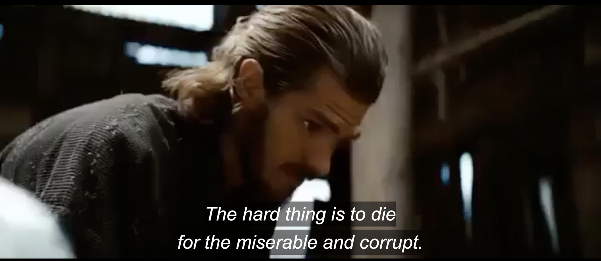

"Piety is not what the lessons bring to people, it's the mistake they bring to the lessons." - John Oldman, The Man from Earth

> # If you really want to do this with your life you have to believe that you're necessary, and you are. People want to live like this with their cars and their big fucking houses they can't even pay for - then you're necessary. The only reason people get to continue living like kings is because we've got our fingers on the scales and we're tipping in their favor. I take my hand off, well then the whole world gets really fucking fair really fucking quick and nobody actually wants that. They say they do, but they really don't. They want what we have to give but they also want to play innocent and pretend they have no idea where it actually came from; and that's more hypocrisy than I'm willing to swallow, so fuck 'em. - margin call

