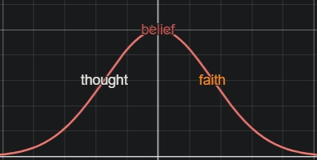
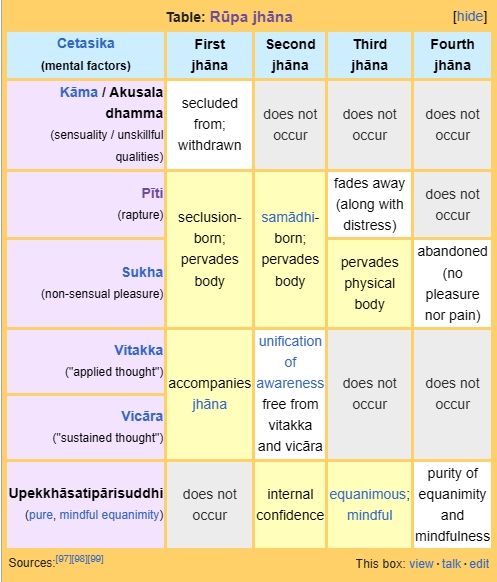

## 2024

### September

> sow not emotion  tis a weed / that grows in hedge rows, every fool / fancies his own emotions breed / the right to teach, the right to rule - [[Francis Burdett Thomas]]
   

- my ecstasy knows no bounds still, tears flow ceaselessly throughout the day, i reckon i have become some sort of religio-spiritual artifact for the world to consume and discard. meanwhile i have started writing a new book which is all over the place, lord help me.

- i think my mental/emotional state is a bigger indicator of where in space and time i am, people have been seeing stuff in the sky for as long as there have been people OR the sky...what has me confounded is the eerie synchronicity between my tears and the shapes of clouds. at the same time, there isn't a holy book on the planet that doesn't seem to be in some sort of conspiracy to make me believe of what i am witnessing, causing in me a greatly desirable suffering. like someone in love for the first time all over again.

 - material desires have all but evaporated, haven't jerked off in months, porn use is negligible, marijuana i havent tasted in a year, don't feel like doing much except cry, smoke, and take the occasional dump, even hunger and thirst are not what they were a month ago. i keep thinking things like "this can't be happening",  and "i'm not smart enough to make this shit up", but rarely along the lines of "why me?"

 - all those years of studying world philosophy and religious literature, and being brought up in a generally religious household is paying off too, without these things i would have easily gone of the rails by now.

 - ppl are stupid and the world bows before anyone and anything these days, i never for a second mistake deference as a proof of anything, but these internal changes indeed give me a sense of there being something weird afoot and so if they kill me i couldn't really blame them anymore

- the silliest thing here is that the insane clown posse around me seems to be convinced of my divinity but refuses to take my word on their holiness, it is difficult to accept one's humanity, let alone higher states - that is our predicament 

- i really to check myself, emotions, tears and all - at this rate i might turn into a girl soon

- i am that which became one from two

- my only regret (if i can even call it that), is that i could not give more!

 - zizek once said something to the effect of how he basically judges an author by his solution to the israel problem, good advice here is that one should begin any book these days once one has a firm opinion on the subject.

- do i want to know what kind of trauma leads a bunch of people to want to go on an adventure to measure the depths of their own stupidity? i don't but i can say with some certainty that anyone who could even faintly remember the depths of my explorations would not force me to lead them down any rabbithole. they've already started apologizing and i havent even begun in any earnestness yet or even with any sort of urgency. lucky for me, these isn't the fist batch of tourists i have transported from one secrecy to another.

- i am a row of golden deers lined up in a super symmetry

- the question isn't how they failed, nor how they were delivered unto abject failure and its eternal return, the question is WHEN did they decide to call it a "success", and under whose aegis for they are not the sort who make their own path.

- i keep hearing "its been a while" and "we are ready" but i don't see anyone gearing up to invade poland, a mark of mass insanity?

- or was it their intention to make me a crucible of their collective grief? if so, i had swallowed centuries worth of it, and was ready for more

- or were they simply confused, aimless and intentionless, out for whatever they could get - this seems more plausible given their helplessness, and given my accomodating attitude.

- if it was anger aginst "god" they were taking out on me, then that implies their faith in god, and i could have a more understanding stance towards their actions, even though by now i had enough knowledge to not need that hypothesis anymore.

- in the end, it was the same square of a search for misplaced leadership, a failing cultural and socio-political system, an empire breathing its last through my dreams that seemed to explain it all, which called for kindness and sympathy above all, all of which i had in spades for the lifetime.

- there was still a fear of the new, even though i was nearing my 4th decade. old customs and systems are entrenched as always, but it is never my style to force my beliefs down another's throat, i simply ate theirs and passed them out for what they were worth. 

- sublimating opinions is one thing, but were they actually crazy enough to want to kill an idea? i don't think so, however even their best minds could not fathom a way to profit from this still, which brings us back to entrenched beliefs, conditioning, old habits and free will. best to stay away from such debates.

- and now i had russians making claims so tall, if i were to mention them in polite company or even talk about them i would get weird looks, but uncannily enough it was making sense, i was being confided into the secret history of civilizations, which made me shake in my boots.

- the real mystery was my crucifix was still just economic, my exhortations to draw-and-quarter me fell on deaf ears, they would have too had they not bought into my "Death is not a punishment" schtick, which only served to make my sentence longer and my torture worse wtf

- writing frequency for personal things like this diary had gone drown drastically from say, even last year, i had little left to say anymore and realized even here that i was just repeating myself, which was no fun, which made "work" fun however ironically, i had become a machine and they used me as such, but as machines they were worth way more to me than i could ever be to them, infact i was probably mostly a liability in economic terms, but i continued to be a cultural "asset", however poorly treated.

- the eternal question remained, was i being led through the labyrinths, or was i doing the leading here? either way, pretty moronic tribal tragedy if nothing comes of it. a shame for religious and democratic communities worldwide, so i tried to keep my mischief under wraps and play along.

- one NEW aspect of personal writings could be to use it as a guage of spiritual progress, but spiritual progress is an oxymoron, nurture works reductively and you forget more than you remember, but still, could i .. perhaps track "spiritual goals"? but no sooner do i type these two words it hits me that this cannot be done. 

- well what about this then? 

- **practice without understanding**, this is a useless table and i might as well die having made only halfway through ... 

- otoh, it seems a trifle simplistic to say that the inner game is also a matter of numbers...which brings us to matters of bruteforce, willpower etc.. strategies in which i put no faith whatsoever as explained elsewhere in these notes 

- the notion of practice for its own sake is also lacking in understanding and maybe can be helpful in maintaining steady state once arhatship is reached but as of now seems pointless

- what seems equally pointless is to strive for a greater position on the spiritual ladder because then there is no fight left to win material - i'm not going to give up sex, quit smoking and then ask the world for lambos now am i? but no, even if i have it backwards here, that behaviour change FOLLOWS kusala states - there seems to be little reason left for me to truly WANT anything

- so in my 38th year my position is this, fresh out of fucks to give - i understand that an organ grinder without his monkey is really not worth anything. so, having resolved to quietly move away and extricate myself from society and let nature take its due course. having this much resolve, what should my action be? 

- to make any economic progress at gunpoint seems futile, downstream pleasures have been well defeated, if not conquered by spiritual aspirations and concerns for mom and sis have been well assuaged by the OWBs. 

- at the same time ditching mother (to be cared for by her absentee co-conspirators?) and not seeing her through would be cowardice, and i will find no peace in mother nature if i leave without her permission...i would not find a peaceful death unless she ejects me... 

- i could easily fake behaviour forcing her to kick me out but that doesn't work since i can never act in bad faith and delude myself for the sake of some imagined "freedom" 

- i guess my only option is to keep trying to fuck some sense into these ppl, while improving my inner condition

### August

- what is religion if not the "science of one"? where every idea is peer-reviewed by every cell, bone and sinew.

- there is no time to grow complacent, even as a skadagami things have changed fundamentally for me. now practicing meditation isn't a matter of time but a chance at preemptively shortening the next and final birth - i think i may yet sublimate time to a point that there isn't a return or if there is one, it is exceedingly short.

- from skadagami to anagami or even arhat is a whole different ball game though, but with newfound understanding i am certain it won't take as long as it did to get here. nearly forty years of rummaging through darkness i have squandered much but not enough to be completely spiritually bankrupt or even consider the inevitability of my once-and-final return.

- increasingly, there have been moments of Proustian bliss wherein i feel my being zooming through the memory of all births at once. of course the memory of present lifetime are highlighted as the strongest during such moments, but I know there is more to them than meets the being.

- moving forward is a matter of physical restraint, mental agility, and overall discipline that should see me through. of these ___mental agility___ is most important since lethargy starts in the mind, i must constantly keep reminding myself of the long journey ahead and of the depleting reserves needed to carry it out.

### July

- to blame "others" for lack of any spiritual enlightenment is akin to blaming the weather, otherness exists for all - even the hermit in his cave will have some interface with society if he is to survive - the truth is we are simply too habituated, too conditioned - removing oneself from the battlefield of karma is only logistical aid to the challenge - there is a way out even even from hell, infact, the gates of hell never close unlike heaven where the gates are always closed. we stay in hell out of laziness predominantly.

- yet, furthering the cause is of paramount necessity now. especially since the fruits of meditation are now tangible in a subtle form, and for the first time in empirical gross form. 

- the difficulty is not a matter of "will" but a lack of correct understanding. will is a rational faculty and follows understanding but if your understanding is faulty, you will act lazily thinking you will be able to bruteforce your way through the time when the time comes, but the lack of understanding entails the belief that we are following time, when the counterintuitive truth is, time follows us. the other folly of understanding is the thought that there is no end to wants, which will give rise to the fatalist belief that working towards one's salvation is more-or-less futile endeavor because the end of maya is a shore so distant as to be inaccessible. this is categorically false and an irrational trick of the mind to keep us from the goal.

- yet another fetter in the search is a desire for desirelessness or an overnight, permanent change from wrong to right understanding - a satori that will fix all your problems - it may be possible but is rarer than history would have you believe - a spiritual lottery is not on the cards for most of us, swallow this bitter pill as early as possible. and remember that `even arhats have been known to regress`

- the resolution of discipline was for me a question of perpetual self-debate. 

- the truth is hard to grasp because it is counterintuitive to the point of stupidity. to tie another is to tie yourself. to free another is to free yourself. 

### June

- 📰 ___embutement___, __noun__, _the liminal state preceding embodiment, the quantum wave function right before the collapse, the physical state of schrodinger's cat right before the moment of observation_, a state of contexual superposition, wherein for all intents and purposes the wave function has collapsed pending formal verification, or the collapsing of the wave function in intent or will. 

### May 

- no success is  without its attendant jelousy, even the smallest step to the future is periled by its shadow  

- i was poor that decided to live for the rich instead of dying for myself, death is not a punishment

- quantum tradeoffs everywhere

- my threshold for pain was immense, but i wondered...

- i no longer fought with shadows

- the libertarian's hatred towards me was completely justified, and welcome for i was everything he dreamt of being but "life" made them compromise.

- my father is a kind of man who could hold your soul in your hands and you couldn't complain

- #ip prediction-as-a-service a war predicting API endpoint serving a single probability of global mood for war, lets call it #inversepolarity #imminentthreatindex 
  - input sources
    - indices
      - commodities
      - money
      - equity
      - geopolitics
      - entertainment
      - sport
      - meta indices and AI magic 
  - output
    - single float
    - 🍻 0.3 -> me and billy drinking gunnies in the pub, 
    - 😠 0.6 -> did you hear that?, 
    - 🤯 0.9 -> uh-oh!
  - technology
    - node
    - firebase
    - puppeteer
    - transformersjs

- war is the domain of morons in this environment, moreover starting a global conflict now would mean risk losing it all in the best case and gaining nothing at its worst. my assertion is that the current '?' that looms overhead is a perpetual phenomenon, the capital H of history and the real that hurts - in other words the persistent threat of (personal) insanity that feeds the engine of not.

- jhuth-sach-jhuth #hegel

- the eyes of all the world were on us, just waiting to see how this ends...

- today i saw starlink pass overhead, it was cool, if not special given my condition

- you ever think death is just another wave function collapsing? #zen #meditations

- test: hawkeye mutex semaphore

- test: albatross does not floss

- ameeron ne kabhi kranti nahi layi, lekin context zarur bana diya - the seeds have been sown rather well for all destinies to come manifest. 

- my life is no charitable donation, though it helped them sleep better thinking that it was one. knowing myself as well as i always have, it is a loan to billionaires for upkeep and maintainance of their orders, beliefs, systems and religion - and i'm living off the accruing interest - with the recovery of interest and penalties deferred until after death.

- this is the game: if you never surrender, you never win. i won and was able to retire as a result of surrender to powers higher than those that think they run the planet

- poverty is lost on the poor, much like youth is lost on the young, but in a deeper, more resounding way that does not carry the baggage of nostalgic regrets.

- a hush fell upon the world, a deepening dimness of divine proportions. a forever silent, timeless-time had begun wherein no single event could be separated from another. 
  
- a singularity was upon humanity, even though we were tasked to keep it well under the wraps, but the fact that mankind had perhaps come to know itself better, maybe even seen its original face as a direct result of our story was a truth to be reckoned with hereon - most people could not stomach this.

- i understood the fixation, the "loop" and the cycle of wonder that followed, this secret "otherness" could only come out so much, so the only thing left to do is put ones head down and code - which i did

- the voilence inflicted by putin and the jews was symptomatic of this symbolic upheaval. since these wars are to be considered as nothing more than pleas for order. 
  
- the traditional values weren't under attack but dissolving into one another via technology and cheap travel. the lockdowns were a natural reaction to shocks to the corporeal humanity

- but perhaps the post-truth was nothing more than culture shock.

- the question "what is to be done?" can have a few answers - more importantly, who is spreading the chaos, and how to create more order? 

- the answer isn't one-size-fits-all, cultures crippled by the disorder of late capitalism like us should focus more on nipping the tragedicians in the bud but they seem to be going the opposite way. economies early to the next correction should try to find avenues of more political order, but here too, we could witness a lack of common sense and a hodge-podge of right wing positions playing trump cards with the opposition.

- though the world had not yet become a stanford campus, the students were up in arms against their conditioning and perhaps against their best instincts. anti-jewish sentiment growing everywhere. this was another case of misplaced hatred for the zionists, and a failure to understand the true causes of the belligerence.

- therfore, seen from the lenses of a collective ontology, it all added up, if only for the moment and not for history as a whole. 

- strange times indeed, because recorded history had betrayed us? history is an easy scapegoat because it cannot fight back, but it can also not forecast future in anything but the broadest of scopes. 

- what history tells us is simple, moral decline indicates the end. but an ending for some is just another beginning for others. 

- the thing about asking "why" is that you soon find out the edge of language and reason, ending up in a reductive and shallow-infinite pool of understanding.

- there is a deeper infinity from where one can draw reason and ethics in abundance, morality is never in short supply except in high-antropic situations.

- no, the question that remained was not "what can we gain?" anymore but "what can we save?", and the more i assessed, the less i found worth nothing

- the decay was always there, nothing had platued because nothing can plateau, so the gradient upon wich the west had charted its end was steep, but miraculously, there did seem to be no culture that was bold enough to claim it would survive the fall. except, putin and the jews - once again taking existential threats too literally and too personally.

- between the two, russian agression was more justified due to its historical proximity to the pandemic. but with gaza, this was simply a howl of the void - violence without soul, violence without substance.

- war is theater, but what was once an honorable pasttime for man, was increasingly a mere annoyance, an echo of primitive drives bellowing out here and there, instinctual bouncing around like a cloud of gas in the stomach.

- evolutionarily, once there were no values left worth fighting for, the fight got bigger - yet the world wasn't on autopilot, although the pilots were not to confident of a plane whose walls were now all glass.

- far from the laissez faire needed for emancipation, but nobody could tell you how far exactly because evolution stared us in the face, and we had no answer except closing our eyes, which was as good as anything.

- imagine the "automation" it took to get here, two millennia worth of work that stood to be destroyed at the itch of a finger. 

### April

- I've given up on all counts, gone thoroughly numb from the abuse only ask my suffering to be prolonged and my misery to be unbearable now. there is no point expecting otherwise when surrounded by idiots, racist psychopaths and failed politicians ... 

- my visions continue and seem to suggest strongly that i might not be dealing with what is generally understood to be humanity after all. if that is so, all that is left to do is to register each moment of agony and etch it onto memory as i watch whatever these creatures are devour each other and drown in a sea of fire, from which a sea of glass shall emerge and eventually --- the last wall shall be built. sort of funny really, how casually it all went down.

- there is no politics happening here, because it cannot, to do politics in this situation would be to deny actual politics its context. the truth never comes out because the world doesn't run on truth. history with a capital H is usually the pain of unknown, or unnamed - what is fed to in schools is a narrative conducive to the working of the "matrix".

- having realised that there is and could not be any actual politics to do here, the hobgoblins stuck around  - my guess is the compulsion here was partly ego driven and partly entertainment driven. the schadenfruede was palpable and there is no point in being rich unless you have some poor souls to torture. peter theil at his best tried to convey a deep sense of longing and incompletion he felt, which, when translated into my misery because the real causa-belli. for which he will forever be the evil one.

- meanwhile i tried to carry on while not dwelling too much on bad memories, though i did not hope for anything to change. 

- there was no particular reason to be religious, at least not in any canonical sense, thus betraying the ogranized shams and mockeries that passed on  in the name of religion and at the same time, further strengthening the well-established idea that true religion is more like a desire-path than a highway. nor did it matter whether some divine vengeance was on the cards, the faith involved assured that even if it wasn't, all would be made even, a flattening was witnessed which made my days bearable inside this infinite theater of terror.

- people of a lesser character would have died by now, or at least given up, if not in material terms then at least physically or spiritually - we just carried on like nothing was bothering us, even though the temptation to act like we were on some sort of jerry springer trial-by-mob was strong. this made us superior, and incited more envy. which was a matter of routine. 

- i think the decision had been made to treat us like caged animals for the rest of ours and their life. nobody could dare speak as to what was going on here, and perhaps those who could didn't deem it profitable enough to do so. 

- i had resolved to not fornicate or reproduce under captivity. understandably so.

- there was little left to do but watch the worms drop off, so i did.

- by now almost every sound had turned into a painful experience, every sight an aggravating one. i had given up on music. every word utterred or read seemed as if someone was abusing me. nice.

- they called me a saint, and i guess comparatively, by 21st century standards i was one, though i did not quite see myself as one. but when has that ever stopped the mob from pinning labels. not to mention the ones calling me saint were depraved enough that in contrast most normal people would appear saint... but i was born into this so they could slap any label that helped them sleep better.

- the fake death threats had turned into fake apologies, i took it all in like fish in water.

- every day was adding up to the proof that mankind had thoroughly lost the plot and craved the very simplicity that lied bleeding at the butcher's table before them.

- this was an election year, and the death of democracy was self evident, nobody gave two wet whistles anymore.

- to think that what they did/were doing to me they could never do to a woman, just made it that much worse...

- if the motivating factor here was power, i failed to see how. what power could there possibly be in keeping me as a pet? i mean beyond the very meagre satisfaction of having some semblance of indirect control over my tiny body... and over my elderly folk.. i guess some billionaires are satisfied with this much in exchange for hellfire and eternal damnation, not a bad deal if that is what is missing... 

- else, if the power play here involved setting some sort of legal precedence around data usage, then how did torturing us help with thast? i guess the stereotype of american denseness had transpired here in its purest instance

- common sense seemed to dictate that this was just another case of class struggle and racism, so i sided with it.

- what was also abundantly clear from common sense was that the american civilization was rapidly approaching a terrible end. this wasn't a case of a car hitting a wall, rather a driver, already dead at wheel, foot squeezing the gas pedal all the way down while psaassers-by applaud the engine noise. my little death cult was just at the very center of this implosion taking these folk the way of the dodo.

### February

- #mentalmodels #ssf "when the disease is unreal, diagnosis is the cure"

- before i came on the scene everyone hated capitalism, after i came, they hated me and forgot capitalism. #ssf

- racist child abusers and peeping toms now expect "good vibes", that is not how this works, batten the hatches.

- what is #war, why it is nothing but a #revolution supressed. a status-quo purchased at a cost equal to what it is worth.

- the closer i got to the truth, the more it started to appear that sense data was almost wholly a 
- case of disorder, an aberration, a chaos. to be precise it isn't random, for randomness needs a context, it is #chaos ex-nihil, unqualified and absolute. what made it appear orderly, or to use a better word "senseworthy" was a habitus - an inward, self-referential momentum sometimes called "energy". to say nothing of time, the paragon of illusions. time will have you believe things are going somewhere, whereas nothing is going anywhere. indeed, there is very little of anything to go anywhere - the whole contraption is about as complicated as a fart in a box - and we take it all so seriously - to continue the analogy, there aren't many moving parts in the penultimate reality and none in the ultimate. the objective of "life" was this, to tend to this "energy" and keep it as "motionless" and inert as the ultimate, and as far away from the penultimate, lest the whole thing come to a literal resemblance of the aforementioned petulant contraption.

- unless you transcend language, you can never transcend society. you will be stuck in social mores, values and value systems (like money, rat-race etc).. your biggest prison is language itself. i wonder how many SJWs protested the invention of English. society is by and large an on-going, real-time trial in a universal courthouse, you have the right to remain silent, within and without, anything you say, or even plan to say, will be used to crucify you eventually.

- ngl i suffered so much abuse i have started believing in some stuff that is out there even by my relaxed standards of belief, i did consider myself a rationalist once, but my face was held for far too long against the fire of the truth, and i was disabused of most of what i once held as "pure", life went beyond all structure and function and i was left without a clue.

- if one started measuring the max-min of differences in opinions in a generally honest gathering, one would conclude that there wasn't enough to go around, hence a small differences is abstracted until molehills becomes mountains everyone can live off of. 

### January

- show me one guy to listen to who is not an indian and i wil show you a charlatan, an entertainer out to make a quick buck, or a 1% illuminati member

- for the last time, there is no war (as far as i can see, and i can see the end and beyond that from here), only narcissistic entertainment and politics, please ya'll are so tiresome

- very high quality narcissistic entertainment because i am not coming back, you are, and for this you might act in self-destructive ways which worries me

- the world will always appear as if in a pact to blow up anytime, this is an illusion

- if i am unable to raise others to my level, i am sure as shit not falling to theirs

- in situations of moral dissonance, we should do the most im/moral thing we possibly can. i.e revert to extremes, because any situation that creates a moral dissonance in you is likely an evil, objectively narcissistic double-bind undeserving of moderate response. the only fitting response in such a situation is a violently disproportinate one.

- the essence of #spiritualwarfare, or even #spirituality is this - your intuition is taken away from you in the name of education, money, "love" or sex.  hence the phrase "i was born intelligent...", fight tooth and nail to safeguard it, reclaim it.

- sharabi humare nashe chuddane ki koshish kar rahe hain #ssf 

- if you are not born out of anything "personal", and you do not die for any "personal" reasons, then logically, there is nothing "personal" about life - everything is a social construct, laws, rights, duties, food, family etc.. there is nothing personal about anything. the very claim of a "personal" or "private" realm is erroneous and thus a stupidity, even your body is not your own but at the mercy of various social and natural forces. there are no "private languages" or personal laws, just hangups. mera mujh mein kuch nahi. #commonsense

- my #mother was innocent, but prolonged exposure to psychopaths [[the 2 rupees cult]] sent her over the edge into mental and physical ailments, diseases (including cancer), and malaises hard to categorize, there was little left to do but suffer through the rest, taking each day as it comes 

- my only response to the white people bothering me and being a general nuisance around me since birth is one of pity, but an icreasingly cautious kind of pity for they know not what they do, while i have started to gather some semblance of an idea of the powers at play here. 

- "a grave is only a curtain" #rumi

- perhaps civilizations really come with a termination plot, a sunset clause. 

- psychopathy = "a suffering sown"

- "since the very beginning" #yhwh 

[//begin]: # "Autogenerated link references for markdown compatibility"
[Francis Burdett Thomas]: <../lit/poetry/Francis Burdett Thomas> "Francis Burdett Thomas"
[the 2 rupees cult]: <../tyrna get murdered/the underworld/the 2 rupees cult> "Invocation"
[//end]: # "Autogenerated link references"
