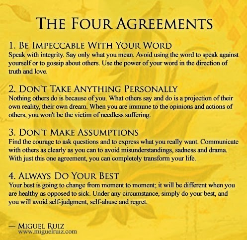

- Ask Why
- whatever is yours isn't yours, this includes thoughts, opinions, and body
- be explicit
- the true use of license is in not using it
- thinking is highly unnecessary
- there are more ways to wake up than there are to stay/fall asleep
- manipulation is a two-way street
- no special relationships
- no secrets
- cultivate indifference, shoot the narrative
- Come back to your senses
- two things to be highly suspicious of: success and failure
- you cannot take away someone's right to remain ignorant
- no matter how much you covet something, remember, someone, somewhere is tired of it
- anticipate trouble
- be grateful to be of service without being servile
- don't start unsustainable relationships, keep distance from indecisive, insecure, jealous folks, [keep your distance] because the inmates have taken over the asylum
- He who makes an alien of himself relieves himself the pain of being a beast.
- sometimes the whole point of art is that you didn't do it first
- make allowance for the present
- 1 new habit / year
- there is no enlightened person, only enlightened behaviour
- you get what you tolerate
- freedom and forgiveness cannot be timed
- take mixed signals as a no
- your life will be decide by the way you spend your time and the company you spend it in, not by what you're consuming on screen as a past time
- if made to choose beween mom and dad, i will prefer to stay with dad
- IT IS BETTER TO GET HURT PLAYING WITH CROOKS THAN GET HURT PLAYING WITH POLITICIANS, but ideally one should stay away from both
- surprise, don't challenge