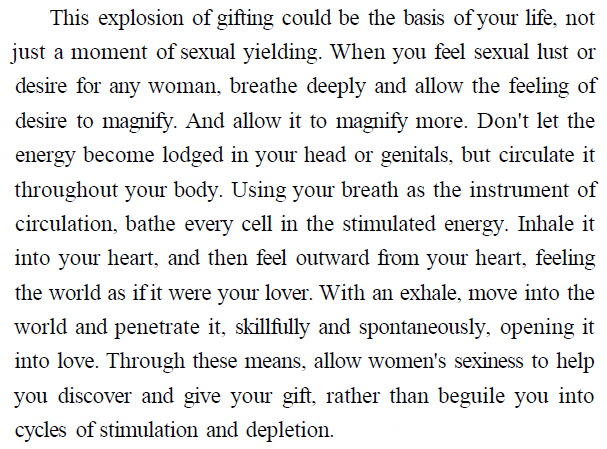
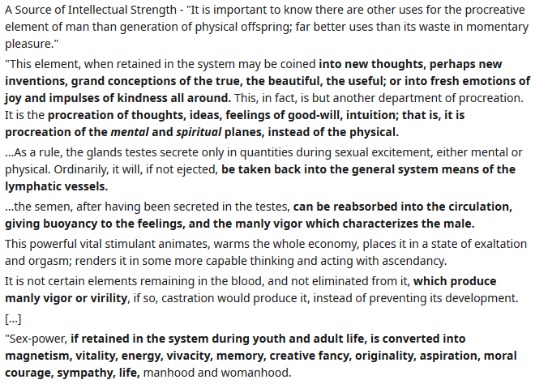

> Those considering Jhana development should not worry whether they will become enthralled by the wetter path. In the Simile of the Quail the Buddha describes the mundane pleasures and joy we strive to experience everyday through our five senses as a filthy pleasure, a coarse pleasure, an ignoble pleasure  

>. . . that it should not be pursued, that it should not be developed, that it should not be cultivated, that it should be feared.” He then describes the first four Jhanas as  the bliss of renunciation, the bliss of seclusion, the bliss of peace, the bliss of enlightenment  

> . . . that this kind of pleasure should be pursued, that it should be developed, that it should be cultivated, and that it should not be feared. 

> There are alternative names for this practice: "Meditation on Repulsiveness”, "Meditation on Foulness”17, but we’d like to propose a better translation of the Pali term "Asubhasaññā” as "Meditation on the Unlovely”.  

> For those who are looking for a way to help them resist addictions and addictive tendencies, there will be noticeable gain if this practice is developed to Step 3 as described below. Countering such thoughts and urges will be much easier. 

>Lust is easily quieted by taking a moment to mentally work through the first five body parts when you have mastered Step 3. If you aspire to take this meditation as far as it can take you, then daily practice will probably need augmenting with meditation retreats to reach step 6. 

>The Appendices contains a discussion on retreat preparation for those looking to take this meditation to Jhana and further meditative development. But to start it is recommended to set aside six months to devote your time to learning this meditation, which is stated to be "designed for a person of medium understanding.” 

> STEP 1: MEMORIZE AND RECITE THIS OUT LOUD: ~~~ > Hair of the Head, 2. Hair of the Body, 3. Nails, 4. Teeth, 5. Skin < Skin, Teeth, Nails, Hair of the Body, Hair of the Head > 6. Flesh, 7. Sinews, 8. Bone marrow, 9. Kidneys < Kidneys, Bone marrow, Sinews, Flesh 5. Skin, Teeth, Nails, Hair of the Body, Hair of the Head > 11. Heart, 12. Liver, 13. Membranes, 14. Spleen, 15. Lungs < Lungs, Spleen, Membranes, Liver, Heart 10. Kidneys, Marrow, Bone, Sinews, Flesh < Skin, Teeth, Nails, Hair of the Body, Hair of the Head > 16. Bowels, 17. Mesentery, 18. Gorge, 19. Dung, 20. Brain < Brain, Dung, Gorge, Mesentery, Bowels < Lungs, Spleen, Membranes, Liver, Heart > Kidneys, Marrow, Bone, Sinews, Flesh < Skin, Teeth, Nails, Hair of the Body, Hair of the Head > 21. Bile, 22. Phlegm, 23. Pus, 24. Blood, 25. Sweat, 26. Fat < Fat, Sweat, Blood, Pus, Phlegm, Bile 27. Brain, 28. Dung, 29. Gorge, 30. Mesentery, 31. Bowels Lungs, Spleen, Membranes, Liver, Heart Kidneys, Marrow, Bone, Sinews, Flesh Skin, Teeth, Nails, Hair of the Body, Hair of the Head > Tears, Grease, Spittle, Snot, Oil of the Joints, Urine < Urine, Oil of the Joints, Snot, Spittle, Grease, Tears Fat, Sweat, Blood, Pus, Phlegm, Bile Brain, Dung, Gorge, Mesentery, Bowels Lungs, Spleen, Membranes, Liver, Heart Kidneys, Marrow, Bone, Sinews, Flesh Skin, Teeth, Nails, Hair of the Body, Hair of the Head ~~~~

