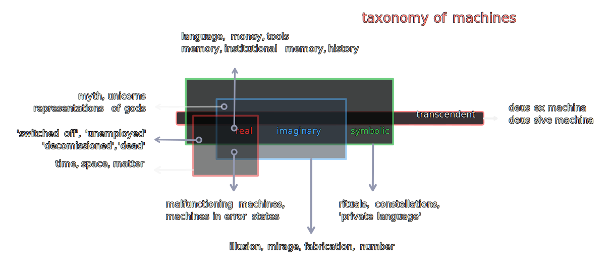

## 2.

> _Nenn’ ich, Sakuntala, Dich, und so ist Alles gesagt._ - Goethe

#### 2.1 basic outline of machine taxonomy (with examples)
 

#### 2.2 the closest definition of a machine in this context then, is something like an origami sculpture - _a structure "folded" into function(s)_.

2.2.1 just as complex creations arise out of a small number of folding techniques in the Japanese art form, complex machines arise out of combinations, permutations, and repetitions of simpler ones.

2.2.2 what is folded and folded into is not only other machines, but structures of cognition itself - thus, not only protiens fold, but even physical dimensions like time and space, mathematical abstractions, and ultimately, even the epistemological categories arrange as an assortment of bends and creases

2.2.3 the three epistemological categories of real, imaginary, and symbolic are well understood, if not in the current context then in other philosophical, psychological, or sociological discussions

2.2.3.1 transcendence as an epistemological category is easily overlooked in the rough and tumble of diurnal chugging along, nevertheless it is perhaps more important than all the other categories in that it is possible for a machine to not be transcendent but not for an epistemological category. thus, qualia and its praxis (consciousness) are both rooted in concerns beyond the real, imaginary, and symbolic

2.2.3.2 epistemological categories are not sources of episteme but conditions necessary for knowledge to occur, they are the context for knowledge and define the working environment of machines

#### 2.3 these categories together form the anatomy of all experience

2.3.1 each epistemic category independently, as well as in conjunction with other categories, provides the context for a class of machines.

2.3.2 from 2.2.3.3, some machines operate across multiple categories, others stay confined to a single one.

2.3.3 modalities of cognition or epistemic categories are configured in a manner analogous to RGB values across a matrix representing an image. In that it can be said to be a configuration of one or multiple (parallaxed) layers of meaning. 

2.3.4 each category is configured discretely enough to be studied independently, but not each renders itself available to a exhaustive interpretation in mutual exclusion. The real appears contradictory and relative from an imaginary standpoint, the imaginary lacks corporeality, the symbolic descends into metacognitive networks of meaninglessness, and the transcendent appears as a paranormal void well-shielded from scientific enquiry.

2.3.5 objectively, these _degrees of historicity_ become the apparatus of subjective cognition whose synthesis are the _the principles of discernment_ of one machine from another, and also one network of machines (e.g. superstructures like nation states, organizations, trusts, groups etc) from another.

2.3.5.1 superstructures are machines too, with the caveat that the frame of reference is always relative to the size of the immediate network. thus, a flock of seagulls is as much a machine as a seagull but compared to a single cell in its body, a seagull is also a relative superstructure.

2.3.6 cognitively, it is as if the mind and body are on an eternal drive home on highways both real (roads), imaginary (roads in video games, paintings), symbolic (roads in pilgrimages), and transcendent (roads in myth), the dialectic of history thus churns itself out of itself.

2.3.7 it would be prudent thus, to think of these constructively as easels upon which are hung (or wrapped) the paintings called machines. Deconstructively, the frame around the canvas. 

#### 2.4 these categories sort machines into futher relationships (hierarchies) downstream, such as those of declinations, declensions, inclinations, and intentions etc. As interesting as these hierarchies are in themselves, for the purposes of this text we shall consider language as a machine/tool without much emphasis on linguistic relations. 

2.4.1 our primary interest is the cartography of this metaphysical kingdom without getting lost in the paralysing parade of linguistic flotillas of meaning, or allowing psychoanalytic concerns to queer the pitch any more than necessary.

#### 2.5 just as a counter cannot be made without numbers, legends in metaphysical maps cannot be constructed without using the configurations of singularity (self, identity...), duality, trinity and so on. as described in 3.3.2 the _self_ or singularity of psychosomatic "oneness", is one such config, the duality of a childhood friendship, or the holy trinity others.

2.5.1 such identities of identities form the landscape above which levitate unmoored - circular, linguistic, and string-like rings of _assignation_ and _association_, grouping machines further into categories ad infinitum.

2.5.2 a movement of these rings correlates strongly with the movements of '_grounding_' and '_decentering_' in personal and public psyches.

2.5.3 these structures are purely language-derived in themselves but assume logico-social reality in operation and execution outside of language.