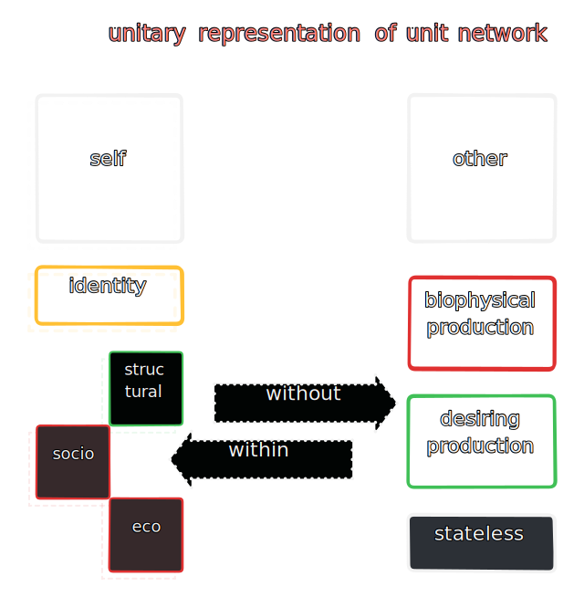

## 3

> _Cognesco, ergo sum_

#### 3.1 types of connections

#### 3.2 all machines appear to be connected to other machines, and these connections extend all the way within (and without) until all the categories of consciouness make an apparently seamless whole which is a network seemingly indestructible and pervasive as to appear impervious to reductive faculties.

3.2.1 the idea of a machine unconnected from others is unteneable for the same reasons a 'private language' is unteneable (see 3.2.1), even fictional apparatus is connected to the humdrum of the real via the parallax of symbolic and imaginary. every quark, blade of grass, and drop of ocean is eternally networked.

3.2.1.1 a machine isolated from its network, like an isolated neuron, quickly transcend their functional boundaries, leaving behind only structural ruins serving only historical functions.

3.2.1.2 in earnestness, machines can only be _transferred_ from one immediate network (organ, tribe, assembly etc), to another (jail, hospital, cubicle, chassis etc) and even in states of error or retirement never truly disenfranchised royally enough.

#### 3.3 machines are 'conscious' to the extent that their connections can discern this network.

3.3.1 it is such discernment that turns imaginary networks into real and symbolic and vice-versa. thus, a wolf's consciouness is by and large limited to the pack, a buddhist monk's to the sangha, on offline computer knows only itself, and a comb tooth in exile from the comb becomes a decentered machine at once more and less useful than a comb.

3.3.2 sentient machines exist in a state of stochastic ergodicity, thanks to their identity connection, whereas for non-sentient machines the primary state of being is more markovian. bearing in mind 1.4.2 which implies the bounds (including bounds of irrational and erroneous states like madness etc.) of rationality.

3.3.2.1 it is a superlative critique of pure reason that cognitive faculties of each machine are limited to the context of its connections, a pneumatic robot arm has fewer connections than a human brain thus exists in a state space exponentially smaller.

3.3.3 sentience and consciousness are somewhat different callings of the identity connection, in that while sentience means awareness of only localized sense datum, consciouness is a non-local feedback loop within sentience.

3.3.4 as the networked consciousness grows, individual and group behaviours take on a multiplicity of states. such as hunting in groups, waging wars, technological innovations and so on.

3.3.5 this is diametrically opposed to marxist emphasis on negation, or negation of negations, for regardless of unit, what is apparent is a positivism.

3.3.5.1 like any positivism worth its salt, this one is also self-replicating, often in beautiful fractals. a hollow pvc tube is a machine that through this kind of additive synthesis shifts into entirely different identities under different networks (drainage, insulation etc.)

#### 3.4 connections are relatively simple machines grounding machines into states of self and other inside the network.

#### 3.5 a machine's connections assign state to its structure.

3.5.1 state is, for the most part, synonymous with function. a function is a series of states seen frequently in a linear succession or a state is a snapshot of a function during execution. candidly, function is _the_ state of being machine.

3.5.2 a migrant laborer performing morning ablutions on the railway track is in a state assigned by the socio-economic connections with the machine that is the track, the biopolitical connections between the body and the sun, and the connection of desiring production assigned by the machine that is the day and so on.

3.5.3 connections are as innumerable as there are machines and can at best be grouped into numerable categories as illustrated above.

.5.4 the key idea in substituting function with state is to weaken the concept of process, there are no processes, only state transitions ever.

3.5.4.1 processes are as illusory as constellations, which is to say only symbolic and abstract, they are neither machines, nor connections. only a label given usually post-facto to streaks of state transitions observed repeatedly.

#### 3.6 simplicity is a guiding tenet for the study at hand, but a simplicity beyond attributes of matter and spaces, a simplicity which is elegant like rivers, railways, and toasters and unlike that of mere bottlecaps and contraptions without rigor.

3.6.1 but if it is difficult for clergy and laity alike to see a river as a machine, consider their plight if asked to imagine the (concept of) an uncanny valley as an automaton, or perhaps visualise the parasitic torques and countercurrents of resistance flowing through both air and water in each infinite valley and each river running through it.

3.6.1.1 to truly measure the scale of this field-of-perception, glance at the machinations of history in all its glory, ever in motion as the planet it claims to transcribe - replete with its own tools and accesories where every bullet fired is as much a machine as the war or revolution it was fired in, the person it was fired at, the organs it pierced through, the gun etc. 

3.6.1.2 history however, is rarely transcendent. which is to say that unless sought, unlike real, symbolic, and imaginary, it slips through the fingers. thus transcendent machines are rare.

#### 3.7 'entelechy' is a model for transcendence

3.7.1 connections inspire change of state, but these states clearly aren't arranged in a  random fashion, the survival of any machine depends on detecting these patterns in states and between changes in them.

3.7.2 nor is the diurnal chugging along one happenstance in service of another, larger one - one that lasts 