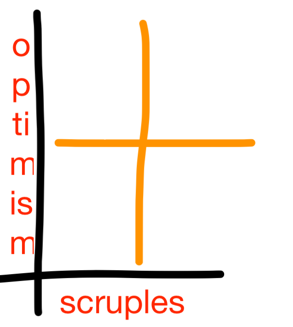

# 8. modern hinduism: a show about nothing

`modern hinduism: a show about nothing` (comparative outline, the chimera that is tech, caste your vote, AI or astrology?, deification of error, steve jobs, enlightenment as a never ending war, war as suffering fools gladly, identity politics (hindu rashtra and other totalitarian fantasies (walter benjamin)

----

- unscrupulous pessimism > scrupulous pessimism > unscrupulous optimism > scrupulous optimism

## comparative outline

- imagine aliens landed on earth and decided to rate organized religions:

- hinduism is like a maze with as many entrances and exits as it has deities, no matter how smart you are, if you're in it and have even a little curiosity to tune into it correctly, you will get lost. in other words a religion for people who like to get lost in devotion, where each is free to pick their own path, entry, and exit  - very DIY, lots of choice. The crown of ontological maximalism, exalted polytheism

- Islam is like a tunnel, 

- Christianity like a narrow path along nature that has lately been blockaded and that once lead to god as well, at least for a few anyway. 

- Taoism has no frontend, no embelllishments, very "matrilineal" and lack-oriented, what it gains in efficiency it is by sacrificing all narrative, although confucianism tries to amend this, and is successful to an extent. A jewel of ontological minimalism. 

- Buddhism is also a minimal onltology at its core but is wrapped in much history, including sects, subsects and cultural differences. Still relatively clean and room to experiment (unlike pure Taoism) even among the edge interpretations.

- i have yet to see a civilisation that still treats language as unfinished AND cares deeply enough to start fights over it, whereas the world is mostly still fighting over KFC nuggets and OIL.

- somwar, mangalwar, budhwar, guruwar, shukrawar, shaniwar, raviwar

"The Third Reich is a train that does not leave until everyone is on board" - walter benjamin
