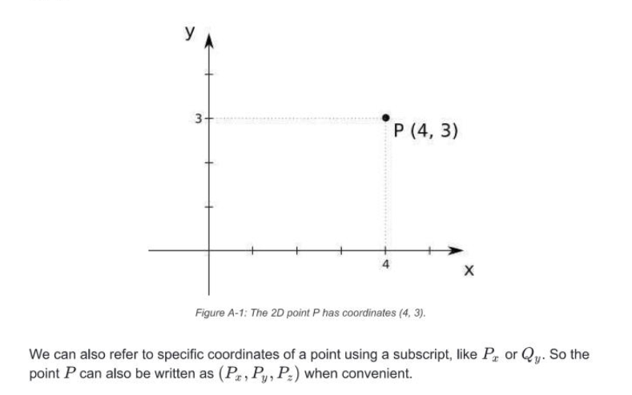
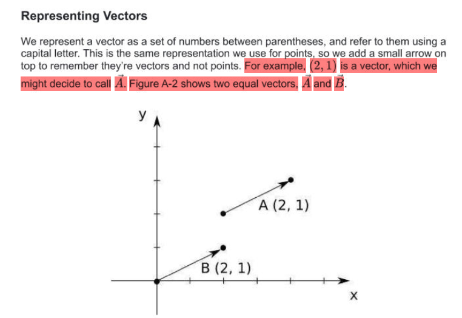
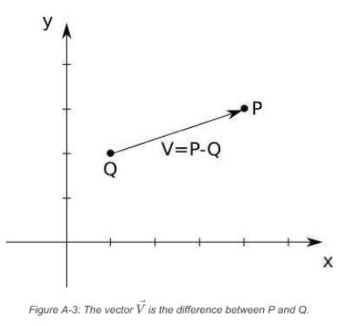
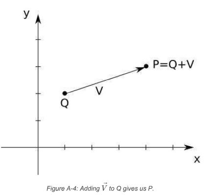
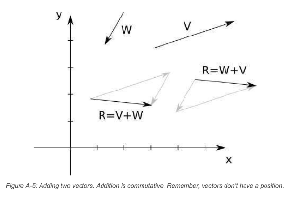
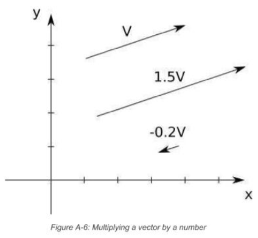

## Points 

## Vectors

- Vector 'represents' a difference between two Points
- aka an arrow from any point x to any point y 
- aka "instructions to get from one point to another"

- vectors do not have a position, they are just abstractions over difference between two points  
- have a __direction__ = angle in which they point
    - __orientation__ = slope of the line they are on
    - __sense__ = +ve or -ve 
 - have a __magnitude__ = how long  

### Vector Magnitude (aka length aka norm)

- m = 1.0 = UNIT VECTOR 
- you can compute m from vector coords
- formula: 
$$|\vec V| = \sqrt{V_{x}^2 + V_{y}^2 + V_{z}^2}
$$end

## Point and Vector Ops
### Subtracting Points 
- you can subtract two points and get  a vector :
$$ \vec V = P - Q  $$ end 
- think of this as "V going from Q to P" 

- agebraically, subtract each of the coordinates separately : 

$$ (V_x,V_y,V_z) = (P_x,P_y,P_z) - (Q_x,Q_y,Q_z) = (P_x-Q_x, P_y-Q_y, P_z-Q_z) $$end

### Adding a Point and Vector 

$$ (V_x,V_y,V_z) = (P_x,P_y,P_z) + (Q_x,Q_y,Q_z) = (P_x+Q_x, P_y+Q_y, P_z+Q_z) $$end

$$ or \\ 
V_x  = P_x - Q_x \\
V_y = P_y - Q_y \\
V_y = P_y - Q_y \\ 
$$end 

- which means we can do this 
$$ Q_x  = P_x + V_x \\
Q_y = P_y + V_y \\
Q_y = P_y + V_y \\ \
\\ thus \\ 
Q + \vec V = P
$$end 

- you can add a vector and a point __to get a new point__
- given a starting __position__ (__point__) and a __displacement__ (__vector__), you will get a new position / __point__

### Adding Vectors 

- imagine putting one vector after another 
- __commutative__ = order does not matter 

- formally:
- $$ \vec V + \vec W = (V_x,V_y,V_z) + (W_x,W_y,W_z) = (V_x+W_x, V_y+W_y, V_z+W_z) $$end

### Scalar Product / Multiplying Vector with Number 

- makes the vector shorter or longer 

- if a number is -ve vector will point the other way 
- it will remain along the same line 
- formally : 
- $$ k. \vec V = k. (V_x, V_y, V_z) = (k.V_x, k.V_y,k.V_z) $$end 

- division can be done, except with 0 

#### normalize a vector 

- turn it into a vector 
- changes the magnitude to 1.0 
- to do this divide the vector by its length 
- $$ \vec V_{normalized} = \frac{\vec V}{|\vec V|} $$end

### Multiplying Vectors 
#### Dot Product 

- $$ \langle \vec P \cdot \vec Q \rangle = \langle (P_x,P_y,P_z) , (Q_x,Q_y,Q_z) \rangle = P_x \cdot Q_x + P_y \cdot Q_y + P_z\cdot Q_z $$end

- Geometrically, the dot product of V and W is related to their lengths, and to the angle α between them. The exact formula neatly ties together linear algebra and trigonometry:

- $$ \langle \vec P \cdot \vec Q \rangle = |\vec P| \cdot |\vec Q| \cdot cos(\alpha) $$end

- distributive 
- __commutative__ wrt scalar product

- the second formula can be used to calculate the angle between two vectors
- $$ \alpha = cos^-1 \left( \frac {\langle \vec P , \vec Q  \rangle}{|\vec P| \cdot  |\vec Q|} \right) $$end

- the dot product of a vector with itself = square of its length 

- $$ \langle \vec P \cdot \vec P \rangle = P_x^2+P_y^2+P_z^2  = |\vec P|^2 $$end

- thus, the length of the vector can be calculated thus 

- $$  |\vec P| = \sqrt{\langle \vec P \cdot \vec P \rangle}

#### Cross Product 

- 