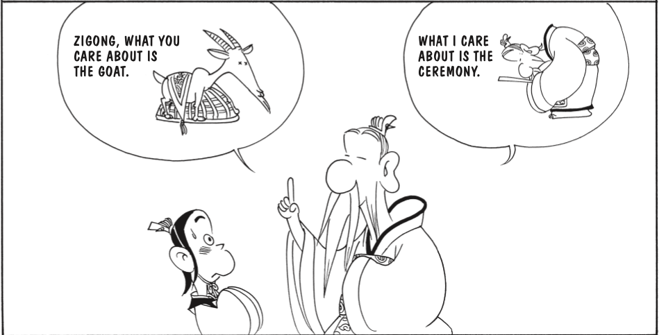

The [morally] noble man guards himself against three things. When he is young, his xue–qi has not yet stabilized, so he guards himself against sexual passion. When he reaches his prime, his xue–qi is not easily subdued, so he guards himself against combativeness. When he reaches old age, his xue–qi is already depleted, so he guards himself against acquisitiveness.

— Confucius, Analects, 16:7

TO BECOME AN EXPERT IN OUTLANDISH IDEAS IS SIMPLY HARMFUL.

"I am determined to study when I am fifteen years old, I have made some achievements when I am 30 years old, I am not confused when I am 40 years old, understand the laws of nature at 50 years old, distinguish right from wrong at 60 years old, and do whatever I want at 70 years without breaking the rules."

Zi You asked what filial piety was. The Master said, "The filial piety nowadays means the support of one's parents. But dogs and horses likewise are able to do something in the way of support;-without reverence, what is there to distinguish the one support given from the other?"

WORRY ABOUT HAVING WHAT IT TAKES TO HOLD ONE. 
DON’T WORRY ABOUT YOUR WORTH GOING UNRECOGNIZED, 
PURSUE QUALITIES WORTH RECOGNIZING.

